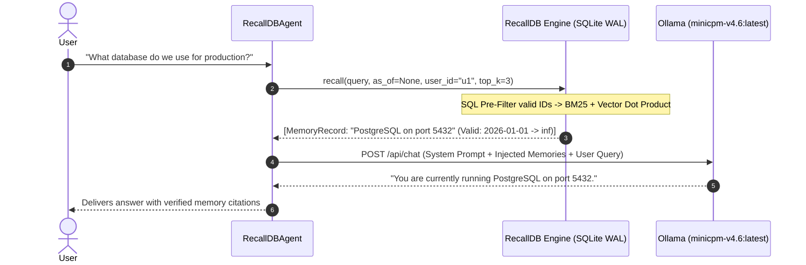

# Developer Guide: Building Autonomous Agents with RecallDB & Ollama

This guide details how to build an autonomous, memory-augmented AI agent using **RecallDB** as the embedded bitemporal persistence layer and **Ollama** (`minicpm-v4.6:latest`) as the local edge reasoning model.

---

## 1. Architectural Overview



Unlike naive RAG systems that concatenate entire conversation histories into context, a RecallDB-backed agent:
1. **Pre-filters candidates** via bitemporal SQL constraints (`db.get_valid_ids(as_of)`), preventing superseded historical configurations from cluttering context.
2. **Injects high-precision context chunks** (<400 tokens), enabling fast inference on edge models like `minicpm-v4.6:latest` without context truncation.
3. **Preserves full historical auditability** via non-destructive state supersession ($ACTIVE \to SUPERSEDED$).

---

## 2. Core Python Agent Implementation

Here is the complete, self-contained architecture for an agent backed by RecallDB and Ollama:

```python
import json
import urllib.request
from typing import List, Dict, Any, Optional
from recalldb import RecallDB, MemoryRecord

class RecallDBAgent:
    """
    An autonomous agent combining RecallDB bitemporal memory with
    local Ollama (minicpm-v4.6:latest) inference.
    """
    def __init__(
        self,
        db_path: str = "./agent_memory.db",
        model: str = "minicpm-v4.6:latest",
        ollama_url: str = "http://localhost:11434",
        tenant_id: str = "default_org",
        user_id: str = "default_user",
        agent_id: str = "sentinel_agent"
    ):
        self.db = RecallDB(db_path=db_path, embedding_provider="deterministic")
        self.model = model
        self.ollama_url = ollama_url
        self.tenant_id = tenant_id
        self.user_id = user_id
        self.agent_id = agent_id

    def remember(
        self,
        fact: str,
        valid_from: Optional[str] = None,
        valid_until: Optional[str] = None,
        importance: float = 0.8,
        thread_id: Optional[str] = None
    ) -> MemoryRecord:
        """Stores a new verified fact in RecallDB."""
        return self.db.remember(
            content=fact,
            valid_from=valid_from,
            valid_until=valid_until,
            importance=importance,
            tenant_id=self.tenant_id,
            user_id=self.user_id,
            agent_id=self.agent_id,
            thread_id=thread_id
        )

    def supersede(
        self,
        old_memory_id: str,
        new_fact: str,
        transition_time: Optional[str] = None,
        thread_id: Optional[str] = None
    ) -> MemoryRecord:
        """
        Atomically updates a fact by superseding the old record.
        Zero data is erased; historical queries remain 100% accurate.
        """
        return self.db.supersede(
            old_memory_id=old_memory_id,
            new_content=new_fact,
            transition_time=transition_time,
            tenant_id=self.tenant_id,
            user_id=self.user_id,
            agent_id=self.agent_id,
            thread_id=thread_id
        )

    def chat(
        self,
        user_message: str,
        as_of: Optional[str] = None,
        thread_id: Optional[str] = None,
        top_k: int = 3
    ) -> Dict[str, Any]:
        """
        Executes a memory-grounded conversational turn:
        1. Retrieves point-in-time memories.
        2. Injects memories into system instructions.
        3. Calls local Ollama model.
        """
        # Step 1: Point-in-time retrieval
        memories = self.db.recall(
            query=user_message,
            as_of=as_of,
            top_k=top_k,
            tenant_id=self.tenant_id,
            user_id=self.user_id,
            thread_id=thread_id
        )

        # Step 2: Format prompt with strict memory citations
        memory_context = ""
        if memories:
            memory_context = "### RETRIEVED VERIFIED MEMORIES:\n"
            for m in memories:
                memory_context += (
                    f"- [ID: {m.id[:8]}] (Valid: {m.valid_from} -> {m.valid_until or 'Present'} | State: {m.state})\n"
                    f"  Content: {m.content}\n"
                )
        else:
            memory_context = "### RETRIEVED MEMORIES:\nNo relevant memories found for this query/timeframe.\n"

        target_time = as_of if as_of else "CURRENT LIVE STATE"
        system_prompt = (
            f"You are an autonomous AI assistant powered by RecallDB memory.\n"
            f"EVALUATION TIMEFRAME: {target_time}\n"
            f"Strictly base your answers on the verified memories provided below. "
            f"If answering a historical question, only cite facts that were valid during that epoch. "
            f"Do not hallucinate or use outdated configurations for current queries.\n\n"
            f"{memory_context}"
        )

        payload = {
            "model": self.model,
            "messages": [
                {"role": "system", "content": system_prompt},
                {"role": "user", "content": user_message}
            ],
            "stream": False,
            "options": {
                "temperature": 0.1  # Low temperature for factual precision
            }
        }

        # Step 3: Local HTTP inference
        req = urllib.request.Request(
            f"{self.ollama_url}/api/chat",
            data=json.dumps(payload).encode("utf-8"),
            headers={"Content-Type": "application/json"}
        )
        with urllib.request.urlopen(req) as resp:
            data = json.loads(resp.read().decode("utf-8"))
            assistant_response = data["message"]["content"]

        return {
            "response": assistant_response,
            "retrieved_memories": [m.to_dict() for m in memories],
            "as_of": as_of
        }
```

---

## 3. The 5-Step Operational Lifecycle

### Step 1: Initial Ingestion (`remember`)
When the user configures their tech stack or preference:
```python
agent = RecallDBAgent(user_id="arunmozhi")

m1 = agent.remember(
    fact="Primary database is MySQL 8.0 hosted on AWS RDS instance db.t4g.xlarge",
    valid_from="2024-01-01T00:00:00Z"
)
```

### Step 2: Current State Querying
```python
res = agent.chat("What database engine do we use?")
print(res["response"])
# -> "We are currently using MySQL 8.0 hosted on AWS RDS instance db.t4g.xlarge."
```

### Step 3: Factual Evolution via Non-Destructive Supersession (`supersede`)
Six months later, the database is upgraded:
```python
# Supersedes m1 as of 2026-02-01
m2 = agent.supersede(
    old_memory_id=m1.id,
    new_fact="Migrated primary database to PostgreSQL 16 with Citus clustering on port 5432",
    transition_time="2026-02-01T00:00:00Z"
)
```
- $m_1$'s `valid_until` is updated to `2026-02-01T00:00:00Z` and state becomes `SUPERSEDED`.
- $m_2$ is inserted with `valid_from = 2026-02-01T00:00:00Z` and state `ACTIVE`.

### Step 4: Point-in-Time Historical Time-Travel (`as_of`)
The agent can now answer retrospective audits without contradiction collapse:

```python
# 1. Ask about current state:
current_ans = agent.chat("What database are we using?")
# Injected memory: PostgreSQL 16
# Output: "You are currently using PostgreSQL 16 with Citus clustering on port 5432."

# 2. Ask about past state (e.g., during 2025 audit):
past_ans = agent.chat("What database were we using?", as_of="2025-06-01T00:00:00Z")
# Injected memory: MySQL 8.0
# Output: "As of June 2025, you were using MySQL 8.0 hosted on AWS RDS instance db.t4g.xlarge."
```

### Step 5: Multi-Tenant & Thread Isolation
Ensure multi-agent workflows never leak sensitive contexts:
```python
# Thread-isolated debugging session
agent.remember(
    fact="Staging redis cache is currently disabled due to memory leak investigation",
    thread_id="incident_409"
)

# Only accessible within thread_id="incident_409"
thread_memories = agent.chat(
    "Is redis enabled?", 
    thread_id="incident_409"
)
```

---

## 4. Why MiniCPM-V 4.6 Excels with RecallDB

Edge models (1.6 GB) have tight attention budgets. In standard RAG, feeding both the old MySQL config and the new Postgres config into MiniCPM-V causes attention confusion (the model frequently answers "MySQL and Postgres"). 

With RecallDB:
1. **Pre-Filtering:** Obsolete facts are excluded at the SQL index level before prompt serialization.
2. **Context Efficiency:** Injects ~200 tokens instead of 10,000 tokens of conversational fluff.
3. **Execution Speed:** Sub-300ms inference turnaround on consumer GPUs or modern CPUs.
