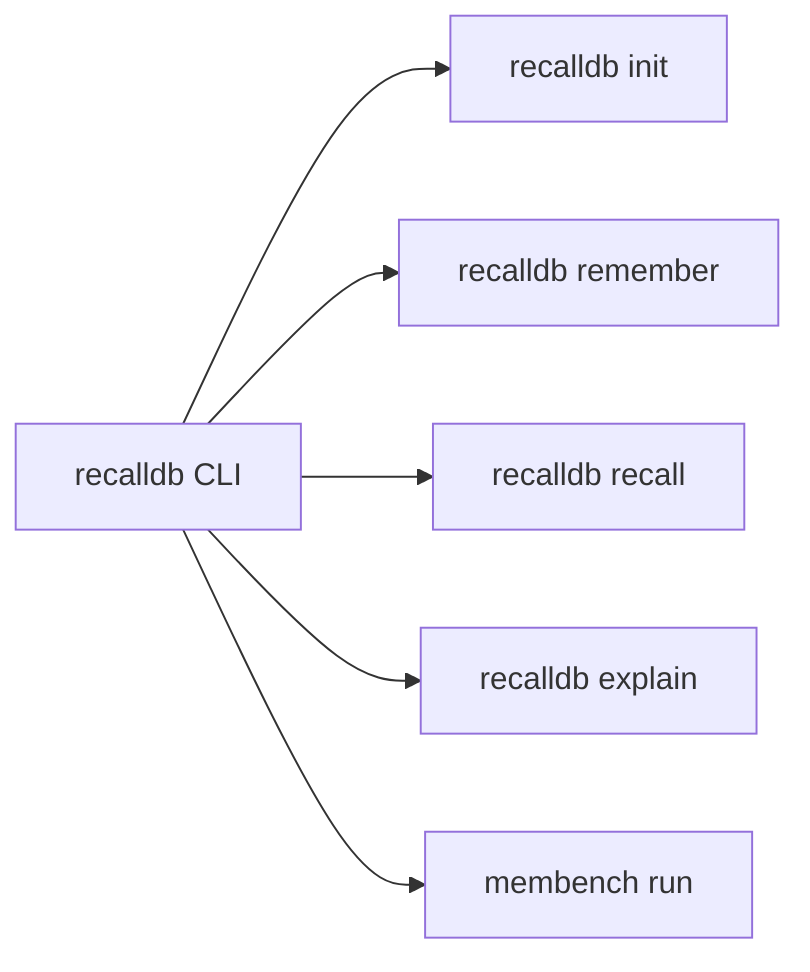

# RecallDB: Python API & CLI Reference Manual

**Document Version:** 1.0.0-RESEARCH  
**Classification:** Developer Reference & API Specification  
**Status:** Approved / Active Specification  
**Repository:** [github.com/AMV0027/recalldb](https://github.com/AMV0027/recalldb)  
**Primary Target Location:** [`c:/founder-os/sandbox/recalldb/docs/API_REFERENCE.md`](file:///c:/founder-os/sandbox/recalldb/docs/API_REFERENCE.md)

---

## 1. Package Installation & Module Structure

RecallDB is distributed as a zero-daemon, embedded Python package supporting Python 3.10+.

```bash
# Production installation
pip install recalldb

# Local development / Research editable install
git clone https://github.com/AMV0027/recalldb.git
cd recalldb
pip install -e ".[dev,bench]"
```

### Module Organization
* `recalldb.core`: Main `RecallDB` engine interface, session orchestrator, and lifecycle management.
* `recalldb.storage`: SQLite WAL storage backend, FTS5 virtual tables, and vector BLOB buffers.
* `recalldb.retrieval`: Hybrid multi-factor ranker, bitemporal filter, and candidate fusion.
* `recalldb.embeddings`: Dense vector embedding providers (Local ONNX, SentenceTransformers, API).
* `recalldb.provenance`: Lineage graphs, cryptographic content hashing, and explanation traces.
* `recalldb.cli`: Command-line tools for shell workflows and system administration.
* `bench`: Benchmark evaluation harness (`membench`), dataset adapters, and reporting suite.

---

## 2. Core Python API Reference: `RecallDB` Class

The primary entry point is the [`RecallDB`](file:///c:/founder-os/sandbox/recalldb/app/recalldb/core/engine.py) class.

```python
from recalldb import RecallDB

db = RecallDB(
    db_path="agent_memory.db",
    embedding_model="all-MiniLM-L6-v2",
    device="cpu",
    wal_mode=True
)
```

### Constructor Parameters

| Parameter | Type | Default | Description |
| :--- | :--- | :--- | :--- |
| `db_path` | `str \| Path` | `":memory:"` | Filesystem path to the SQLite database file. Use `":memory:"` for ephemeral in-memory testing. |
| `embedding_model` | `str \| BaseEmbeddingProvider` | `"all-MiniLM-L6-v2"` | HuggingFace model identifier, local ONNX weights path, or custom embedding provider instance. |
| `device` | `str` | `"cpu"` | Compute device for embedding inference (`"cpu"`, `"cuda"`, or `"mps"`). |
| `wal_mode` | `bool` | `True` | Enables SQLite Write-Ahead Logging for high concurrency. |
| `cache_size_mb` | `int` | `64` | In-memory SQLite page cache allocation in megabytes. |

---

## 3. Core Engine Methods

### 3.1 `remember()`

Ingests an assertion, generates dense embeddings, populates FTS5 lexical indexes, establishes bitemporal valid intervals, and links provenance metadata.

```python
def remember(
    self,
    content: str,
    event_time: Optional[Union[str, datetime]] = None,
    valid_from: Optional[Union[str, datetime]] = None,
    valid_until: Optional[Union[str, datetime]] = None,
    memory_type: str = "semantic",
    entities: Optional[List[str]] = None,
    source: Optional[str] = None,
    confidence: float = 1.0,
    importance: float = 0.5,
    supersedes: Optional[str] = None,
    metadata: Optional[Dict[str, Any]] = None
) -> MemoryRecord:
```

#### Parameters:
* `content` (*str*, required): The natural language fact, preference, or event to store.
* `event_time` (*str | datetime*, optional): ISO 8601 timestamp when the real-world event occurred. Defaults to current UTC timestamp ($t_{\text{now}}$).
* `valid_from` (*str | datetime*, optional): ISO 8601 timestamp marking the start of factual validity. Defaults to `event_time`.
* `valid_until` (*str | datetime*, optional): ISO 8601 timestamp marking the end of factual validity. Defaults to `"9999-12-31T23:59:59.999999Z"` (indefinitely valid).
* `memory_type` (*str*, optional): Memory classification: `"episodic"`, `"semantic"`, `"procedural"`, or `"working"`. Default: `"semantic"`.
* `entities` (*List[str]*, optional): Key entity tokens (e.g. `["PostgreSQL", "Backend"]`) for fast exact indexing. If omitted, extracted automatically via regex/NER.
* `source` (*str*, optional): Provenance URI or session turn pointer (e.g., `"conversation:sess_102:turn_4"`).
* `confidence` (*float*, optional): Epistemic certainty score between $0.0$ and $1.0$. Default: $1.0$.
* `importance` (*float*, optional): Intrinsic priority weight between $0.0$ and $1.0$. Default: $0.5$.
* `supersedes` (*str*, optional): Memory ID of an existing record that this new assertion invalidates or updates.
* `metadata` (*Dict[str, Any]*, optional): Arbitrary key-value JSON dictionary for custom agent attributes.

#### Returns:
* `MemoryRecord`: Complete persisted record object containing generated UUID, hashes, and timestamps.

---

### 3.2 `recall()`

Executes multi-factor hybrid retrieval across lexical, dense vector, and temporal dimensions with point-in-time state slicing.

```python
def recall(
    self,
    query: str,
    k: int = 5,
    as_of: Optional[Union[str, datetime]] = None,
    filter_types: Optional[List[str]] = None,
    min_confidence: float = 0.0,
    alpha: float = 0.35,
    beta: float = 0.25,
    gamma: float = 0.20,
    delta: float = 0.10,
    eta: float = 0.10,
    explain: bool = False
) -> List[MemoryResult]:
```

#### Parameters:
* `query` (*str*, required): Natural language search query or retrieval prompt.
* `k` (*int*, optional): Maximum number of top-ranked results to return. Default: `5`.
* `as_of` (*str | datetime*, optional): Target historical point-in-time. Slices the database so only facts valid at that timestamp are eligible. If `None`, queries current valid state ($t_{\text{now}}$).
* `filter_types` (*List[str]*, optional): Restrict retrieval to specific memory types (e.g. `["semantic", "episodic"]`).
* `min_confidence` (*float*, optional): Minimum confidence threshold ($0.0 \le \kappa \le 1.0$). Default: `0.0`.
* `alpha` (*float*, optional): Vector cosine similarity weight. Default: `0.35`.
* `beta` (*float*, optional): FTS5 BM25 lexical keyword weight. Default: `0.25`.
* `gamma` (*float*, optional): Temporal proximity score weight. Default: `0.20`.
* `delta` (*float*, optional): Intrinsic importance weight. Default: `0.10`.
* `eta` (*float*, optional): Staleness decay penalty weight. Default: `0.10`.
* `explain` (*bool*, optional): If `True`, attaches an `ExplanationTrace` to each returned `MemoryResult`. Default: `False`.

#### Returns:
* `List[MemoryResult]`: Ordered list of matched memory results, ranked by composite hybrid score.

---

### 3.3 `update()`

Updates an existing memory assertion, supporting atomic temporal supersession.

```python
def update(
    self,
    memory_id: str,
    content: str,
    event_time: Optional[Union[str, datetime]] = None,
    supersedes: bool = True,
    confidence: Optional[float] = None,
    importance: Optional[float] = None,
    metadata: Optional[Dict[str, Any]] = None
) -> MemoryRecord:
```

#### Behavior:
* If `supersedes=True` (default): The existing memory (`memory_id`) has its `valid_until` timestamp atomically updated to `event_time`, its `is_active` flag set to `0`, and its `superseded_by` pointer set to the new record's ID. A new memory record is inserted with `valid_from = event_time` and `valid_until = 9999-12-31`.
* If `supersedes=False`: Performs an in-place mutation of the existing record's content, re-indexing embeddings and FTS5 without modifying temporal intervals.

---

### 3.4 `explain()`

Generates a detailed mathematical explanation trace for a specific memory retrieval.

```python
def explain(
    self,
    memory_id_or_result: Union[str, MemoryResult],
    query: Optional[str] = None
) -> ExplanationTrace:
```

#### Returns:
* `ExplanationTrace`: Object containing exact numerical breakdown of vector similarity, BM25 term scores, temporal distance, staleness penalty, applied weights, and provenance origin.

---

### 3.5 `delete()`

Removes or invalidates a memory record.

```python
def delete(
    self,
    memory_id: str,
    hard_delete: bool = False
) -> bool:
```

* `hard_delete=False` (default): Soft-deletes the record by setting `is_active = 0` and clipping `valid_until = NOW()`. The memory remains accessible for historical `as_of` queries.
* `hard_delete=True`: Completely purges the record, FTS5 tokens, and embedding vector from the database.

---

### 3.6 `export_json()` and `import_json()`

Enables atomic data portability, backup, and cross-agent federation.

```python
def export_json(
    self,
    path: Union[str, Path],
    include_embeddings: bool = False
) -> int:
    """Exports all memories and provenance graphs to JSON. Returns total record count."""

def import_json(
    self,
    path: Union[str, Path],
    recompute_embeddings: bool = False
) -> int:
    """Imports memories from a JSON dump. Returns successfully imported record count."""
```

---

## 4. Data Models & Schemas

### 4.1 `MemoryRecord`
```python
@dataclass
class MemoryRecord:
    id: str
    content: str
    memory_type: str
    event_time: str
    valid_from: str
    valid_until: str
    recorded_time: str
    confidence: float
    importance: float
    supersedes: Optional[str]
    superseded_by: Optional[str]
    is_active: bool
    source: Optional[str]
    entities: List[str]
    metadata: Dict[str, Any]
```

### 4.2 `MemoryResult`
```python
@dataclass
class MemoryResult:
    id: str
    content: str
    memory_type: str
    score: float
    event_time: str
    valid_from: str
    valid_until: str
    confidence: float
    importance: float
    source: Optional[str]
    explanation: Optional[ExplanationTrace] = None
```

### 4.3 `ExplanationTrace`
```python
@dataclass
class ExplanationTrace:
    memory_id: str
    total_score: float
    vector_sim: float
    bm25_norm: float
    temporal_score: float
    importance_score: float
    staleness_penalty: float
    weights: Dict[str, float]
    provenance: Dict[str, Any]
    temporal_validity: Dict[str, Any]
```

---

## 5. Command-Line Interface (CLI) Reference

RecallDB provides the `recalldb` binary and the `membench` evaluation suite for terminal and script operations.



### 5.1 `recalldb init`
Initializes a new RecallDB SQLite database file with WAL mode, triggers, and FTS5 tables.

```bash
# Initialize in current directory (defaults to ./memory.db)
recalldb init

# Initialize at custom path
recalldb init --db-path /var/data/agent_memory.db
```

### 5.2 `recalldb remember`
Ingests a new assertion from the command line.

```bash
recalldb remember \
  --db-path ./memory.db \
  --content "Production cluster migrated to AWS us-east-1" \
  --event-time "2026-08-15T14:30:00Z" \
  --type semantic \
  --source "cli:manual" \
  --importance 0.85
```

### 5.3 `recalldb recall`
Searches stored memories with hybrid ranking and optional historical time-travel.

```bash
# Query current valid state
recalldb recall \
  --db-path ./memory.db \
  --query "Where is the production cluster hosted?" \
  --k 3

# Historical point-in-time recall
recalldb recall \
  --db-path ./memory.db \
  --query "Where is the production cluster hosted?" \
  --as-of "2025-01-01T00:00:00Z" \
  --explain
```

### 5.4 `recalldb explain`
Displays a formatted scoring and provenance breakdown for a memory ID.

```bash
recalldb explain \
  --db-path ./memory.db \
  --id "mem_01hqb7z89e6y51"
```

### 5.5 `membench run`
Executes an automated benchmark evaluation suite against an experiment manifest.

```bash
membench run \
  --manifest ./benchmarks/manifests/synthetic_temporal.yaml \
  --output ./runs/exp_a_baseline/
```

---

## 6. End-to-End Code Examples

### Example 1: Longitudinal State Tracking & Historical Travel
```python
from recalldb import RecallDB

# Initialize local embedded memory
memory = RecallDB("company_state.db")

# 1. User declares initial tech stack in 2024
mem1 = memory.remember(
    content="Our primary web backend is implemented in Django Python",
    event_time="2024-03-01T10:00:00Z",
    source="conversation:founder_meeting_01"
)

# 2. Company transitions to Go in 2025
mem2 = memory.remember(
    content="Our primary web backend is rewritten in Go for performance",
    event_time="2025-06-15T09:30:00Z",
    supersedes=mem1.id,
    source="conversation:architecture_review"
)

# Query 1: What was our backend in 2024?
past_results = memory.recall(
    query="What framework powers our web backend?",
    as_of="2024-09-01T00:00:00Z"
)
print("2024 State:", past_results[0].content)
# Output -> "Our primary web backend is implemented in Django Python"

# Query 2: What is our backend today?
current_results = memory.recall(
    query="What framework powers our web backend?",
    as_of="2026-10-01T00:00:00Z"
)
print("Current State:", current_results[0].content)
# Output -> "Our primary web backend is rewritten in Go for performance"
```

### Example 2: Inspecting Retrieval Explanation Traces
```python
results = memory.recall(
    query="web backend implementation",
    k=1,
    explain=True
)

trace = results[0].explanation
print(f"Total Hybrid Score: {trace.total_score:.4f}")
print(f"  Vector Similarity: {trace.vector_sim:.4f} (Weight: {trace.weights['alpha']})")
print(f"  BM25 Lexical:      {trace.bm25_norm:.4f} (Weight: {trace.weights['beta']})")
print(f"  Temporal Proximity:{trace.temporal_score:.4f} (Weight: {trace.weights['gamma']})")
print(f"  Staleness Penalty: {trace.staleness_penalty:.4f} (Weight: {trace.weights['eta']})")
print(f"Provenance Source:   {trace.provenance['source']}")
```
