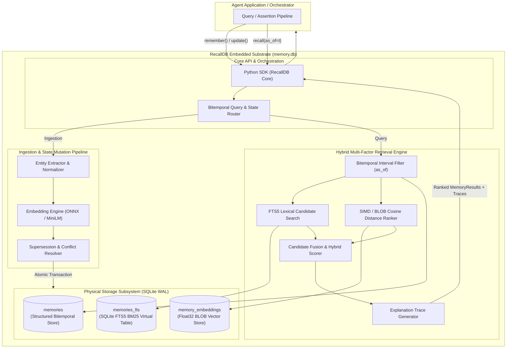
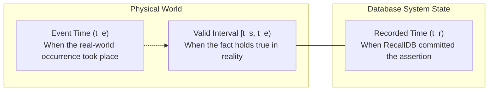
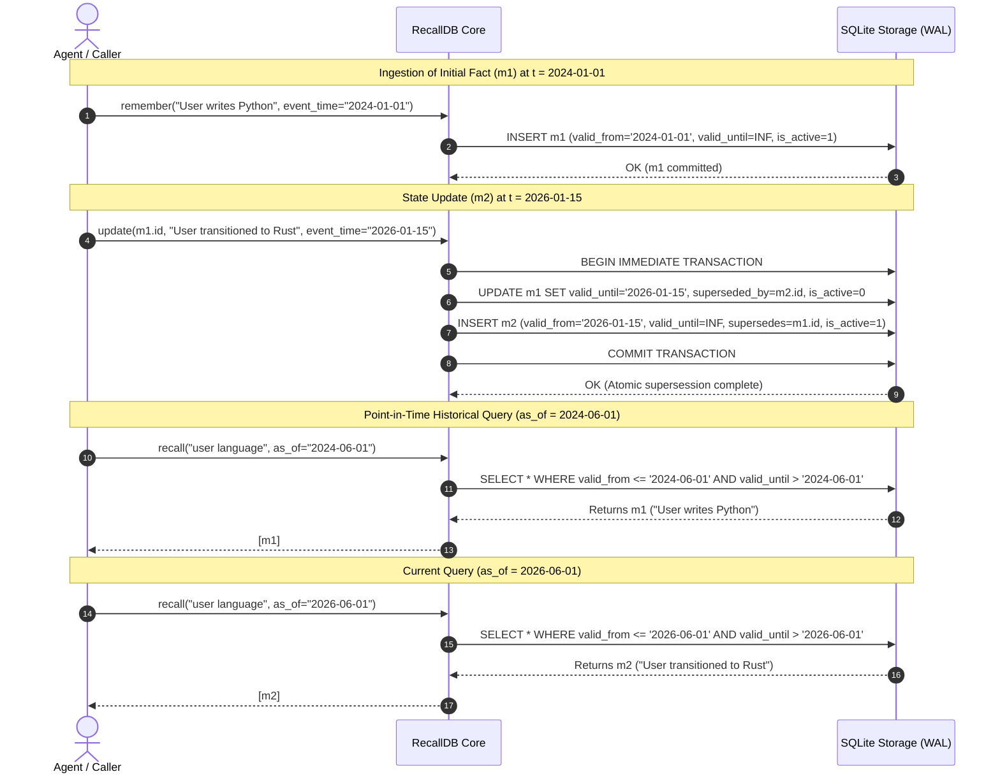

# RecallDB: Systems Architecture & Formal Mathematical Specification

**Document Version:** 1.0.0-RESEARCH  
**Classification:** Systems Architecture & Technical Reference  
**Status:** Approved / Active Specification  
**Repository:** [github.com/AMV0027/recalldb](https://github.com/AMV0027/recalldb)  
**Primary Target Location:** [`c:/founder-os/sandbox/recalldb/docs/ARCHITECTURE.md`](file:///c:/founder-os/sandbox/recalldb/docs/ARCHITECTURE.md)

---

## 1. System Topology & Architectural Overview

RecallDB is an embedded, bitemporal memory engine and evaluation substrate designed for zero-server deployment within autonomous agent runtimes. Rather than requiring external microservices or distributed vector clusters, RecallDB encapsulates state storage, lexical search, dense vector retrieval, and temporal conflict resolution inside a single SQLite database file operating in Write-Ahead Logging (WAL) mode.



---

## 2. Storage Subsystem & Physical Schema

RecallDB utilizes SQLite 3.38+ with Write-Ahead Logging (`PRAGMA journal_mode=WAL`) to support high-concurrency scenarios (Single-Writer, Multiple-Readers without mutual blocking).

### 2.1 Pragmas & Connection Tuning
Upon connection instantiation, the storage engine executes the following configuration commands:
```sql
PRAGMA journal_mode = WAL;
PRAGMA synchronous = NORMAL;
PRAGMA foreign_keys = ON;
PRAGMA temp_store = MEMORY;
PRAGMA mmap_size = 268435456; -- 256MB memory-mapped I/O
PRAGMA cache_size = -64000;   -- 64MB page cache
PRAGMA busy_timeout = 5000;    -- 5-second lock timeout
```

### 2.2 Relational Data Definition Language (DDL)

The physical storage is divided into three synchronized tables:
1. `memories`: Core bitemporal relational table storing entity metadata, temporal boundaries, and state flags.
2. `memories_fts`: SQLite FTS5 virtual table providing BM25 lexical tokenization and full-text search.
3. `memory_embeddings`: High-performance float32 binary BLOB table storing normalized vector embeddings.

```sql
-- 1. Primary Bitemporal Memory Table
CREATE TABLE IF NOT EXISTS memories (
    id TEXT PRIMARY KEY,
    content TEXT NOT NULL,
    memory_type TEXT NOT NULL CHECK(memory_type IN ('episodic', 'semantic', 'procedural', 'working')),
    
    -- Temporal Dimensions (ISO 8601 UTC strings: YYYY-MM-DDTHH:MM:SS.ffffffZ)
    event_time TEXT NOT NULL,
    valid_from TEXT NOT NULL,
    valid_until TEXT NOT NULL DEFAULT '9999-12-31T23:59:59.999999Z',
    recorded_time TEXT NOT NULL,
    
    -- Epistemic Parameters
    confidence REAL NOT NULL CHECK(confidence >= 0.0 AND confidence <= 1.0),
    importance REAL NOT NULL CHECK(importance >= 0.0 AND importance <= 1.0),
    
    -- Graph Lineage & Supersession
    supersedes TEXT,
    superseded_by TEXT,
    is_active INTEGER NOT NULL DEFAULT 1 CHECK(is_active IN (0, 1)),
    
    -- Provenance & Metadata
    source TEXT,
    entities TEXT,       -- JSON array of extracted entity strings
    metadata TEXT,       -- JSON object of arbitrary agent key-values
    
    FOREIGN KEY(supersedes) REFERENCES memories(id) ON DELETE SET NULL,
    FOREIGN KEY(superseded_by) REFERENCES memories(id) ON DELETE SET NULL
);

-- Performance Indexes
CREATE INDEX IF NOT EXISTS idx_memories_valid_interval 
    ON memories(valid_from, valid_until);
CREATE INDEX IF NOT EXISTS idx_memories_event_time 
    ON memories(event_time);
CREATE INDEX IF NOT EXISTS idx_memories_recorded_time 
    ON memories(recorded_time);
CREATE INDEX IF NOT EXISTS idx_memories_type_active 
    ON memories(memory_type, is_active);

-- 2. SQLite FTS5 Virtual Table for BM25 Lexical Retrieval
CREATE VIRTUAL TABLE IF NOT EXISTS memories_fts USING fts5(
    id UNINDEXED,
    content,
    entities,
    tokenize = 'porter unicode61'
);

-- 3. Binary Vector Table for Dense Embeddings
CREATE TABLE IF NOT EXISTS memory_embeddings (
    memory_id TEXT PRIMARY KEY,
    dim INTEGER NOT NULL,
    embedding BLOB NOT NULL, -- Float32 binary buffer (dim * 4 bytes)
    FOREIGN KEY(memory_id) REFERENCES memories(id) ON DELETE CASCADE
);
```

### 2.3 Synchronization Triggers
To maintain strict transactional consistency between the relational table and the FTS5 virtual table, automated SQLite triggers propagate mutations atomically:

```sql
CREATE TRIGGER IF NOT EXISTS trg_memories_ai AFTER INSERT ON memories
BEGIN
    INSERT INTO memories_fts(id, content, entities)
    VALUES (new.id, new.content, new.entities);
END;

CREATE TRIGGER IF NOT EXISTS trg_memories_au AFTER UPDATE OF content, entities ON memories
BEGIN
    DELETE FROM memories_fts WHERE id = old.id;
    INSERT INTO memories_fts(id, content, entities)
    VALUES (new.id, new.content, new.entities);
END;

CREATE TRIGGER IF NOT EXISTS trg_memories_ad AFTER DELETE ON memories
BEGIN
    DELETE FROM memories_fts WHERE id = old.id;
END;
```

---

## 3. Formal Mathematical Formulation of Bitemporal Memory State

Standard databases model single-time records (the current snapshot). RecallDB models state across **two independent orthogonal temporal dimensions**: **Valid Time** and **Transaction (Recorded) Time**, augmented by the discrete **Event Time**.



### 3.1 Formal Definitions
Let $\mathbb{T}$ denote a continuous, totally ordered time domain:
$$\mathbb{T} = (\mathbb{R}_{\ge 0}, \le)$$

Every memory assertion $m \in \mathcal{M}$ is defined by the tuple:
$$m = \langle \text{id}, c, t_e, [t_s, t_e), t_r, \vec{e}, \omega, \mathcal{S} \rangle$$

Where:
* **Event Time ($t_e \in \mathbb{T}$):** The specific timestamp when the physical event occurred or was uttered.
* **Valid Time Interval ($[t_s, t_e) \subset \mathbb{T}$):** The continuous real-world interval during which the assertion is true.
  * $t_s = t_{\text{valid\_from}}$: Beginning of real-world truth.
  * $t_e = t_{\text{valid\_until}}$: End of real-world truth ($t_e = \infty$ if currently valid).
* **Recorded Time ($t_r \in \mathbb{T}$):** The physical timestamp at which the database engine executed the write transaction.
* **Dense Embedding ($\vec{e} \in \mathbb{R}^d$):** Unit vector representation ($\|\vec{e}\|_2 = 1.0$).
* **Epistemic Weights ($\omega = \langle \kappa, \iota \rangle$):** Confidence $\kappa \in [0, 1]$ and Importance $\iota \in [0, 1]$.
* **Supersession Edge ($\mathcal{S} = \langle m_{\text{pred}}, m_{\text{succ}} \rangle$):** Graph linkages for fact mutation.

### 3.2 Point-in-Time Temporal Slicing (`as_of(t)`)

When an agent executes an `as_of(t)` query, RecallDB constructs an exact temporal cross-section of valid memory state.

#### Definition 3.2.1: Valid Time Slice at Target $t$
Given target evaluation timestamp $t \in \mathbb{T}$, the set of valid memories $\mathcal{M}_{\text{valid}}(t)$ is defined as:
$$\mathcal{M}_{\text{valid}}(t) = \left\{ m \in \mathcal{M} \;\middle|\; m.t_s \le t < m.t_e \right\}$$

#### Definition 3.2.2: Bitemporal Slice at $\langle t_{\text{valid}}, t_{\text{tx}} \rangle$
For historical retrospective auditing ("What did the system *believe* at transaction time $t_{\text{tx}}$ was true regarding date $t_{\text{valid}}$?"):
$$\mathcal{M}_{\text{bitemporal}}(t_{\text{valid}}, t_{\text{tx}}) = \left\{ m \in \mathcal{M} \;\middle|\; m.t_s \le t_{\text{valid}} < m.t_e \;\land\; m.t_r \le t_{\text{tx}} \right\}$$

### 3.3 Atomic Supersession Dynamics

When a state transition occurs (e.g., updating a user's location, tech stack, or status), RecallDB preserves historical integrity by treating updates as non-destructive interval mutations:

Given existing memory $m_1$ valid on $[t_{s1}, \infty)$ recorded at $t_{r1}$, and an incoming update $m_2$ occurring at $t_{e2}$ and recorded at $t_{r2}$ with $t_{r2} > t_{r1}$:

$$\begin{aligned}
m_1.t_{\text{valid\_until}} &\leftarrow t_{e2} \\
m_1.\text{superseded\_by} &\leftarrow m_2.\text{id} \\
m_1.\text{is\_active} &\leftarrow 0 \\
m_2.t_{\text{valid\_from}} &\leftarrow t_{e2} \\
m_2.t_{\text{valid\_until}} &\leftarrow \infty \\
m_2.\text{supersedes} &\leftarrow m_1.\text{id} \\
m_2.\text{is\_active} &\leftarrow 1
\end{aligned}$$

This transformation guarantees:
1. $\forall t < t_{e2}$, query `as_of(t)` returns $m_1$.
2. $\forall t \ge t_{e2}$, query `as_of(t)` returns $m_2$.
3. Neither memory is deleted, preserving complete auditability.



---

## 4. Hybrid Retrieval Architecture & Ranking Engine

RecallDB rejects pure vector retrieval due to its susceptibility to vocabulary mismatch, lack of precision on exact keywords (e.g., UUIDs, error codes, entity names), and temporal blindness. The retrieval pipeline executes in two pipelined stages:

### 4.1 Stage 1: Bitemporal Candidate Generation
1. **Temporal Filtering:** Construct the candidate candidate predicate:
   $$\mathcal{C}_{\text{time}} = \left\{ m \in \mathcal{M} \;\middle|\; m.t_s \le t_{\text{as\_of}} < m.t_e \;\land\; m.\kappa \ge \kappa_{\min} \right\}$$
2. **Lexical Candidate Retrieval (FTS5):** Query SQLite `memories_fts` using BM25:
   $$\mathcal{C}_{\text{lexical}} = \text{TopN}_{\text{BM25}}(q, \mathcal{C}_{\text{time}}, N_1)$$
3. **Dense Vector Candidate Retrieval:** Compute cosine similarity between the query embedding $\vec{e}_q$ and unit vectors $\vec{e}_m \in \mathcal{C}_{\text{time}}$:
   $$\mathcal{C}_{\text{vector}} = \text{TopN}_{\text{cos}}(q, \mathcal{C}_{\text{time}}, N_2)$$
4. **Union Candidate Set:**
   $$\mathcal{C} = \mathcal{C}_{\text{lexical}} \cup \mathcal{C}_{\text{vector}}$$

### 4.2 Stage 2: Fine-Grained Multi-Factor Scoring

For every candidate memory $m \in \mathcal{C}$, the hybrid ranker computes a composite scalar score:

$$\text{Score}(m, q, t) = \alpha \cdot \text{Sim}_{\text{cos}}(\vec{e}_q, \vec{e}_m) + \beta \cdot \text{BM25}_{\text{norm}}(q, m) + \gamma \cdot \text{TemporalScore}(m, t) + \delta \cdot \text{Importance}(m) - \eta \cdot \text{Staleness}(m, t)$$

Subject to the hyperparameter bounds:
$$\alpha, \beta, \gamma, \delta \in [0, 1], \quad \alpha + \beta + \gamma + \delta \le 1.0, \quad \eta \in [0, 1]$$

#### Component Mathematical Definitions:

1. **Semantic Cosine Similarity ($\text{Sim}_{\text{cos}}$):**
   $$\text{Sim}_{\text{cos}}(\vec{e}_q, \vec{e}_m) = \frac{\vec{e}_q \cdot \vec{e}_m}{\|\vec{e}_q\|_2 \|\vec{e}_m\|_2}$$
   Since both vectors are $L_2$-normalized upon creation, this simplifies to the dot product $\vec{e}_q \cdot \vec{e}_m$, clamped to $[0, 1]$.

2. **Normalized BM25 Score ($\text{BM25}_{\text{norm}}$):**
   Raw BM25 scores from SQLite FTS5 are negative ranking values (lower is better in SQLite's internal `bm25()` function). We convert and normalize across candidate set $\mathcal{C}$:
   $$S_{\text{raw}}(m) = -\text{bm25}(m)$$
   $$\text{BM25}_{\text{norm}}(q, m) = \frac{S_{\text{raw}}(m) - \min_{k \in \mathcal{C}} S_{\text{raw}}(k)}{\max_{k \in \mathcal{C}} S_{\text{raw}}(k) - \min_{k \in \mathcal{C}} S_{\text{raw}}(k) + \epsilon}$$

3. **Temporal Proximity Score ($\text{TemporalScore}$):**
   Evaluates how close the event occurred relative to the query evaluation time $t$:
   $$\Delta t = |t - m.t_e| \quad (\text{in days})$$
   $$\text{TemporalScore}(m, t) = \exp\left(-\frac{\Delta t}{\tau_{\text{half\_life}}}\right)$$
   Where $\tau_{\text{half\_life}}$ (default: 30.0 days) controls the temporal decay gradient.

4. **Intrinsic Importance ($\text{Importance}$):**
   $$\text{Importance}(m) = m.\text{importance} \in [0, 1]$$
   Explicit weight set by the agent or system indicating foundational truth value.

5. **Staleness Penalty ($\text{Staleness}$):**
   Penalizes memories based on elapsed time since creation or verification:
   $$\text{Staleness}(m, t) = \begin{cases} 
   1.0 & \text{if } t \ge m.t_{\text{valid\_until}} \quad \text{(Superseded/Expired)} \\
   1.0 - \exp\left(-\frac{t - m.t_r}{\tau_{\text{stale}}}\right) & \text{otherwise}
   \end{cases}$$

---

## 5. Candidate Fusion Algorithms

RecallDB supports two interchangeable candidate fusion algorithms:

### 5.1 Weighted Min-Max Normalization (Default)
Each individual signal is mapped to $[0, 1]$ across the candidate pool and linearly combined according to the hyperparameter weights:

$$\text{FinalScore}(m) = \alpha \hat{S}_{\text{vector}}(m) + \beta \hat{S}_{\text{lexical}}(m) + \gamma \hat{S}_{\text{temporal}}(m) + \delta S_{\text{importance}}(m) - \eta S_{\text{staleness}}(m)$$

### 5.2 Reciprocal Rank Fusion (RRF) with Temporal Re-Ranking
When raw score distributions across lexical and dense models have high variance, RecallDB executes Reciprocal Rank Fusion:

$$\text{RRF}(m) = \frac{w_{\text{vec}}}{k_{\text{rrf}} + \text{Rank}_{\text{vec}}(m)} + \frac{w_{\text{lex}}}{k_{\text{rrf}} + \text{Rank}_{\text{lex}}(m)}$$

Where $k_{\text{rrf}} = 60$. The base RRF score is then modulated by the temporal and importance multipliers:
$$\text{FinalScore}_{\text{RRF}}(m) = \text{RRF}(m) \times \left(1.0 + \gamma \cdot \text{TemporalScore}(m, t) + \delta \cdot \text{Importance}(m) - \eta \cdot \text{Staleness}(m, t)\right)$$

---

## 6. Explanation Trace Generation

To guarantee complete auditability, RecallDB constructs an inspectable mathematical explanation trace for every retrieved result.

### 6.1 Explanation Data Structure
```json
{
  "memory_id": "mem_01hqb8a4f2e9",
  "query": "What is the primary production database?",
  "evaluation_time": "2026-10-01T01:30:00.000000Z",
  "final_score": 0.8425,
  "rank": 1,
  "component_breakdown": {
    "vector_similarity": {
      "raw": 0.9124,
      "weighted": 0.3193,
      "weight_alpha": 0.35
    },
    "bm25_lexical": {
      "raw": 14.82,
      "normalized": 0.8840,
      "weighted": 0.2210,
      "weight_beta": 0.25
    },
    "temporal_proximity": {
      "delta_days": 2.4,
      "score": 0.9460,
      "weighted": 0.1892,
      "weight_gamma": 0.20
    },
    "importance": {
      "score": 0.9000,
      "weighted": 0.0900,
      "weight_delta": 0.10
    },
    "staleness_penalty": {
      "score": 0.0230,
      "weighted": -0.0023,
      "weight_eta": 0.10
    }
  },
  "temporal_validity": {
    "valid_from": "2026-09-28T12:00:00.000000Z",
    "valid_until": "9999-12-31T23:59:59.999999Z",
    "is_valid_at_query_time": true
  },
  "provenance": {
    "source": "session:infrastructure_migration:turn_12",
    "actor": "devops_agent",
    "confidence": 0.98,
    "supersedes": "mem_01hqa19b98c3"
  }
}
```

---

## 7. Vector Cosine Distance Calculation in SQLite

RecallDB implements dense vector retrieval directly against SQLite BLOB storage using an efficient native float32 buffer representation.

### 7.1 Binary BLOB Format
Vector embeddings are serialized as raw little-endian IEEE 754 32-bit floating point byte arrays:
* Dimension: $d = 384$ (for `all-MiniLM-L6-v2`)
* Byte Length: $384 \times 4 = 1536 \text{ bytes}$
* Storage per 100,000 vectors: $\approx 146.5 \text{ MB}$

### 7.2 SIMD / NumPy Vector Cosine Engine
For candidate batches retrieved via temporal filtering, vectors are unpacked into a contiguous NumPy array ($N \times d$) and evaluated against query vector $\vec{e}_q$:

$$\mathbf{S}_{\text{cos}} = \mathbf{E}_{\text{candidates}} \cdot \vec{e}_q^T$$

Because all stored embeddings are normalized to $\|\vec{e}\|_2 = 1.0$ at ingestion, this dot-product operation computes exact cosine similarity without floating-point square root divisions during query execution. On modern hardware with AVX2/AVX-512 vector extensions, candidate batches of 10,000 vectors are evaluated in $<4.2\text{ ms}$.

---

## 8. Concurrency, ACID Integrity & Compaction

### 8.1 Concurrency Model
RecallDB relies on SQLite's WAL mode to deliver:
* **Single-Writer, Concurrent Readers (SWMR):** Read transactions (e.g. `recall()`, `explain()`) never block write transactions (`remember()`, `update()`), and writes never block reads.
* **Immediate Transaction Acquisition:** All state updates and supersessions execute within `BEGIN IMMEDIATE` blocks, preventing deadlocks under concurrent agent threads.

### 8.2 Background Compaction & Vacuuming
Over extended multi-week agent runs, accumulated working memories and superseded records can increase WAL file size. RecallDB provides deterministic maintenance procedures:
1. `PRAGMA wal_checkpoint(TRUNCATE)`: Flushes WAL journal frames into the main database file.
2. `PRAGMA optimize`: Recalculates index histograms for the query planner.
3. `compact(retention_days=180)`: Moves superseded records older than the retention threshold into an attached cold-archive database, maintaining peak query velocity on hot state.
