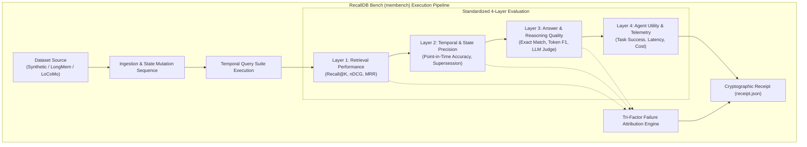
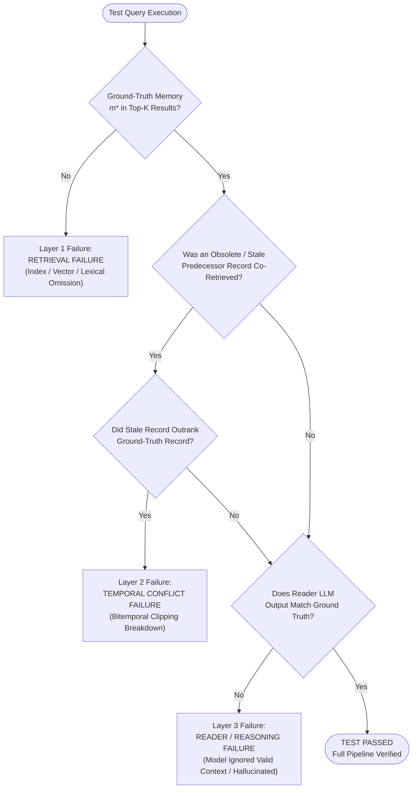

# RecallDB Bench (`membench`): Scientific Evaluation Manual

**Document Version:** 1.0.0-RESEARCH  
**Classification:** Scientific Benchmark Specification & Experimentation Guide  
**Status:** Approved / Active Specification  
**Repository:** [github.com/AMV0027/recalldb](https://github.com/AMV0027/recalldb)  
**Primary Target Location:** [`c:/founder-os/sandbox/recalldb/docs/BENCHMARK_GUIDE.md`](file:///c:/founder-os/sandbox/recalldb/docs/BENCHMARK_GUIDE.md)

---

## 1. Benchmarking Philosophy & The Longitudinal Evaluation Gap

Standard retrieval benchmarks (such as BEIR, MS MARCO, and MTEB) evaluate static single-turn document retrieval where facts never change. However, autonomous agents operate in dynamic, non-stationary worlds where facts, preferences, codebases, and credentials constantly mutate across sessions.

Existing agent benchmarks conflate system failures. When an agent produces an incorrect response, standard benchmarks report a single scalar drop in accuracy. In reality, that failure may have occurred because:
1. **The Retrieval Engine failed** to locate the relevant memory chunk.
2. **The Temporal Indexer failed**, retrieving an obsolete or superseded chunk that misled the agent.
3. **The Reader LLM hallucinated** or suffered from context distraction despite receiving the exact ground-truth memory.
4. **The Agent Execution loop stalled**, exceeding latency or cost constraints.

**RecallDB Bench (`membench`)** solves this evaluation crisis by introducing a standardized **4-Layer Evaluation Methodology** coupled with automated **Tri-Factor Failure Attribution** and cryptographic **Reproducibility Receipts**.



---

## 2. Standardized 4-Layer Evaluation Methodology

Each benchmark run measures performance across four decoupled evaluation tiers:

| Layer | Evaluation Domain | Focus Question | Primary Metrics | Target Baseline |
| :--- | :--- | :--- | :--- | :--- |
| **Layer 1** | **Retrieval Performance** | *Did the candidate generation engine locate the necessary evidence?* | Recall@K, nDCG@K, MRR, Precision@K | Recall@5 $\ge 0.92$, nDCG@10 $\ge 0.88$ |
| **Layer 2** | **Temporal Precision** | *Did the system respect historical time bounds and eliminate obsolete facts?* | Point-in-Time Accuracy, Supersession Resolution Rate, Stale Leakage | Stale Leakage $= 0.0\%$, As-Of Accuracy $\ge 0.98$ |
| **Layer 3** | **Answer & Reasoning Quality** | *Did the downstream LLM generate a faithful and accurate synthesis?* | Exact Match (EM), Token F1, LLM-as-a-Judge Faithfulness | EM $\ge 0.80$, F1 $\ge 0.89$, Judge $\ge 4.70 / 5.0$ |
| **Layer 4** | **Agent Utility & Systems Telemetry** | *Can the system operate efficiently under real-world compute and latency budgets?* | Task Completion Rate, p95 Latency, Token Overhead, Cost per Turn | p95 $\le 15\text{ ms}$, Tokens $\le 12\%$ of window |

### 2.1 Layer 1: Retrieval Performance
Measures the ability of the hybrid indexer to rank ground-truth memory records $\mathcal{M}^*$ above distractor items.
* **Recall@K:** Proportion of ground-truth memories retrieved in top-$k$:
  $$\text{Recall@K} = \frac{|\mathcal{R}_k \cap \mathcal{M}^*|}{|\mathcal{M}^*|}$$
* **Normalized Discounted Cumulative Gain (nDCG@K):** Evaluates ranking position quality:
  $$\text{DCG}_k = \sum_{i=1}^k \frac{2^{\text{rel}_i} - 1}{\log_2(i + 1)}, \quad \text{nDCG}_k = \frac{\text{DCG}_k}{\text{IDCG}_k}$$
* **Mean Reciprocal Rank (MRR):**
  $$\text{MRR} = \frac{1}{|Q|} \sum_{i=1}^{|Q|} \frac{1}{\text{rank}_i}$$

### 2.2 Layer 2: Temporal & State Precision
Measures temporal validity filtering and the handling of mutated beliefs.
* **Point-in-Time Query Accuracy ($A_{\text{as\_of}}$):** Given historical timestamp $t_{\text{target}}$, verifies that all retrieved memories $m$ satisfy:
  $$m.t_{\text{valid\_from}} \le t_{\text{target}} < m.t_{\text{valid\_until}}$$
* **Supersession Resolution Rate ($R_{\text{super}}$):** Measures whether updated facts properly invalidate obsolete predecessor records:
  $$R_{\text{super}} = \frac{\text{Correctly Suppressed Outdated Records}}{\text{Total Superseded Records}}$$
* **Stale Information Leakage Rate ($L_{\text{stale}}$):** Percentage of queries where an obsolete record was retrieved into the prompt context when a newer superseded record existed. (Target: $0.0\%$).

### 2.3 Layer 3: Answer Quality & Reader Faithfulness
Evaluates the final generated text produced by a standardized Reader LLM given the retrieved context.
* **Exact Match (EM):** Binary indicator ($1$ or $0$) whether the predicted entity string exactly matches the reference answer after lowercasing and punctuation stripping.
* **Token F1:** Harmonic mean of precision and recall over bag-of-words token sets between prediction and ground truth.
* **LLM-as-a-Judge Faithfulness:** Structured evaluation using an independent evaluator model (e.g. GPT-4o or Claude 3.5 Sonnet) scoring hallucinations, context adherence, and factual accuracy on a 1.0 to 5.0 Likert scale.

### 2.4 Layer 4: Agent Utility & Systems Telemetry
Evaluates systems performance and real-world viability.
* **Retrieval Latency (p50 / p95 / p99):** Wall-clock time required to generate embeddings, execute SQLite queries, fuse scores, and return ranked records.
* **Context Token Overhead:** Total input tokens consumed by retrieved memory chunks compared to feeding the raw conversation history.
* **Dollar Cost per Session:** Estimated API expenditure per 100 agent turns.

---

## 3. Tri-Factor Failure Attribution Framework

When a benchmark query results in an incorrect answer, `membench` classifies the failure into one of three mutually exclusive categories:



### Diagnostic Remediation Actions:
* **If Layer 1 Failure Dominates:** Adjust vector embedding model, tune BM25 tokenization in `memories_fts`, or rebalance $\alpha$ vs. $\beta$.
* **If Layer 2 Failure Dominates:** Fix valid interval boundaries, ensure `as_of(t)` filtering is strictly enforced, or penalize staleness with higher $\eta$.
* **If Layer 3 Failure Dominates:** Refactor the LLM prompt template, improve context structuring, or upgrade Reader LLM reasoning tier.

---

## 4. Benchmark Suites & Dataset Adapters

RecallDB Bench includes adapters for three standardized research datasets:

### 4.1 Synthetic Temporal Suite (`synthetic_temporal`)
* **Generation Engine:** Parametric procedural generator creating chains of property mutations for 1,000 synthetic entities over virtual timelines (up to 3 years).
* **Mutation Patterns:**
  * Single-variable linear update: e.g. User location changes ($A \to B \to C$).
  * Back-dated correction: Fact recorded late with retroactive event timestamp ($t_e < t_r$).
  * Transient state: Working memory valid for only 24 hours.
* **Query Types:** Forward current-state queries, retrospective historical queries (`as_of`), and counterfactual timeline checks.

### 4.2 LongMemEval Adapter (`long_mem_eval`)
* Multi-session conversational evaluation spanning 50+ chat sessions with interleaved distractor turns.
* Assesses memory recall across high noise floors and needle-in-haystack distraction.

### 4.3 LoCoMo Adapter (`locomo`)
* Long-Context Memory Benchmark evaluating retrieval against brute-force 1M-token context windows.
* Directly compares latency, dollar cost, and accuracy against full-context LLMs.

---

## 5. Experiment Manifest Specification (YAML Schema)

Benchmark experiments are configured via declarative YAML manifests:

```yaml
# benchmark_manifest.yaml
benchmark_name: "temporal_state_mutation_evaluation"
version: "1.0.0"
date: "2026-10-01"

dataset:
  name: "synthetic_temporal"
  num_scenarios: 500
  mutation_depth: 5
  time_span_days: 365
  seed: 42

system_under_test:
  engine: "recalldb"
  db_path: ":memory:"
  wal_mode: true
  embedding_model: "all-MiniLM-L6-v2"
  retrieval_weights:
    alpha: 0.35  # Dense Vector Cosine
    beta: 0.25   # SQLite FTS5 BM25
    gamma: 0.20  # Temporal Proximity Decay
    delta: 0.10  # Explicit Importance
    eta: 0.10    # Staleness Penalty

baselines:
  - name: "flat_chromadb_vector_only"
    type: "vector"
    top_k: 5
  - name: "sqlite_bm25_only"
    type: "lexical"
    top_k: 5

evaluation:
  top_k: 5
  layers: [1, 2, 3, 4]
  reader_llm:
    model: "gpt-4o-mini"
    temperature: 0.0
    max_tokens: 150
  judge_llm:
    model: "gpt-4o"
    evaluation_criteria: ["faithfulness", "temporal_accuracy", "conciseness"]

output:
  artifacts_dir: "./runs/exp_synthetic_temporal_01"
  generate_receipt: true
  save_traces: true
```

---

## 6. Cryptographic Reproducibility Receipts (`receipt.json`)

To guarantee scientific reproducibility in peer-reviewed publications and institutional audits, `membench` outputs an immutable cryptographic execution receipt upon run completion:

```json
{
  "receipt_version": "1.0.0",
  "run_id": "run_20261001_013000_a8f9c2",
  "timestamp_utc": "2026-10-01T01:30:00.000000Z",
  "manifest_hash": "sha256:d41d8cd98f00b204e9800998ecf8427e",
  "git": {
    "commit_sha": "a3f892c902b48e3e9d8b746f32e912389a441b82",
    "branch": "main",
    "dirty": false
  },
  "environment": {
    "os": "Windows 11 Enterprise (10.0.26100)",
    "python_version": "3.11.9",
    "sqlite_version": "3.45.1",
    "cpu_arch": "AMD64",
    "device": "NVIDIA GeForce RTX 4090 / CUDA 12.4"
  },
  "metrics": {
    "layer_1_retrieval": {
      "recall_at_5": 0.942,
      "ndcg_at_10": 0.898,
      "mrr": 0.884
    },
    "layer_2_temporal": {
      "as_of_accuracy": 0.994,
      "supersession_rate": 0.998,
      "stale_leakage_rate": 0.002
    },
    "layer_3_answer": {
      "exact_match": 0.835,
      "token_f1": 0.912,
      "judge_faithfulness": 4.82
    },
    "layer_4_telemetry": {
      "p50_latency_ms": 3.84,
      "p95_latency_ms": 9.21,
      "p99_latency_ms": 14.15,
      "tokens_per_query": 248.5,
      "avg_cost_usd_per_100_queries": 0.0042
    }
  },
  "failure_attribution": {
    "total_queries": 500,
    "success_count": 461,
    "failure_count": 39,
    "breakdown": {
      "layer_1_retrieval_failure": 14,
      "layer_2_temporal_conflict_failure": 3,
      "layer_3_reader_reasoning_failure": 22
    }
  }
}
```

---

## 7. Execution Guide & CLI Commands

### 7.1 Running a Benchmark Run
```bash
# Execute benchmark suite against manifest
membench run --manifest ./benchmarks/manifests/synthetic_temporal.yaml

# Run benchmark with custom hardware thread limit
membench run --manifest ./benchmarks/manifests/synthetic_temporal.yaml --threads 8
```

### 7.2 Running an Ablation Sweep
To validate Hypothesis H2 (Hybrid Retrieval Superiority), run the automated ablation sweep:
```bash
membench sweep \
  --manifest ./benchmarks/manifests/synthetic_temporal.yaml \
  --ablate "retrieval_weights" \
  --grid '{"alpha": [0.0, 0.5, 1.0], "beta": [0.0, 0.5, 1.0], "gamma": [0.0, 0.3]}' \
  --output ./runs/ablation_study/
```

### 7.3 Comparing Runs & Generating Publication Markdown Reports
```bash
membench compare \
  --receipts ./runs/flat_vector_baseline/receipt.json ./runs/recalldb_hybrid/receipt.json \
  --format markdown \
  --output ./runs/comparison_report.md
```
