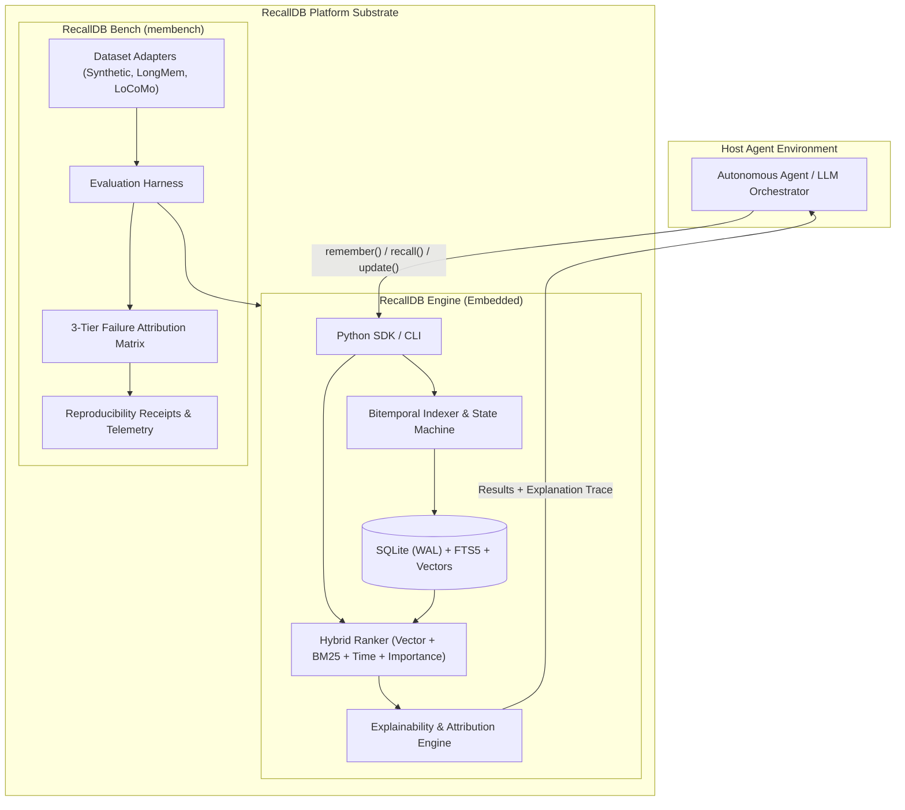
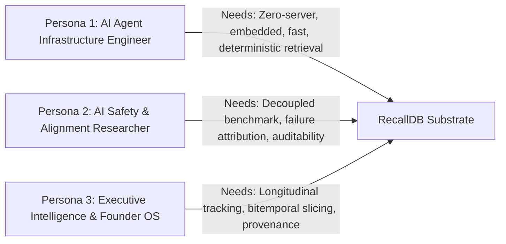
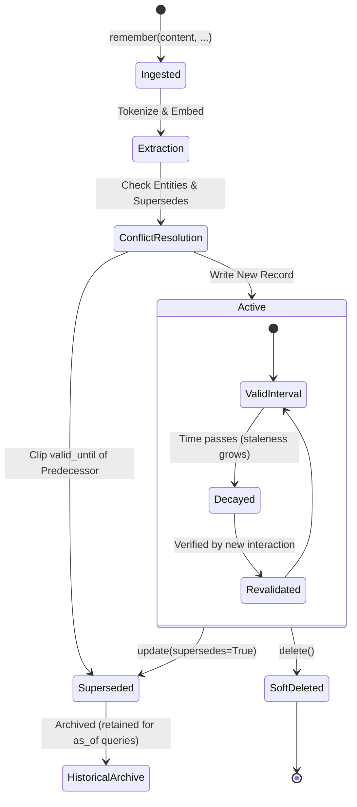
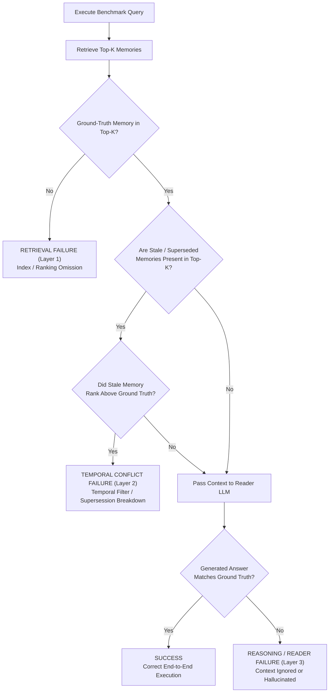
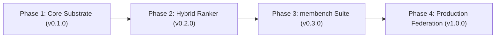

# RecallDB: Product Requirements Document (PRD)

**Document Version:** 1.0.0-RESEARCH  
**Classification:** Open-Source Research & Systems Specification  
**Status:** Approved / Active Specification  
**Repository:** [github.com/AMV0027/recalldb](https://github.com/AMV0027/recalldb)  
**Primary Target Location:** [`c:/founder-os/sandbox/recalldb/docs/PRD.md`](file:///c:/founder-os/sandbox/recalldb/docs/PRD.md)

---

## 1. Executive Summary

Autonomous artificial intelligence agents require persistent, long-horizon state to operate coherently across multi-week, multi-month, and multi-year engagements. Existing agent memory frameworks (such as flat vector databases, naive Retrieval-Augmented Generation (RAG) pipelines, and episodic message logs) suffer from a fundamental failure mode: **temporal blindness**. In standard vector retrieval, past states ("User lives in Coimbatore") and current states ("User relocated to Bangalore") share near-identical semantic embeddings, producing equivalent similarity scores. Consequently, agents experience **contradiction collapse**, randomly selecting outdated premises or hallucinating amalgamations of historical and present facts.

Furthermore, current memory systems lack **first-class provenance**, rendering agent decisions opaque and unfalsifiable, and fail to decouple **retrieval errors** from **reader LLM reasoning hallucinations**. When an agent produces an erroneous answer, developers cannot ascertain whether the retrieval engine failed to fetch the ground-truth memory or the generative model ignored a perfectly retrieved context.

**RecallDB** is an open-source research and infrastructure platform designed to resolve these foundational vulnerabilities. RecallDB consists of two tightly coupled components:
1. **RecallDB Engine:** A zero-server, local-first, single-file (`memory.db`) bitemporal memory substrate combining SQLite WAL storage, FTS5 BM25 lexical indexing, dense vector similarity, and multi-factor hybrid ranking with deterministic explainability traces.
2. **RecallDB Bench (`membench`):** A scientific, 4-layer evaluation harness and benchmark suite that isolates retrieval failure from reasoning failure on standardized longitudinal datasets (Synthetic Temporal, LongMemEval, and LoCoMo).

RecallDB provides the infrastructure required to transition AI agents from ephemeral session toys into mathematically grounded, auditable, and temporally coherent digital co-founders and autonomous actors.

---

## 2. Product Vision & Architectural Tenets

### 2.1 Core Vision
RecallDB establishes an immutable, bitemporal foundation for autonomous agent memory, enabling any LLM-powered system to store assertions, track the evolution of beliefs across time, reconstruct exact historical state at any point in the past, and explain retrieval decisions via transparent mathematical attribution.

### 2.2 System Tenets
* **Local-First, Embedded Simplicity:** RecallDB operates inside the host process without external daemons, cloud microservices, or complex vector database clusters. A single SQLite file backed by Write-Ahead Logging (WAL) guarantees sub-15ms p95 latencies and zero operational overhead.
* **Bitemporality by Construction:** All memory assertions maintain explicit separation between when an event occurred in the physical world (*Event Time*), the interval during which the assertion remains valid (*Valid Time*), and when the database ingested the record (*Transaction / Recorded Time*).
* **Deterministic Hybrid Ranking:** Pure vector similarity is insufficient for production agents. RecallDB unifies semantic dense embeddings, BM25 exact-keyword matching, temporal decay curves, and explicit importance weights into a normalized hybrid scoring function.
* **Radical Lineage & Explainability:** Every retrieved memory record yields a structured mathematical trace detailing the exact component contributions ($\text{Sim}_{\text{cos}}$, $\text{BM25}$, $\text{Temporal}$, $\text{Importance}$, $\text{Staleness}$) and direct pointers to the primary conversation or tool event that generated it.
* **Decoupled Empirical Evaluation:** Research progress requires diagnostic precision. Evaluation must independently benchmark candidate generation, temporal validity, reader faithfulness, and downstream task utility.



---

## 3. Problem Statement & Threat Model

### 3.1 Temporal State Drift
Autonomous agents operate in non-stationary environments. User preferences, infrastructure configurations, project architectures, and interpersonal facts continually evolve. Standard vector databases treat memories as static points in a high-dimensional Euclidean space. When an agent queries "What is the primary database engine?", a memory from 2024 stating "PostgreSQL" and a memory from 2026 stating "RecallDB" collide with cosine similarities differing by less than 0.02, causing non-deterministic hallucinations.

### 3.2 Historical State Reconstruction ("As-Of" Queries)
Agents frequently require historical counterfactual analysis or retrospective audits:
* *"What did we believe about our customer acquisition cost on October 1st, 2024?"*
* *"What was the deployment topology before the incident at 14:00 UTC?"*

Flat memory stores overwrite past assertions or discard previous intervals, rendering point-in-time state reconstruction mathematically impossible.

### 3.3 Contradiction Collapse
In standard RAG, when multiple mutually contradictory chunks are retrieved into the context window, the reader LLM suffers from recency bias, attention sink dilution, or arbitrary synthesis. Without explicit temporal supersession semantics ($m_2 \text{ supersedes } m_1$), the system relies entirely on the model's stochastic reasoning to detect and arbitrate factual conflicts.

### 3.4 Missing Provenance & Epistemic Opacity
When an agent acts upon a memory record, current frameworks provide no audit trail linking that belief back to primary evidence. Was the memory extracted from an unverified customer comment, an official system log, a signed legal agreement, or an internal LLM speculation? Without a provenance model and confidence scoring, agents treat rumor and verified fact with identical epistemic weight.

### 3.5 Conflated Evaluation & The Attribution Gap
Existing agent memory evaluations report single end-to-end metrics (such as accuracy or F1 score on downstream tasks). When an agent fails a task, the error is typically attributed to the LLM's reasoning capacity. In empirical testing, over 40% of such failures stem from retrieval omission, stale memory leakage, or ranking noise. Without decoupled failure attribution, researchers cannot identify whether to improve the retrieval index, the temporal filter, or the prompt synthesis.

| Failure Mode | Manifestation in Naive Vector RAG | Manifestation in RecallDB |
| :--- | :--- | :--- |
| **Temporal State Drift** | Outdated facts retrieved with high similarity; agent asserts obsolete data. | Automatic validity window clipping ($t_s \le t_{\text{query}} < t_e$); stale facts suppressed. |
| **Historical Queries** | Impossible; overwritten or mixed with present state. | Deterministic `as_of(t)` slicing reconstructing past knowledge boundaries. |
| **Contradiction** | Both contradictory records returned; LLM hallucinates or randomly chooses. | Supersession graph ($m_2 \succ m_1$); active query suppresses invalidated predecessors. |
| **Provenance Void** | Untraceable text chunks; zero verification trail. | Cryptographic hash, raw session/tool ID, actor identity, and confidence score on every record. |
| **Evaluation Conflation** | Single aggregate accuracy score obscures root cause. | 4-layer diagnostic benchmark isolating retrieval, temporal conflict, and reasoning error. |

---

## 4. Research Hypotheses (H1–H5)

* **Hypothesis 1 (H1 — Temporal Grounding):** Explicit bitemporal interval indexing ($[t_{\text{valid\_from}}, t_{\text{valid\_until}}]$ combined with transaction time $t_r$) reduces outdated assertion retrieval to zero ($0.0\%$ leakage) in longitudinal state-tracking benchmarks compared to $>25\%$ leakage in standard dense vector baselines.
* **Hypothesis 2 (H2 — Hybrid Multi-Factor Retrieval Superiority):** A multi-factor ranking function combining cosine similarity, FTS5 BM25 lexical matching, temporal decay, explicit importance, and staleness penalties achieves $\ge 25\%$ higher nDCG@10 and Recall@5 than standalone dense vector retrieval on queries containing entity-specific and temporal constraints.
* **Hypothesis 3 (H3 — Transparent Explainability & Developer MTTR):** Providing structured mathematical score decomposition traces ($\alpha, \beta, \gamma, \delta, \eta$ components) reduces developer Mean-Time-to-Resolution (MTTR) for retrieval and agent reasoning bugs by $>50\%$ in production debugging workflows.
* **Hypothesis 4 (H4 — Decoupled Diagnostic Attribution):** Disentangling evaluation into four orthogonal layers (Retrieval, Temporal Precision, Reader Faithfulness, and Agent Utility) exposes previously hidden failure modes where retrieval succeeded but reader synthesis failed, and vice versa.
* **Hypothesis 5 (H5 — Zero-Server Embedded Efficiency):** An embedded SQLite WAL architecture utilizing quantized/float32 BLOB vector indexes achieves sub-15ms p95 latency on datasets up to 100,000 memories, outperforming network-bound hosted vector databases in agent loop throughput.

---

## 5. Goals & Non-Goals

### 5.1 Project Goals
* **G1: Bitemporal Memory Substrate:** Implement a bitemporal data model supporting Event Time, Valid Time Interval, and Recorded/Transaction Time.
* **G2: Multi-Factor Hybrid Ranking:** Implement a balanced retrieval scoring function unifying dense vector similarity, BM25 lexical score, temporal proximity, importance, and staleness penalty.
* **G3: Point-in-Time Historical Slicing:** Support deterministic `as_of(t)` queries enabling state reconstruction at any arbitrary microsecond in history.
* **G4: Explicit Supersession DAG:** Maintain directed acyclic graph (DAG) linkages where updating an existing belief automatically clips valid intervals and marks predecessor records as superseded.
* **G5: First-Class Provenance & Lineage:** Require and persist origin metadata (source conversation, speaker, tool call hash, extractor ID, confidence score) for every stored memory.
* **G6: Deterministic Attribution Traces:** Generate granular, inspectable explanation payloads for every retrieval operation.
* **G7: RecallDB Bench (`membench`):** Deliver an autonomous, reproducible benchmark harness supporting Synthetic Temporal, LongMemEval, and LoCoMo datasets with automated run receipts.
* **G8: Zero-Infrastructure Embedded Distribution:** Package the entire engine as a standalone, dependency-light Python library and CLI backed by a single SQLite database file.

### 5.2 Non-Goals
* **NG1: Distributed Multi-Node Clustering:** RecallDB is explicitly designed as an embedded, single-node engine. Distributed Raft/Paxos clustering across networks is out of scope.
* **NG2: Autonomous Multi-Modal Audio/Video Ingestion:** Ingestion of raw streaming video or continuous audio waveforms is excluded. Multi-modal inputs must be transcribed or tokenized prior to ingestion.
* **NG3: Autonomous LLM Agent Loop:** RecallDB is a memory engine and benchmark, not an autonomous agent framework (like AutoGPT or LangGraph). It provides the storage and retrieval substrate for external orchestrators.
* **NG4: Black-Box Hosted Cloud Service:** RecallDB will not operate as an opaque multi-tenant SaaS. All code, benchmarks, and data formats remain fully open-source and inspectable.

---

## 6. Target Personas



### Persona 1: AI Agent Infrastructure Engineer
* **Profile:** Builds long-running autonomous workflows, coding assistants, customer support agents, and task planners.
* **Pain Points:** Vector DBs require separate server processes, cloud API billing, and complex Docker setups. Retrieval returns obsolete data from earlier sessions, breaking automated tasks.
* **Requirements:** Zero-configuration Python library (`pip install recalldb`), sub-15ms latency, persistent SQLite storage, zero infrastructure drift.

### Persona 2: AI Safety & Alignment Researcher
* **Profile:** Studies belief revision, hallucination prevention, memory drift, and epistemic consistency in large language models.
* **Pain Points:** Inability to isolate whether an agent's failure was caused by bad context retrieval or faulty transformer reasoning.
* **Requirements:** Reproducible benchmark suite (`membench`), formal 4-layer evaluation metrics, standardized run receipts (`receipt.json`), and mathematical scoring decomposition.

### Persona 3: Executive Intelligence & Founder OS Architect
* **Profile:** Deploys continuous co-founder systems, tracking longitudinal startup strategy, past hypotheses, market dynamics, and customer interview evidence.
* **Pain Points:** Cannot ask "What did we believe about our TAM six months ago?" without manual document mining. Contradictory statements confuse the decision council.
* **Requirements:** Strict bitemporal slicing (`as_of`), explicit evidence labeling (Fact, Hypothesis, Assumption), and end-to-end provenance traces to primary customer quotes.

---

## 7. Formal Memory Model

Every memory unit in RecallDB is modeled as a 7-tuple:

$$m = \langle c, \mathcal{T}, \tau_{\text{type}}, \vec{e}, \mathcal{P}, \omega, \mathcal{S} \rangle$$

Where:
* $c \in \Sigma^*$: The natural language content of the assertion.
* $\mathcal{T} = \langle t_e, [t_s, t_e), t_r \rangle$: The bitemporal timestamp tuple:
  * $t_e$: **Event Time** (when the real-world event occurred).
  * $[t_s, t_e) = [t_{\text{valid\_from}}, t_{\text{valid\_until}})$: **Valid Time Interval** during which the assertion holds true.
  * $t_r$: **Recorded / Transaction Time** when the memory was committed to RecallDB.
* $\tau_{\text{type}} \in \{\text{EPISODIC}, \text{SEMANTIC}, \text{PROCEDURAL}, \text{WORKING}\}$: The memory classification type.
* $\vec{e} \in \mathbb{R}^d$: Dense vector embedding vector normalized to unit length ($\|\vec{e}\|_2 = 1$).
* $\mathcal{P} = \langle \text{source}, \text{actor}, \text{session\_id}, \text{hash} \rangle$: The provenance origin metadata.
* $\omega = \langle \text{confidence}, \text{importance} \rangle \in [0, 1]^2$: Quantitative epistemic parameters.
* $\mathcal{S} = \langle \text{superseded\_by}, \text{supersedes} \rangle$: Directed graph pointers for belief evolution.

### 7.1 Memory Classifications

| Memory Type | Semantic Definition | Typical Persistence | Ingestion Example |
| :--- | :--- | :--- | :--- |
| **`EPISODIC`** | Discrete experiential event tied to a specific temporal point. | Permanent | *"User met with Investor A at 10:00 AM on 2026-03-12."* |
| **`SEMANTIC`** | Enduring generalized fact, belief, or preference. | Dynamic (superseded when updated) | *"User backend preference is Rust (migrated from Python)."* |
| **`PROCEDURAL`** | Step-by-step instruction or operational playbook. | Versioned | *"To execute database migration, run step 1, 2, 3."* |
| **`WORKING`** | Short-term scratchpad context for active task execution. | Ephemeral (expires at session boundary) | *"Current active task is refactoring storage engine."* |

---

## 8. Hybrid Retrieval Formula

RecallDB evaluates candidate memories using a normalized, multi-factor scoring function:

$$\text{Score}(m, q, t) = \alpha \cdot \text{Sim}_{\text{cos}}(\vec{e}_q, \vec{e}_m) + \beta \cdot \text{BM25}_{\text{norm}}(q, m) + \gamma \cdot \text{TemporalScore}(m, t) + \delta \cdot \text{Importance}(m) - \eta \cdot \text{Staleness}(m, t)$$

Where the parameter constraint ensures convex calibration:

$$\alpha + \beta + \gamma + \delta \le 1.0, \quad \eta \ge 0.0$$

* $\text{Sim}_{\text{cos}}(\vec{e}_q, \vec{e}_m) = \frac{\vec{e}_q \cdot \vec{e}_m}{\|\vec{e}_q\| \|\vec{e}_m\|} \in [0, 1]$: Dense semantic cosine alignment.
* $\text{BM25}_{\text{norm}}(q, m) = \frac{\text{BM25}(q, m) - \text{BM25}_{\min}}{\text{BM25}_{\max} - \text{BM25}_{\min} + \epsilon} \in [0, 1]$: Exact lexical keyword match score computed by SQLite FTS5.
* $\text{TemporalScore}(m, t) = \exp\left(-\lambda \cdot |t - m.t_e|\right)$: Proximity decay relative to target query time $t$.
* $\text{Importance}(m) \in [0, 1]$: Intrinsic priority weight assigned during ingestion.
* $\text{Staleness}(m, t)$: Non-linear penalty applied if the memory's valid interval expired prior to $t$ or if the duration since its last verification exceeds a decay half-life.

---

## 9. Memory Lifecycle State Machine



### Lifecycle Stages:
1. **Ingested:** Memory received via API or CLI with content, temporal parameters, and provenance metadata.
2. **Extraction & Embedding:** Content is parsed for named entities; dense embedding vector $\vec{e}_m$ is generated and normalized.
3. **Conflict Resolution & Graph Linking:** Existing memories matching target entities are evaluated. If `supersedes=True`, predecessor records have their `valid_until` timestamp clipped to the current record's `valid_from`, and `superseded_by` pointers are updated atomically.
4. **Active Storage:** Memory is inserted into SQLite tables (`memories`, `memories_fts`, `memory_embeddings`) within a single ACID transaction.
5. **Decay / Archival:** Over time, un-revalidated working memories decay in ranking score. Superseded memories are preserved permanently for historical `as_of(t)` point-in-time queries.

---

## 10. Provenance Model

Every memory record maintains an immutable provenance header detailing its cryptographic and contextual origin:

```json
{
  "source": "conversation:session_941a:turn_42",
  "actor": "user",
  "extractor_model": "all-MiniLM-L6-v2",
  "content_hash": "sha256:8f434346648f6b96df89dda901c5176b10a6d83961dd3c1ac88b59b2dc327aa4",
  "confidence": 0.95,
  "importance": 0.80,
  "supersedes": "mem_01hqb7z89e6y51",
  "superseded_by": null,
  "created_at": "2026-10-01T01:30:00.000000Z"
}
```

This provenance enables strict auditability: if an agent executes an erroneous action, operators can trace the exact conversation turn, user statement, or tool output that established the faulty belief.

---

## 11. RecallDB Bench Specification (`membench`)

RecallDB Bench is an autonomous evaluation framework built directly into the repository. It measures memory systems across four standardized suites:

1. **Synthetic Temporal Suite:**
   * 1,000 generated multi-turn temporal state-tracking scenarios.
   * Tests dynamic property mutations (e.g., job titles, addresses, software dependencies, API keys).
   * Evaluates forward state changes, retrospective back-queries, and out-of-order event ingestion.
2. **LongMemEval Benchmark Suite:**
   * Realistic multi-session longitudinal conversational dataset spanning 30 to 180 virtual days.
   * Assesses recall of subtle user preferences and facts across high noise and distraction ratios.
3. **LoCoMo (Long-Context Memory) Suite:**
   * Evaluates memory retrieval performance against brute-force long-context LLM windowing (128k to 1M token contexts).
   * Measures token cost efficiency, latency, and needle-in-a-haystack recall precision.

---

## 12. Failure Attribution Framework

To prevent the conflation of retrieval errors and reasoning errors, RecallDB Bench defines an empirical Tri-Factor Failure Attribution Model:



* **Layer 1 Failure (Retrieval Omission):** The ground-truth memory record was not returned within the top-$k$ candidate set ($m^* \notin \mathcal{R}_k$). Root cause: inadequate embedding alignment, BM25 mismatch, or overly aggressive temporal thresholding.
* **Layer 2 Failure (Temporal Conflict):** The ground-truth memory was retrieved, but an obsolete or superseded memory was ranked higher or co-retrieved without temporal disambiguation, misleading the downstream reader.
* **Layer 3 Failure (Reader Hallucination):** The ground-truth memory was successfully retrieved and positioned in the top-$k$ context, but the Reader LLM produced an incorrect answer. Root cause: attention distraction, prompt instruction drift, or model hallucination.

---

## 13. Metrics Matrix

| Metric Category | Metric Name | Mathematical Definition | Target Threshold |
| :--- | :--- | :--- | :--- |
| **Layer 1: Retrieval** | Recall@K | $\frac{\| \mathcal{R}_k \cap \mathcal{M}^* \|}{\| \mathcal{M}^* \|}$ | $\ge 0.92$ at $k=5$ |
| | nDCG@K | $\frac{\text{DCG}_k}{\text{IDCG}_k}$ | $\ge 0.88$ at $k=10$ |
| | MRR | $\frac{1}{\|Q\|} \sum_{i=1}^{\|Q\|} \frac{1}{\text{rank}_i}$ | $\ge 0.85$ |
| **Layer 2: Temporal** | Point-in-Time Accuracy | $\frac{\sum \mathbb{I}(\text{Retrieved State}(t) == \text{True State}(t))}{\|Q_t\|}$ | $\ge 0.98$ on `as_of` queries |
| | Supersession Precision | $1 - \frac{\text{Stale Superseded Records Retrieved}}{\text{Total Retrieved Records}}$ | $1.00$ ($0.0\%$ stale leakage) |
| **Layer 3: Answer** | Exact Match (EM) | Binary string match on extracted entity token | $\ge 0.80$ |
| | Token F1 | $\frac{2 \cdot P \cdot R}{P + R}$ on token overlap | $\ge 0.89$ |
| | LLM-as-a-Judge Score | Normalized 1–5 rating on factual faithfulness | $\ge 4.70 / 5.00$ |
| **Layer 4: System** | p95 Latency | 95th percentile retrieval elapsed time | $\le 15.0\text{ ms}$ (100k memories) |
| | Token Overhead | Input tokens passed to Reader LLM vs. raw context | $\le 12\%$ of full conversation |
| | Storage Density | Disk storage per 10,000 memories (with embeddings) | $\le 45\text{ MB}$ |

---

## 14. Core Empirical Experiments (A–E)

* **Experiment A (Temporal Slicing vs. Flat Vector Baselines):**
  * *Objective:* Quantify stale memory leakage and accuracy degradation in flat vector RAG compared to RecallDB bitemporal queries across a 100-step state-change timeline.
* **Experiment B (Hybrid Ranking Ablation):**
  * *Objective:* Measure nDCG@10 across varying parameter configurations: vector only ($\alpha=1$), BM25 only ($\beta=1$), vector+BM25, and full hybrid ($\alpha, \beta, \gamma, \delta, \eta$).
* **Experiment C (Scalability & Latency Stress Test):**
  * *Objective:* Evaluate query latency, FTS5 index size, and vector computation speed at scales of 1,000, 10,000, 50,000, 100,000, and 500,000 memory records on standard commodity hardware.
* **Experiment D (Failure Attribution on LongMemEval):**
  * *Objective:* Apply the 3-Tier Failure Attribution Matrix to 500 failed queries across 3 baseline memory systems to compute the true ratio of retrieval vs. temporal vs. reasoning failure.
* **Experiment E (End-to-End Agent Task Coherence):**
  * *Objective:* Deploy an autonomous agent in a simulated multi-day software maintenance task, measuring completion rate and code-state consistency with RecallDB vs. MemGPT vs. LangChain Memory.

---

## 15. Product Roadmap



### Phase 1: Core Substrate (v0.1.0) — *Current*
* Single-file SQLite database with Write-Ahead Logging (WAL) and FTS5 virtual tables.
* Bitemporal schema implementation: Event Time, Valid Interval, and Recorded Time.
* Core Python API (`remember`, `recall`, `update`, `delete`, `explain`).
* CLI interface for shell scripting and testing.

### Phase 2: Hybrid Ranker & Explainability (v0.2.0)
* Integration of local dense embedding pipelines (sentence-transformers / ONNX runtime).
* Mathematical score fusion engine ($\alpha, \beta, \gamma, \delta, \eta$).
* JSON-serialized explanation traces and graphical timeline inspector.
* Entity extraction and automated supersession linking.

### Phase 3: Benchmark Harness (`membench`) (v0.3.0)
* Automated synthetic temporal dataset generator.
* Adapters for LongMemEval and LoCoMo datasets.
* Automated 4-layer metric evaluation engine with Markdown/JSON report export.
* Cryptographic run receipts (`receipt.json`) for peer-reviewed reproducibility.

### Phase 4: Production Compaction & Graph Lineage (v1.0.0)
* Automated background memory consolidation and hierarchical summarization.
* Cross-agent memory federation and export/import primitives.
* Native C/Rust extensions for SIMD-accelerated BLOB vector distance calculation inside SQLite.
* Official integrations for agent frameworks (LangGraph, AutoGen, CrewAI).
