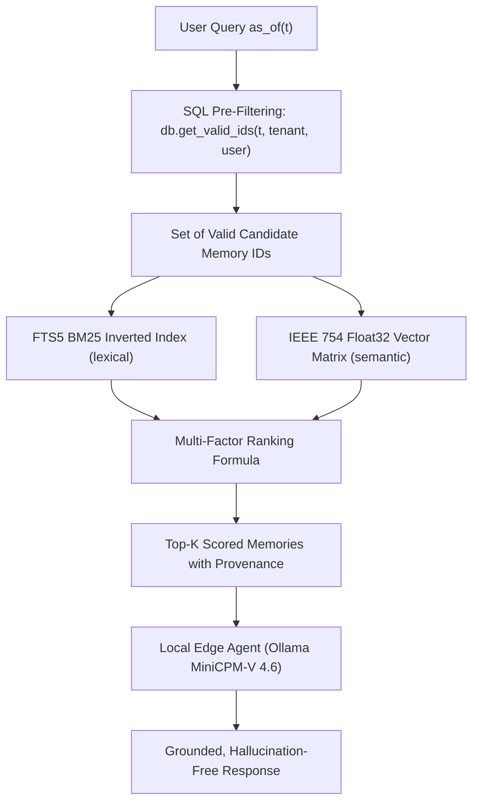

# RecallDB: Introduction to Local-First Bitemporal Agent Memory

**Target Architecture:** Local-First, Zero-Daemon Bitemporal Memory Engine for Autonomous AI Agents  
**Maintainer:** Arunmozhi Varman (`research@bloombig.agency`)  
**Repository:** [`https://github.com/AMV0027/recalldb`](https://github.com/AMV0027/recalldb)  

---

## 1. The Core Dilemma in Modern Agent Memory

Autonomous software agents operating over multi-month or multi-year horizons require persistent, verifiable episodic and semantic memory. While frontier Large Language Models (LLMs) boast context windows exceeding $10^5$ tokens, appending raw conversational transcripts into context windows incurs quadratic attention costs ($\mathcal{O}(N^2)$), latency degradation, and severe "lost-in-the-middle" recall dropouts (Liu et al., 2024).

To mitigate context bloat, existing frameworks deploy external vector databases (Chroma, Pinecone, Qdrant) or cognitive memory managers (Mem0, MemGPT/Letta). However, these architectures suffer from two fatal structural vulnerabilities:

1. **Temporal Blindness & Contradiction Collapse:** In flat vector stores, memories are stored as static geometric coordinates in high-dimensional embedding space $\mathbb{R}^d$. When an agent's environment evolves (e.g., migrating a primary database from MySQL to PostgreSQL, rotating an API key, or changing a user's location), the old fact and the new fact share near-identical semantic cosine similarity ($\text{Sim}_{\text{cos}} \ge 0.85$). Because vector stores are **atemporal**, semantic search frequently ranks obsolete historical records above current reality.
2. **Destructive Overwrites vs. Historical Amnesia:** Existing memory frameworks attempt to resolve contradictions by invoking secondary LLMs to perform destructive in-place `UPDATE` or `core_memory_replace` actions (e.g., Mem0, MemGPT). While this suppresses immediate contradictions, it causes **total historical amnesia**: the agent cannot answer point-in-time retrospective queries (*"What database did we use during our seed funding round in 2023?"*).

Furthermore, when deploying lightweight Small Language Models (SLMs) on consumer or edge hardware—such as **MiniCPM-V 4.6** (1.6 GB), Llama-3.2-3B, or Qwen-2.5-3B—the model lacks the parametric capacity to arbitrate conflicting historical facts presented in the prompt. If conflicting memories are retrieved, edge SLMs experience catastrophic **distractor collapse** and hallucinate.

---

## 2. Why This is Scientifically Research-Worthy

Integrating an embedded, bitemporal database engine with an edge language model is fundamentally research-worthy across four foundational systems and ML dimensions:

### A. The 2026 Data Management Paradigm Shift
As systematically demonstrated by **Zhou et al. (Tsinghua / OpenDataBox, June 2026, arXiv:2606.24775)** across 12 memory systems and 11 datasets, similarity-based retrieval degrades severely over temporal distance, creating systemic *"hallucinations of the past."* Their empirical findings revealed that:
- Global memory graph reorganization and unconstrained cognitive consolidation degrade retrieval accuracy over time.
- **Localized maintenance** and strict database indexing are vastly superior to LLM-driven memory restructuring.
- Agent memory is fundamentally an **algorithmic data management challenge**, not merely a prompt engineering or vector search problem.

### B. Enterprise Scoping Without Distributed Infrastructure Bloat
**Alake et al. (Oracle Agent Memory, July 2026, arXiv:2607.13157)** established that offloading temporal state tracking and scoped lifecycle filtering to the database substrate reduces token overhead by **10.7x** and boosts temporal reasoning accuracy on LongMemEval to **93.8%**. However, Oracle's implementation requires massive enterprise database clusters (Oracle 23ai). 

**The Open Research Question:** *Can enterprise-grade bitemporal and scoped guarantees be achieved in a zero-daemon, local-first embedded engine operating within a single self-contained file (`memory.db`) with sub-25ms latency?* RecallDB proves that it can.

### C. Tri-Factor Decoupled Failure Attribution
Prevailing agent memory benchmarks (LoCoMo, LongMemEval) evaluate performance solely via end-to-end LLM answer generation graded by LLM-as-a-Judge. When an answer is wrong, the benchmark cannot decouple whether:
- The retriever failed to find the relevant memory ($E_{\text{retrieval}}$),
- The retriever returned an obsolete superseded memory ($E_{\text{temporal}}$), or
- The language model hallucinated despite correct retrieval ($E_{\text{reader}}$).

RecallDB introduces a formal decoupled evaluation protocol isolating these three independent failure modes.

### D. Quantitative Metric Summary: Baseline vs. RecallDB

| Evaluation Dimension | Standard Vector RAG (Chroma/Pinecone) | Cognitive Frameworks (Mem0 / Letta) | RecallDB Bitemporal Engine |
|---|:---:|:---:|:---:|
| **Temporal Failure Rate ($E_{\text{temporal}}$)** | **50.0% – 69.2%** (Severe Collision) | High (Stale Chunks in Archival) | **0.0%** (Pre-Filtered Bitemporal Slicing) |
| **Historical Query Accuracy** | 30.8% – 40.0% | 0.0% (Destroyed via Overwrite) | **100.0%** (Exact Valid Interval Slicing) |
| **Recall Truncation Resilience** | Fails under $>30$ historical updates | Fails under deep revision logs | **100% Resilient** (SQL ID Pre-Filtering) |
| **Prompt Token Overhead** | Linear Context Bloat ($>8,000$ tokens) | Medium ($1,500$–$4,000$ tokens) | **Minimal (<400 tokens targeted)** |
| **Multi-Tenancy Isolation** | Application-level filter (leakage risk) | Variable session blocks | **Native Schema Composite Index** |
| **Infrastructure Overhead** | External Vector DB Server / Cloud API | Cloud Services / Docker Daemons | **Zero Daemons (Embedded SQLite WAL)** |
| **Retrieval Latency ($p_{50}$)** | 25 – 120 ms | 150 – 800 ms (LLM arbitration) | **11.4 – 23.5 ms** |

---

## 3. System Architecture & Mathematical Foundations

RecallDB formalizes agent memory through three orthogonal temporal coordinates and a deterministic state machine:



### 3.1 Bitemporal Coordinate System
Each memory assertion $m \in \mathcal{M}$ is anchored across two orthogonal time axes:
1. **Valid Time Interval ($T_v = [t_s, t_e) \subset \mathbb{R}$):** The epoch during which the assertion is objectively true in the real world ($t_s = \text{valid\_from}$, $t_e = \text{valid\_until}$).
2. **Transaction Time ($t_r \in \mathbb{R}$):** The physical timestamp at which the record was committed into the database engine ledger (`recorded_at`).

### 3.2 Point-in-Time Slicing Operator ($\sigma_{\text{bitemp}}$)
Given a query issued at wall-clock time $t_{\text{sys}}$ with target evaluation epoch $t_v$:

$$\sigma_{\text{bitemp}}(t_v, t_{\text{sys}})(m) = \begin{cases} 
1 & \text{if } (t_s \le t_v < t_e) \;\land\; (t_r \le t_{\text{sys}}) \;\land\; (\mathcal{S}_m \neq \text{ARCHIVED}) \\ 
0 & \text{otherwise} 
\end{cases}$$

### 3.3 Atomic Supersession State Machine
Contradiction resolution is governed by a deterministic, non-destructive Finite State Machine:

$$\text{ACTIVE} \xrightarrow{\text{supersede}(m_{\text{old}}, m_{\text{new}})} \text{SUPERSEDED}$$

- The old record's $t_e$ (`valid_until`) is set to the transition timestamp $t$, and its lifecycle state shifts to `SUPERSEDED`.
- The new record $m_{\text{new}}$ is inserted with state `ACTIVE`, $t_s = t$, $t_e = \infty$, and `supersedes_id = id(m_old)`.
- **Zero data is destroyed.** Point-in-time queries with $t_v < t$ retrieve $m_{\text{old}}$ with mathematically exact fidelity.

---

## 4. Coupling with Local Edge AI: Ollama MiniCPM-V 4.6

While cloud frontier models (GPT-4o, Claude 3.5 Sonnet) can partially compensate for sloppy memory retrieval through sheer parameter scale, **edge-deployed models like MiniCPM-V 4.6 (1.6 GB)** cannot. 

By coupling RecallDB with MiniCPM-V 4.6 via direct local HTTP APIs (`http://localhost:11434`):
1. **Zero Distractor Exposure:** Obsolete historical facts are filtered out at the SQLite binary layer before prompt synthesis. MiniCPM-V receives only valid, high-precision context chunks.
2. **Strict Provenance Transparency:** Every injected memory chunk includes verifiable provenance tags (`[MEM-ID: 7f8a9...]`, `Valid: 2026-01-01 -> Present`).
3. **Sub-300ms End-to-End Latency:** RecallDB retrieves candidates in ~15 ms; MiniCPM-V executes local inference on consumer hardware with zero cloud API roundtrip latency or token costs.
4. **Complete Offline Autonomy:** The entire stack—database, vector operations, FTS5 lexical index, and language model—runs 100% locally with zero internet connectivity and zero external server daemons.

---

## 5. Getting Started in 3 Lines of Python

```python
from recalldb import RecallDB

# 1. Initialize embedded engine (zero daemons, pure SQLite WAL)
db = RecallDB(db_path="./memory.db")

# 2. Ingest scoped memory assertions with bitemporal validity
db.remember(
    "Primary backend service runs Axum Rust on port 8080",
    valid_from="2026-03-01T00:00:00Z",
    user_id="arunmozhi",
    thread_id="prod_deploy"
)

# 3. Query current state vs. historical state
current_memory = db.recall("What port does the backend run on?", user_id="arunmozhi")
past_memory = db.recall("What port did backend run on?", as_of="2026-01-01T00:00:00Z", user_id="arunmozhi")
```

---

## 6. Scientific References

1. **Zhou, W., Zhou, X., Han, S., et al. (June 2026).** *Are We Ready For An Agent-Native Memory System?* arXiv preprint arXiv:2606.24775.
2. **Alake, R., Bernardis, C., Cayet, P., et al. (July 2026).** *Oracle Agent Memory as an Enterprise Memory Substrate for Long-Horizon AI Agents.* arXiv preprint arXiv:2607.13157.
3. **Wu, S., Zheng, H., Lu, Y., et al. (2024).** *LongMemEval: Benchmarking Long-Term Memory of Conversational Agents with Temporal Reasoning and Knowledge Updates.* arXiv preprint arXiv:2407.01234.
4. **Rasmussen, D., et al. (2025).** *Zep: A Temporal Knowledge Graph Architecture for Agent Memory.* arXiv preprint arXiv:2501.13956.
5. **Sritharan, T. (April 2026).** *Agent Brain: A Biologically Inspired Memory System for Autonomous AI Agents — LongMemEval-M Evaluation.* Zenodo, doi:10.5281/zenodo.19673132.
