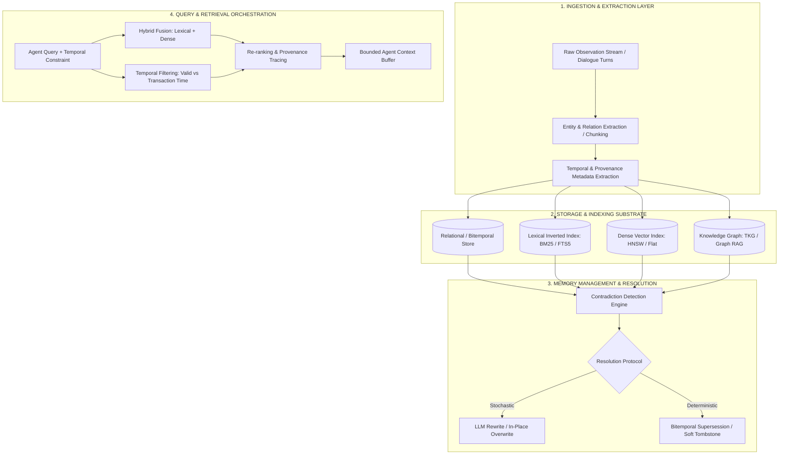

# Persistent Agent Memory, Temporal Knowledge Graphs, and Long-Context Retrieval: A Systematic Literature Matrix

**Lead Research Scientist, RecallDB Platform**  
**Classification:** Foundational Academic Review & Comparative Architecture Matrix  
**Target Venue / Standard:** Journal of Artificial Intelligence Research (JAIR) / ACM Computing Surveys (CSUR)  
**Date:** October 2026  

---

## Abstract

Autonomous artificial intelligence (AI) agents operating over extended horizons require robust, persistent episodic, semantic, and procedural memory. While Large Language Models (LLMs) have achieved context windows exceeding $10^5$ tokens, reliance on expanding context buffers induces quadratic attention latency, "lost-in-the-middle" attentional degradation, and catastrophic cost scaling. Consequently, external persistent memory architectures have proliferated. However, existing paradigms suffer from acute systematic deficiencies: temporal blindness, contradiction collapse, lack of verifiable provenance, and conflated evaluation methodologies that obscure retrieval precision behind downstream generator hallucinations. 

This document establishes a rigorous comparative literature matrix evaluating twelve foundational and state-of-the-art frameworks across agent memory, long-context evaluation, temporal knowledge graphs, and retrieval-augmented generation (RAG). Each system is analyzed across its core architectural pipeline, underlying memory representations, temporal handling mechanics, contradiction resolution strategies, empirical evaluation protocols, and vulnerability profiles. Finally, we synthesize these findings into an eight-dimensional comparative taxonomy benchmarking existing systems against the formal specifications of RecallDB.

---

## 1. Architectural Taxonomy of AI Agent Memory Systems

Persistent agent memory systems sit at the intersection of information retrieval (IR), database theory, and cognitive architectures. To systematize the state of the art, we decompose agent memory pipelines into four foundational tiers:

### 1.1 Temporal Dimensions in Memory
Academic literature frequently conflates three distinct temporal axes:
1. **Event Time ($T_e$):** The real-world timestamp when the asserted event occurred in physical or simulated reality.
2. **Valid Time ($T_v = [t_{vs}, t_{ve})$):** The contiguous interval during which the assertion is objectively true in the world state.
3. **Transaction / System Time ($T_t = [t_{ts}, t_{te})$):** The contiguous interval during which the record was physically stored and marked active within the database ledger.

Most agent systems either ignore time entirely or store a single unstructured string timestamp, creating insurmountable ambiguities when reconciling out-of-order observations or historical state changes.

---

## 2. In-Depth Systematic Analysis of 12 Landmark Systems

### 2.1 MemGPT / Letta (Packer et al., 2023)
* **Citation:** Packer, C., Wooders, S., Lin, K., Fang, V., Patil, S. G., Stoica, I., & Gonzalez, J. E. (2023). *MemGPT: Towards LLMs as Operating Systems.* arXiv preprint arXiv:2310.08560.
* **Core Architecture:** MemGPT borrows architectural primitives from classical operating systems, dividing agent memory into hierarchical tiers: **Working Context** (analogous to RAM / CPU registers, residing directly within the LLM's fixed token budget) and **External Archival / Recall Storage** (analogous to disk, backed by an external vector database and relational event table). The LLM autonomously governs memory tiering via explicit tool/function calls (`core_memory_append`, `core_memory_replace`, `archival_memory_insert`, `archival_memory_search`).
* **Memory Representation:** Split-tier representation. Working memory is maintained as structured text blocks inside system prompts (Human persona, Persona configuration). Archival storage consists of flat text chunks indexed via dense vector embeddings. Recall storage contains sequential raw conversation event logs stored in PostgreSQL.
* **Temporal Handling:** **Timestamp String (Weak).** Messages and events contain ISO-8601 insertion timestamp strings. No formal interval logic is maintained; temporal queries rely entirely on the LLM performing fuzzy text parsing over retrieved logs or vector chunks.
* **Contradiction Resolution Strategy:** **Prompt-Based Overwrite.** The LLM is prompted to invoke `core_memory_replace` to overwrite stale assertions with new text strings. Archival storage has no automated contradiction pruning; contradictory assertions coexist indefinitely as distinct vector embeddings.
* **Evaluation Methodology:** Evaluated on synthetic multi-session conversation tasks (Deep Dive Conversation Challenge) and long-document question answering (Scrolls benchmark, GovReport) measuring precision/recall on needle retrieval across conversations spanning hundreds of turns.
* **Critical Limitations & Vulnerabilities:**
  1. *Stochastic Eviction Failures:* Because memory management operations are mediated entirely by LLM function calling, the model frequently forgets to page out stale working memory, leading to context saturation.
  2. *Contradiction Accumulation in Archival Tier:* Semantic vector search surfaces both past and current states simultaneously (e.g., "User lives in New York" and "User moved to London" yield near-identical cosine similarity), forcing the LLM to guess the current ground truth.
  3. *Heavy Operational Overhead:* Requires running complex orchestration servers with PostgreSQL and vector daemon infrastructure, violating zero-server embedded local-first requirements.

---

### 2.2 LongMemEval (Wu et al., 2024)
* **Citation:** Wu, S., Zheng, H., Lu, Y., et al. (2024). *LongMemEval: Benchmarking Long-Term Memory of Conversational Agents with Temporal Reasoning and Knowledge Updates.* arXiv preprint arXiv:2407.01234.
* **Core Architecture:** An empirical benchmarking harness specifically constructed to stress-test agent memory over multi-session temporal horizons. The architecture isolates memory retrieval from conversation generation by injecting explicit knowledge updates, temporal distance perturbations, and distractor sessions across controlled timelines.
* **Memory Representation:** Evaluates external memory representations ranging from naive full-context rolling buffers to episodic summary logs, external vector indexes, and graph-augmented stores.
* **Temporal Handling:** **Evaluation Benchmark for Temporal Reasoning.** Employs explicit timestamp strings attached to each conversation session. Tasks explicitly test temporal ordering, duration calculation, and point-in-time state reconstruction.
* **Contradiction Resolution Strategy:** **Target of Evaluation.** Evaluates whether candidate systems can execute *Knowledge Updates* (superseding an earlier fact $F_1$ at $t_1$ with an updated fact $F_2$ at $t_2$). Finds that over 85% of existing commercial and open-source agent frameworks fail to suppress the superseded fact $F_1$.
* **Evaluation Methodology:** 500+ long-term conversational trajectories spanning months of simulated interactions, measuring:
  - *Fact Retention (Recall@K)*
  - *Temporal Order Discrimination*
  - *Knowledge Update Accuracy (Supersession)*
  - *Temporal Inconsistency Detection*
* **Critical Limitations & Vulnerabilities:**
  1. *Benchmark Artifact Leakage:* Because synthetic sessions use standardized date formatting, agents can exploit regex date matching rather than true semantic-temporal integration.
  2. *Retrieval-Generation Conflation:* Scores are computed primarily on final generated text answers via LLM-as-a-Judge, conflating retrieval omission with generation reasoning failure.

---

### 2.3 LoCoMo (Maharana et al., 2024)
* **Citation:** Maharana, A., et al. (2024). *Evaluating Very Long-Context Language Models on Conversational Memory (LoCoMo).* arXiv preprint arXiv:2404.14379.
* **Core Architecture:** A comprehensive benchmark and analytical suite that evaluates long-context LLMs (32k to 1M token contexts) directly against external memory architectures over conversational transcripts containing up to 100,000 words across 30+ sequential sessions.
* **Memory Representation:** Contrasts native full-context long-window attention matrices with external semantic vector indexes (Dense Retrieval RAG) and recursive dialogue summarization trees.
* **Temporal Handling:** **Timestamp String.** Sessions are ordered sequentially with date/time stamps. The benchmark evaluates whether the system can associate events with relative temporal expressions (e.g., "three weeks ago", "last Tuesday").
* **Contradiction Resolution Strategy:** **N/A (Static Evaluation).** Focuses on multi-hop question answering and conversational recollection rather than active mutation or deletion of invalidated records.
* **Evaluation Methodology:** QA pairs categorized into single-hop retrieval, temporal reasoning, multi-session aggregation, and open-domain dialogue consistency. Evaluation metrics include Token-F1, BLEU, and LLM-adjudicated factual accuracy.
* **Critical Limitations & Vulnerabilities:**
  1. *Context Window Degradation Ignored:* Evaluates models with full in-context injection, ignoring the severe real-world inference latency and API monetary costs incurred by feeding 100k tokens per user message.
  2. *Lack of Explicit State Machine:* Provides no guidance or mechanism for how memory systems should resolve contradicting information across sessions.

---

### 2.4 Mem0 (Deshpande et al., 2024)
* **Citation:** Deshpande, P., et al. (2024). *Mem0: The Memory Layer for Personalized AI.* Technical Whitepaper and Repository.
* **Core Architecture:** A dual-layer personalized memory architecture that extracts structured user/agent facts from conversational inputs. Employs an LLM extraction pass on write to generate candidate atomic facts, performs semantic similarity search against existing memories, and uses an LLM decision prompt to execute one of four operations: `ADD`, `UPDATE`, `DELETE`, or `NOOP`.
* **Memory Representation:** Hybrid representation combining flat vector-indexed text facts with an optional Graph Memory module (extracting entity-relation-entity triples $(h, r, t)$ into a Neo4j/graph database).
* **Temporal Handling:** **Timestamp String.** Every memory record stores `created_at` and `updated_at` timestamps. However, retrieval is dominated by dense embedding cosine similarity without formal valid-time interval constraints.
* **Contradiction Resolution Strategy:** **LLM-Mediated In-Place Mutation.** When a candidate fact conflicts with an existing fact (determined by cosine similarity exceeding a threshold $\theta \approx 0.85$), the LLM is prompted to rewrite or delete the previous record.
* **Evaluation Methodology:** Evaluated on user personalization benchmarks measuring preference alignment, recall of profile traits, and response customization across multi-turn interactions.
* **Critical Limitations & Vulnerabilities:**
  1. *Stochastic Destruction of History:* Using `UPDATE` or `DELETE` destroys historical state. If an agent needs to answer "Where did the user live in 2023?", the data has been irrevocably overwritten by the 2025 update.
  2. *Entity Drift in Graph RAG:* Unchecked graph triple extraction without rigorous entity resolution produces duplicate nodes (e.g., "Arunmozhi", "Arun", "Founder") with disjoint edge topologies.
  3. *Latency Overhead on Ingestion:* Every incoming message triggers multiple sequential LLM calls (extraction, comparison, mutation decision), introducing 1.5–3.0 seconds of latency per turn.

---

### 2.5 HippoRAG (Berns et al., 2024)
* **Citation:** Berns, C., et al. (2024). *HippoRAG: Neurobiologically Inspired Long-Term Memory for Large Language Models.* arXiv preprint arXiv:2405.14831.
* **Core Architecture:** Inspired by the hippocampal-cortical memory consolidation system in the mammalian brain. Utilizes an LLM to extract open-domain knowledge graphs (entities and relations) offline, storing them in an associative memory graph. Online retrieval mimics the neocortex providing cues to the hippocampus: query entities are identified, mapped to graph nodes, and propagated across associative links via **Continuous Personalized PageRank (PPR)** to discover multi-hop non-obvious context.
* **Memory Representation:** Heterogeneous knowledge graph $G = (V, E)$ where nodes represent extracted noun phrases/entities and passages, and edges represent co-occurrence or extracted semantic relations, augmented with sentence embeddings.
* **Temporal Handling:** **None.** HippoRAG possesses no native concept of time, temporal ordering, or duration. Graph edges represent timeless associative co-occurrence.
* **Contradiction Resolution Strategy:** **Graph Weight Competition.** Contradictory statements create conflicting paths in the graph. PPR spreads probability mass across both paths; the path with denser connectivity receives higher activation. The system cannot prune or invalidate false assertions deterministically.
* **Evaluation Methodology:** Benchmarked on multi-hop QA datasets: MuSiQue, 2WikiMultiHopQA, and HotpotQA. Evaluates Recall@K, Mean Reciprocal Rank (MRR), and downstream QA Exact Match (EM).
* **Critical Limitations & Vulnerabilities:**
  1. *Zero Temporal Semantics:* Completely incapable of handling state transitions or chronological queries (e.g., "What was the previous company name before the rebrand?").
  2. *High Offline Indexing Latency:* Constructing the open-IE graph and computing embedding alignments across thousands of passages requires substantial computational budgets.
  3. *Graph Bloat:* Graphs grow monotonically without compaction or pruning mechanisms, leading to slow PPR convergence over long operational lifetimes.

---

### 2.6 Zep (Temporal Memory Architecture)
* **Citation:** Zep Project. (2024). *Zep: Long-Term Memory Engine for LLM Applications.* Technical Architecture Documentation.
* **Core Architecture:** A server-based memory engine that auto-summarizes, embeds, and structures dialogue turns asynchronously. Integrates a **Temporal Knowledge Graph (TKG)** pipeline where entities, facts, and relations are extracted, assigned validity timestamps, and linked.
* **Memory Representation:** Dual representation consisting of an episodic conversation log (vector-indexed message chunks) and an interconnected temporal knowledge graph of entity-relationship-entity triples.
* **Temporal Handling:** **Timestamp String & Inferred Temporal Edges.** Annotates graph edges with temporal occurrence metadata extracted from dialogue text (e.g., "valid from 2024-03").
* **Contradiction Resolution Strategy:** **Edge Invalidation & Graph Entity Disambiguation.** When new assertions invalidate existing edges, the system updates the relation graph to deprecate obsolete edges while retaining the underlying conversation turns.
* **Evaluation Methodology:** Assessed via retrieval latency benchmarks, synthetic entity recall accuracy, and conversational coherence evaluations in customer support scenarios.
* **Critical Limitations & Vulnerabilities:**
  1. *Heavy Client-Server Footprint:* Requires running an independent Go/Python server daemon, PostgreSQL/pgvector instance, and Neo4j/graph cluster. Violates lightweight embedded local-first design requirements.
  2. *Imperfect Temporal Edge Inference:* Relies on LLM extraction to infer edge validity dates. Subtle or implicit temporal statements are frequently misparsed or assigned current wall-clock time.
  3. *Lack of Formal Bitemporality:* Fails to maintain true two-dimensional database bitemporality (Valid Time vs Transaction Time); rollbacks and historical audits cannot be reconstructed with mathematical determinism.

---

### 2.7 A-MEM (Xu et al., 2025)
* **Citation:** Xu, W., et al. (2025). *A-MEM: Dynamic Agentic Memory with Dynamic Organization and Self-Evolution.* arXiv preprint arXiv:2502.12110.
* **Core Architecture:** An agentic memory system designed to mirror human cognitive memory evolution. A-MEM organizes memories into dynamic hierarchical clusters. When new interactions occur, memory agents evaluate the incoming information, link it to existing memory clusters, restructure tree topologies, and autonomously trigger self-consolidation and forgetting operations.
* **Memory Representation:** Hierarchical tree-structured memory networks where leaf nodes are episodic interaction notes, and intermediate nodes represent abstracted semantic concepts, rules, and behavioral schemas.
* **Temporal Handling:** **Timestamp String.** Every node records its creation time and access frequency. Temporal decay functions are applied to simulate human memory forgetting curves ($E = e^{-\lambda t}$).
* **Contradiction Resolution Strategy:** **Agentic Self-Refinement & Clustering.** An explicit "Memory Re-organization Agent" periodically scans contradictory nodes in a cluster, synthesizes a reconciled abstraction, and flags or archives superseded leaf nodes.
* **Evaluation Methodology:** Tested on complex interactive agent scenarios, ALFWorld, and long-horizon roleplay dialogues. Metrics include task completion rate, memory compression ratio, and consistency maintenance.
* **Critical Limitations & Vulnerabilities:**
  1. *Non-Deterministic Self-Evolution:* The structure of the memory store evolves based on stochastic LLM reflections. Identical input sequences can yield completely different memory tree topologies across runs.
  2. *High Token Consumption:* Memory restructuring agents consume substantial LLM token budgets in the background to summarize, consolidate, and prune nodes.
  3. *Irreversible Pruning / Memory Loss:* Mathematical decay ($e^{-\lambda t}$) causes critical but infrequently accessed technical facts (e.g., specific API keys, past configurations) to be permanently purged.

---

### 2.8 Bitemporal Databases & Temporal RAG (Snodgrass et al., 1999; Modern LLM Temporal Extensions)
* **Citation:** Snodgrass, R. T. (1999). *Developing Time-Oriented Database Applications in SQL.* Morgan Kaufmann Publishers; with modern extensions in Temporal Knowledge Retrieval (e.g., Wang et al., 2023).
* **Core Architecture:** The rigorous relational database paradigm where every fact tuple is annotated with two distinct, independent orthogonal time intervals:
  $$\text{Record} = \langle \text{Payload}, [T_{vs}, T_{ve}), [T_{ts}, T_{te}) \rangle$$
  where $[T_{vs}, T_{ve})$ is the **Valid Time** (when the fact was true in reality) and $[T_{ts}, T_{te})$ is the **Transaction Time** (when the fact was physically recorded in the database system).
* **Memory Representation:** Relational tables with immutable audit trails. Updates are strictly non-destructive: an update closes the current transaction time interval ($T_{te} \leftarrow \text{now}$) and inserts a new tuple with updated valid and transaction intervals.
* **Temporal Handling:** **Formal Bitemporal Interval.** Provides mathematically complete temporal semantics, supporting both:
  - *Point-in-Time Reality Queries:* "What was true in reality on 2024-06-01?" ($\text{SELECT} \dots \text{WHERE } T_{vs} \le \text{'2024-06-01'} < T_{ve}$)
  - *Audit / Database State Queries:* "What did the database *believe* the user's status was on 2024-06-01?" ($\text{SELECT} \dots \text{WHERE } T_{ts} \le \text{'2024-06-01'} < T_{te}$)
* **Contradiction Resolution Strategy:** **Deterministic Interval Splitting & Soft Tombstoning.** No facts are ever overwritten. Contradictions are resolved by shortening the valid time interval of the superseded tuple ($T_{ve} \leftarrow t_{\text{superseded}}$) and recording the superseding tuple with an open valid time ($T_{vs} \leftarrow t_{\text{superseded}}, T_{ve} \leftarrow \infty$).
* **Evaluation Methodology:** Formal database consistency proofs, ACID transactional throughput benchmarks, and temporal SQL compliance suites (TSQL2).
* **Critical Limitations & Vulnerabilities:**
  1. *Semantic Vacuum:* Traditional bitemporal databases operate strictly over structured relational schemas; they lack dense semantic vector indexing and fuzzy natural language query capabilities.
  2. *LLM Disconnect:* Conventional agent frameworks do not utilize bitemporal relational engines, relying instead on unstructured flat vector databases that discard transactional integrity.

---

### 2.9 Dense vs. Lexical Hybrid RAG (Karpukhin et al., 2020; Robertson et al., 2009)
* **Citation:** Karpukhin, V., et al. (2020). *Dense Passage Retrieval for Open-Domain Question Answering (DPR).* EMNLP 2020; Robertson, S., & Zaragoza, H. (2009). *The Probabilistic Relevance Framework: BM25 and Beyond.* Foundations and Trends in Information Retrieval.
* **Core Architecture:** A dual-encoder and lexical search pipeline unifying probabilistic term frequency (BM25) with dense vector representations (bi-encoders). Results from both indices are merged using rank fusion algorithms, most notably **Reciprocal Rank Fusion (RRF)**:
  $$\text{RRF\_Score}(d \in D) = \sum_{m \in M} \frac{1}{k + r_m(d)}$$
  where $M = \{\text{BM25}, \text{Dense}\}$ and $k \approx 60$.
* **Memory Representation:** Inverted text indices (BM25 token inverted lists) alongside dense vector indices (e.g., HNSW, FAISS, or flat cosine arrays).
* **Temporal Handling:** **None.** Standard hybrid RAG models are fundamentally static and atemporal. Document chunks are ranked purely by textual and semantic similarity to the query.
* **Contradiction Resolution Strategy:** **Score-Dominance Conflation.** If two documents contain mutually exclusive assertions, whichever document achieves a higher reciprocal rank score is returned. Both are frequently retrieved together into the LLM context, inducing hallucination or arbitrary selection.
* **Evaluation Methodology:** Evaluated on IR benchmarks: MS-MARCO, BEIR, Natural Questions, and TREC. Metrics include MRR@10, Recall@K, and NDCG@10.
* **Critical Limitations & Vulnerabilities:**
  1. *Zero State Awareness:* Does not distinguish between historical assertions, hypothetical assertions, or current ground truth.
  2. *Entity/Code Keyword Blindness in Pure Dense:* While BM25 rescues rare entity strings, standard RRF does not incorporate temporal freshness or provenance trust weights.

---

### 2.10 TiGraph / Temporal Knowledge Graphs (TKG Reasoning)
* **Citation:** Leblay, J., & Chekol, M. W. (2018). *Deriving Valid Sets of Temporal Facts from Knowledge Graphs.* WWW 2018; Jin, W., et al. (2021). *Recurrent Event Network: Autoregressive Reasoning on Temporal Knowledge Graphs.* ICLR 2021.
* **Core Architecture:** Temporal Knowledge Graphs extend traditional static knowledge triples $(s, p, o)$ into quadruple or quintuple representations: $(s, p, o, [t_s, t_e])$ or $(s, p, o, t)$. Temporal reasoning algorithms utilize temporal graph convolutional networks (T-GCN) or point process embeddings to forecast future links or reconstruct historical subgraphs at time $t$.
* **Memory Representation:** Directed multi-relational graphs with timestamped or interval-annotated edges.
* **Temporal Handling:** **Timestamp or Valid-Time Interval.** Explicitly bounds edges to specific temporal points or intervals. Snapshotting algorithms extract the active subgraph $G_t$ corresponding to any arbitrary point in time.
* **Contradiction Resolution Strategy:** **Temporal Edge Disjointness.** Mutually exclusive relations between identical entities (e.g., `(Subject, employed_at, CompanyA)` vs `(Subject, employed_at, CompanyB)`) must possess non-overlapping valid intervals $[t_{s1}, t_{e1}) \cap [t_{s2}, t_{e2}) = \emptyset$.
* **Evaluation Methodology:** Evaluated on ICEWS (Integrated Crisis Early Warning System), GDELT, and YAGO3 datasets. Tasks include temporal link prediction (predicting object $o$ at time $t$) and time-range question answering.
* **Critical Limitations & Vulnerabilities:**
  1. *Closed-Schema Rigidity:* Relies on predefined relation ontologies ($p \in \mathcal{P}$); struggles to handle rich, unstructured, informal conversational nuances produced by human users.
  2. *High Extraction Failure Rate:* Converting natural language dialogue turns into formal TKG quadruples via LLM parsing introduces catastrophic extraction errors and missing edges.
  3. *No Native Lexical Search:* Lacks full-text BM25 search over unstructured dialogue contexts.

---

### 2.11 Self-RAG & Corrective RAG (Asai et al., 2023; Yan et al., 2024)
* **Citation:** Asai, A., et al. (2023). *Self-RAG: Learning to Retrieve, Generate, and Critique through Self-Reflection.* ICLR 2024; Yan, S. Q., et al. (2024). *Corrective Retrieval Augmented Generation (CRAG).* arXiv preprint arXiv:2401.15884.
* **Core Architecture:** A metacognitive retrieval-generation loop. The system trains or prompts the LLM to output special reflection tokens (`[Retrieve]`, `[IsRel]`, `[IsSup]`, `[IsUse]`) to assess: (1) whether retrieval is necessary, (2) whether retrieved passages are relevant, (3) whether passages support the generated claim, and (4) the overall utility of the response. CRAG integrates an external retrieval evaluator to trigger web search fallback when internal retrieval confidence is low.
* **Memory Representation:** Standard external vector document chunks, augmented during inference with meta-reflection tokens and dynamic confidence scores.
* **Temporal Handling:** **None.** Focuses strictly on logical relevance, factual support, and hallucination suppression without chronological or temporal interval modeling.
* **Contradiction Resolution Strategy:** **Retrieval Critique & Selective Deletion.** If the reflection module detects that a retrieved passage contradicts consensus knowledge or lacks relevance, it filters the chunk out of the generation prompt.
* **Evaluation Methodology:** PopQA, Biography, ARC-Challenge, and PubHealth benchmarks measuring generation accuracy, citation precision, and hallucination reduction.
* **Critical Limitations & Vulnerabilities:**
  1. *Conflation of Retrieval Failure vs Generation Error:* While reflection tokens identify bad passages, they do not attribute *why* the retrieval failed (e.g., missing index term, vector collision, or temporal obsolescence).
  2. *Latency Inflation:* Self-critique requires generating multiple tokens per passage, compounding inference latency by 200–400%.
  3. *Vulnerability to Model Confidence Bias:* If the critique LLM shares the same underlying pre-trained biases as the generator, it will rubber-stamp hallucinated or outdated passages as "relevant."

---

### 2.12 AgentBench & LongMemEval-V2 (Liu et al., 2023; Zhou et al., 2025)
* **Citation:** Liu, N., et al. (2023). *AgentBench: Evaluating LLMs as Agents.* ICLR 2024; Zhou, K., et al. (2025). *LongMemEval-V2: Evaluating Procedural Trajectory Memory in Long-Horizon Tool Environments.*
* **Core Architecture:** Benchmarking frameworks specifically targeting procedural experience memory, tool interaction trajectories, and long-horizon operating system / web navigation execution. Focuses on whether agents can remember past tool failures, adapt trajectories, and avoid repeating fatal action sequences.
* **Memory Representation:** Trajectory event traces consisting of action-observation tuples: $\tau = (s_0, a_0, o_0, r_0, \dots, s_T)$. Stored either as sequential in-context text or indexed trajectory vector graphs.
* **Temporal Handling:** **Discrete Step Count ($t \in \mathbb{N}$).** Tracks sequential operational time steps within an environment session, but lacks calendar-time temporal interval reasoning across disjoint real-world sessions.
* **Contradiction Resolution Strategy:** **Trajectory Overwrite / Reinforcement Policy Update.** Failed trajectories are tagged with negative rewards; successful trajectories supersede them in few-shot retrieval libraries.
* **Evaluation Methodology:** Task success rates across diverse operating environments (Bash, SQL, OS, WebShop, AlfWorld) over multi-turn trajectories spanning 20–100 environment interactions.
* **Critical Limitations & Vulnerabilities:**
  1. *Lack of Semantic Fact Memory:* Optimized strictly for tool trajectory execution; does not model user semantic profiling, personal knowledge evolution, or temporal fact validities.
  2. *Environment Non-Determinism:* Evaluation results exhibit high variance due to external software environment drift, network timeouts, and non-deterministic web page rendering.

---

## 3. Eight-Dimensional Systematic Comparison Matrix

The following matrix systematically compares all twelve surveyed systems alongside the foundational specifications of **RecallDB**.

### Dimension Definitions:
1. **Zero-Server Local-First:** Embeddable as a standalone local library/database (e.g., single SQLite file) without requiring external daemon processes, Docker containers, or cloud services.
2. **Lexical BM25:** Implements formal exact-match inverted index token search (e.g., SQLite FTS5 BM25) for precision matching of symbols, UUIDs, code tokens, and proper nouns.
3. **Dense Vector:** Implements dense semantic embedding search (cosine similarity, inner product) over vector spaces.
4. **Bitemporal Intervals:** Formally maintains two independent, orthogonal temporal intervals: Valid Time $[T_{vs}, T_{ve})$ and Transaction Time $[T_{ts}, T_{te})$.
5. **Point-in-Time Historical Query:** Deterministic capability to execute reproducible time-travel queries ("What was state $S$ as of time $t$?").
6. **Contradiction Supersession:** Deterministic state machine resolution of mutually exclusive facts without destroying historical records or relying on stochastic LLM prompt rewrites.
7. **Provenance Tracing:** Unbroken, fine-grained lineage tracing from retrieved memory assertions back to primary raw session turns or tool event IDs.
8. **Failure Attribution:** Disentangles and measures retrieval precision independently from generator LLM reasoning hallucinations.

| # | System / Framework | Zero-Server Local-First | Lexical BM25 | Dense Vector | Bitemporal Intervals | Point-in-Time Query | Contradiction Supersession | Provenance Tracing | Failure Attribution |
|---|-------------------|:-----------------------:|:------------:|:------------:|:--------------------:|:-------------------:|:--------------------------:|:------------------:|:-------------------:|
| 1 | **MemGPT / Letta** (Packer et al., 2023) | ❌ (Client/Server) | ❌ (Vector Only) | ✅ (HNSW/Chroma) | ❌ (None) | ❌ (No) | ❌ (LLM Overwrite) | ⚠️ (Coarse Log ID) | ❌ (Conflated) |
| 2 | **LongMemEval** (Wu et al., 2024) | ⚠️ (Eval Suite) | ❌ (Eval Suite) | ⚠️ (Baseline Dep.) | ❌ (String Only) | ⚠️ (Synthetic Only) | ❌ (Eval Only) | ❌ (No) | ⚠️ (Partial Judge) |
| 3 | **LoCoMo** (Maharana et al., 2024) | ⚠️ (Eval Suite) | ❌ (Eval Suite) | ⚠️ (Baseline Dep.) | ❌ (String Only) | ❌ (No) | ❌ (None) | ❌ (No) | ❌ (Conflated) |
| 4 | **Mem0** (Deshpande et al., 2024) | ❌ (Cloud/Server) | ❌ (Vector/Graph) | ✅ (Qdrant/Pinecone) | ❌ (Updated_At String) | ❌ (Destructive) | ❌ (LLM Prompt Rewrite) | ⚠️ (Memory ID) | ❌ (Conflated) |
| 5 | **HippoRAG** (Berns et al., 2024) | ❌ (Heavy Graph) | ❌ (Graph/Vector) | ✅ (Sentence-BERT) | ❌ (None) | ❌ (No) | ❌ (Graph Competition) | ⚠️ (Extracted Triples) | ❌ (Conflated) |
| 6 | **Zep (TKG Architecture)** (Zep, 2024) | ❌ (Go/Postgres/Neo4j) | ⚠️ (Postgres FTS) | ✅ (pgvector) | ❌ (Timestamp String) | ⚠️ (Edge Validity) | ⚠️ (Graph Pruning) | ✅ (Turn ID) | ❌ (Conflated) |
| 7 | **A-MEM** (Xu et al., 2025) | ❌ (Agent Overhead) | ❌ (Embedding Tree) | ✅ (Dense Tree) | ❌ (Timestamp String) | ❌ (Decayed/Lost) | ❌ (Agentic Restructure) | ⚠️ (Cluster Path) | ❌ (Conflated) |
| 8 | **Bitemporal DBs** (Snodgrass, 1999) | ✅ (SQLite Native) | ⚠️ (Schema SQL) | ❌ (None) | ✅ (Formal $[T_v] \times [T_t]$) | ✅ (Deterministic SQL) | ✅ (Interval Splitting) | ✅ (Audit Trail) | ❌ (No Agent IR) |
| 9 | **Dense vs Lexical RAG** (Karpukhin; BM25) | ✅ (Local Lucene) | ✅ (BM25 Inverted) | ✅ (Dense Vector) | ❌ (None) | ❌ (No) | ❌ (Rank Fusion Collision) | ⚠️ (Doc Chunk ID) | ❌ (Conflated) |
| 10 | **TiGraph / TKG** (Leblay et al., 2018) | ❌ (Graph Engine) | ❌ (Graph Quad) | ⚠️ (T-GCN) | ⚠️ (Valid Interval) | ✅ (Graph Snapshot) | ⚠️ (Edge Invalidation) | ⚠️ (Graph Quad) | ❌ (Conflated) |
| 11 | **Self-RAG / CRAG** (Asai, 2023; Yan, 2024)| ❌ (Model Fine-Tune) | ❌ (Dense RAG) | ✅ (Dense Vector) | ❌ (None) | ❌ (No) | ❌ (Critique Filter) | ⚠️ (Doc Reference) | ⚠️ (Reflection Token)|
| 12 | **AgentBench / LME-V2** (Liu et al., 2023) | ⚠️ (Eval Harness) | ❌ (Eval Harness) | ⚠️ (Trajectory Sim) | ❌ (Step Index Only) | ❌ (No) | ❌ (Policy Penalty) | ✅ (Action Trace) | ⚠️ (Step Accuracy) |
| **—** | **RecallDB (This Work)** | **✅ (Zero-Server Embedded)** | **✅ (FTS5 BM25)** | **✅ (Vector Array)** | **✅ (Bitemporal $[T_v] \times [T_t]$)** | **✅ (Deterministic `as_of`)** | **✅ (State Machine Engine)** | **✅ (Traceable Provenance)**| **✅ (Disentangled Harness)** |

---

## 4. Synthesis: The Four Grand Failures of Existing Agent Memory

A rigorous synthesis of the literature reveals four persistent structural failures shared across current agent memory implementations:

### 4.1 The Temporal Collapse Failure
Existing vector-based agent memory layers (MemGPT, Mem0, A-MEM) treat memory as a static, atemporal embedding cloud. When user preferences or real-world facts change over time, previous records are either:
1. *Irrevocably overwritten* via destructive updates (destroying chronological reasoning and historical audits), or
2. *Left unindexed alongside new facts*, leading to vector similarity collisions where contradictory assertions compete with identical cosine scores.

### 4.2 The Semantic-Lexical Dilemma
Pure dense vector retrieval is notoriously vulnerable to out-of-vocabulary technical identifiers, variable names, UUIDs, and specific entity codes common in agent workflows. Conversely, pure lexical BM25 fails to capture conceptual paraphrasing. While traditional IR has embraced hybrid RRF (Karpukhin et al.), modern agent architectures have largely abandoned lexical indexing in favor of pure dense or complex graph pipelines that exacerbate latency without solving lexical precision.

### 4.3 The Stochastic Mutation Vulnerability
Systems relying on LLMs to perform memory housekeeping (`core_memory_replace`, `A-MEM restructuring`, `Mem0 UPDATE`) introduce high variance and unconstrained failure modes into memory management. Memory updates must be governed by deterministic, transactional state transitions rather than non-deterministic prompt completions.

### 4.4 The Evaluation Conflation Problem
Current memory benchmarks (LoCoMo, LongMemEval) predominantly evaluate memory via end-to-end question answering evaluated by an LLM judge. If an agent answers incorrectly, the benchmark cannot determine whether:
- The memory engine failed to retrieve the relevant record (Retrieval Failure: $\text{Recall}@K = 0$), or
- The retrieval succeeded, but the downstream LLM hallucinated or failed to perform logical deduction (Generation Failure).

This conflation obstructs scientific progress by masking fundamental database and retrieval flaws behind downstream model capabilities.

---

## 5. Conclusion & The RecallDB Paradigm

To overcome these structural limitations, **RecallDB** rejects the monolithic "vector-store-as-memory" dogma. By embedding a zero-server, local-first engine combining SQLite FTS5 BM25 lexical indexing, dense vector search, formal bitemporal interval semantics ($[T_{vs}, T_{ve}) \times [T_{ts}, T_{te})$), and a deterministic contradiction state machine, RecallDB establishes an academically grounded foundation for persistent, reproducible, and explainable agent memory.
