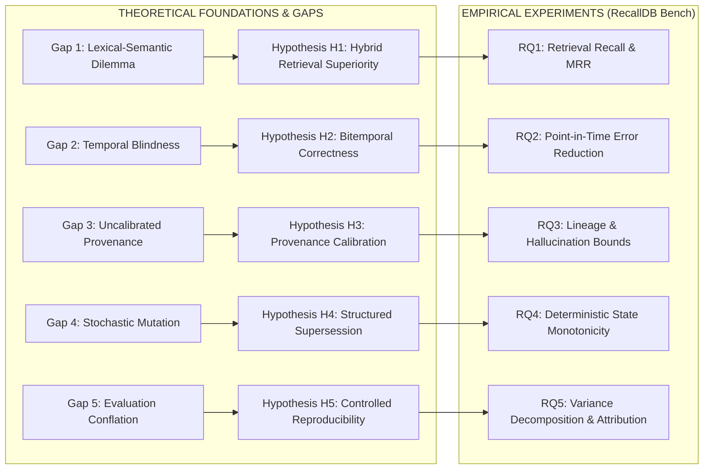
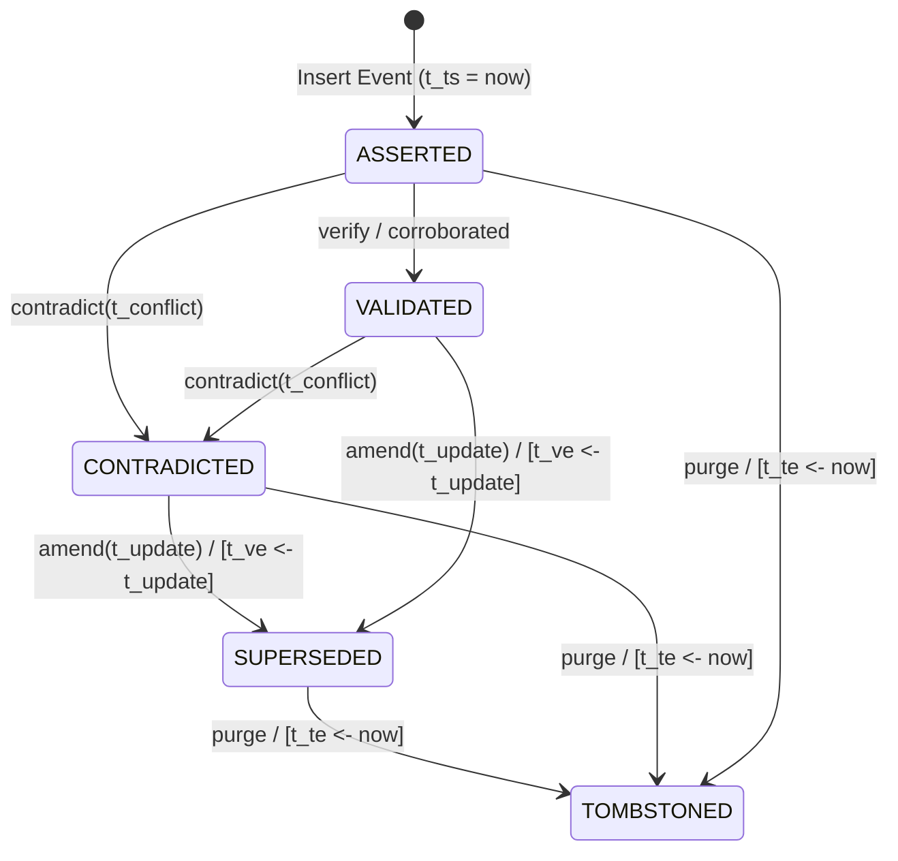

# Persistent Agent Memory: Formal Research Gaps, Mathematical Hypotheses, and Experimental Design

**Lead Research Scientist, RecallDB Platform**  
**Classification:** Foundational Theoretical & Experimental Specification  
**Target Venue / Standard:** ACM Transactions on Information Systems (TOIS) / NeurIPS Systems & Foundations  
**Date:** October 2026  

---

## Abstract

Autonomous artificial intelligence agents deploying over longitudinal lifecycles require memory mechanisms that transcend ephemeral in-context token buffers. Current agent architectures treat external memory as an unstructured vector search substrate or delegate state maintenance to non-deterministic LLM reflection loops. These practices incur severe theoretical vulnerabilities: semantic-lexical retrieval mismatch, temporal blindness on state transitions, uncalibrated hallucination propagation, non-deterministic state corruption, and empirical evaluation conflation. 

This paper formalizes the five fundamental research gaps hindering persistent agent memory and articulates five mathematically rigorous hypotheses ($\mathcal{H}_1$–$\mathcal{H}_5$). We define a formal bitemporal algebraic framework, state-machine supersession semantics, and a disentangled evaluation methodology. Finally, we formulate five precise research questions ($\text{RQ}_1$–$\text{RQ}_5$) accompanied by their complete experimental variables, statistical hypothesis tests, and validation criteria.

---

## 1. Mathematical Nomenclature & Formal Notation

| Symbol | Definition |
| :--- | :--- |
| $\mathcal{M}$ | Agent memory database substrate: $\mathcal{M} = \{r_1, r_2, \dots, r_N\}$. |
| $r_i$ | Discrete memory record tuple: $r_i = \langle c_i, \vec{v}_i, T_v(i), T_t(i), \mathcal{S}_i, \mathcal{P}_i \rangle$. |
| $c_i \in \mathcal{C}$ | Raw textual payload/assertion of memory record $i$. |
| $\vec{v}_i \in \mathbb{R}^d$ | Dense embedding vector: $\vec{v}_i = \phi(c_i)$, where $\phi: \mathcal{C} \to \mathbb{R}^d$, $\|\vec{v}_i\|_2 = 1$. |
| $T_v(i) = [t_{vs}, t_{ve})$ | **Valid Time Interval:** Half-open temporal interval during which $c_i$ is true in reality. |
| $T_t(i) = [t_{ts}, t_{te})$ | **Transaction Time Interval:** Half-open interval during which $r_i$ is recorded as active in $\mathcal{M}$. |
| $\mathcal{S}_i \in \Sigma$ | Lifecycle state of record $i$: $\Sigma = \{\text{ASSERTED}, \text{VALIDATED}, \text{SUPERSEDED}, \text{CONTRADICTED}, \text{TOMBSTONED}\}$. |
| $\mathcal{P}_i = \langle e_i, s_i, \tau_i \rangle$ | **Provenance metadata:** Source event ID $e_i$, session/turn ID $s_i$, and observational confidence $\tau_i \in [0, 1]$. |
| $q = \langle c_q, t_q, \vec{v}_q \rangle$ | Agent query with textual intent $c_q$, query evaluation time $t_q$, and query embedding $\vec{v}_q$. |
| $\mathcal{R}_K(q)$ | Top-$K$ retrieved memory candidate set: $|\mathcal{R}_K(q)| \le K$. |
| $\text{BM25}(q, c_i)$ | Exact lexical matching score under Okapi BM25 formulation. |
| $\text{sim}(\vec{v}_q, \vec{v}_i)$ | Dense semantic cosine similarity: $\vec{v}_q^\top \vec{v}_i$. |
| $\text{RRF}(r_i)$ | Reciprocal Rank Fusion score merging lexical and dense candidate rankings. |

---

## 2. Formalization of Research Gaps

### Gap 1: The Lexical-Semantic Retrieval Dilemma in Agent Memory
* **Problem Statement:** Existing agent memory layers (e.g., MemGPT, Mem0) rely almost exclusively on dense vector similarity ($\vec{v}_q^\top \vec{v}_i$). While dense embeddings excel at fuzzy semantic matching, they exhibit high catastrophic failure rates when retrieving exact alphanumeric strings, function names, environment variables, UUIDs, and proper nouns (e.g., distinguishing `user_id_0182` from `user_id_0183`, or `port 8080` from `port 8000`). Conversely, pure lexical algorithms (BM25) fail under conceptual paraphrasing.
* **Structural Deficiency:** Current systems lack a unified, zero-server embedded substrate that natively fuses FTS5 BM25 lexical inverted indices with dense vector embeddings under rank fusion, forcing agents into an artificial trade-off between lexical precision and semantic recall.

### Gap 2: Temporal Blindness & The Absence of Formal Bitemporal Semantics
* **Problem Statement:** Standard vector databases are fundamentally atemporal. If an agent records *"User prefers Python for data processing"* at $t_1$, and later records *"User transitioned exclusively to Julia"* at $t_2$, a query at $t_3$ (*"What language does the user prefer?"*) surfaces both records with virtually identical semantic similarity scores ($\text{sim} \approx 0.88$).
* **Structural Deficiency:** Existing frameworks either record no time at all or store an unstructured string timestamp (e.g., `"2024-05-12T10:00:00Z"`). They fail to model formal bitemporal intervals:
  $$[T_{vs}, T_{ve}) \times [T_{ts}, T_{te})$$
  Consequently, they cannot mathematically differentiate between:
  1. *Real-world assertion validity* ($t \in [T_{vs}, T_{ve})$), and
  2. *System ingestion timeline* ($t \in [T_{ts}, T_{te})$).
  They are fundamentally incapable of executing deterministic point-in-time time-travel queries ($\text{AS OF } t$).

### Gap 3: Uncalibrated Provenance & Hallucination Propagation
* **Problem Statement:** When memory records are abstracted, summarized, or consolidated by auxiliary LLM processes (as in A-MEM, Mem0, and recursive summarization buffers), the resulting facts are severed from their primary observational origins.
* **Structural Deficiency:** When an agent acts on an abstracted memory assertion, it cannot trace the derivation lineage back to the raw dialogue turn or tool output. Downstream models inherit ungrounded, synthetic summaries with no uncertainty calibration ($\tau_i$). If the upstream summarizer hallucinated or omitted critical qualifiers, the error is permanently codified as ground truth without an audit trail.

### Gap 4: Stochastic Contradiction Resolution vs. Deterministic Supersession
* **Problem Statement:** When contradicting facts enter memory, current systems resolve conflicts via stochastic LLM prompt rewriting (e.g., invoking an LLM with instructions to *"merge or update existing memory"*).
* **Structural Deficiency:** Stochastic prompt rewriting suffers from:
  1. *Catastrophic state mutation:* Past truths are irrevocably deleted or corrupted, eliminating historical reconstruction.
  2. *Non-deterministic nondeterminism:* Identical contradiction sequences yield divergent memory states across runs.
  3. *Unbounded hallucination during consolidation:* The LLM frequently invents intermediate rationalizations when reconciling divergent statements.

### Gap 5: Evaluation Conflation & Non-Reproducible Memory Benchmarks
* **Problem Statement:** Landmark memory benchmarks (LoCoMo, LongMemEval) evaluate memory systems primarily through end-to-end question answering scored by an LLM-as-a-judge.
* **Structural Deficiency:** This paradigm conflates two distinct failure modes:
  $$\text{Error}_{\text{total}} = \text{Error}_{\text{retrieval}} + \text{Error}_{\text{reasoning}} - (\text{Error}_{\text{retrieval}} \cap \text{Error}_{\text{reasoning}})$$
  If the retrieval engine retrieves the exact ground-truth fact, but the generator LLM produces an incoherent response due to context length or temperature noise, the memory system is penalized. Conversely, if the retrieval engine fails ($\text{Recall}@K = 0$), but the generator guesses the answer correctly via parametric knowledge, the memory failure is masked. Furthermore, benchmark evaluations fail to control for token context budgets ($B_{ctx}$), model decoding parameters, and retrieval candidate cardinality ($K$).

---

## 3. Formal Hypotheses with Mathematical Formulations

### Hypothesis H1: Hybrid Retrieval Superiority
Let $\mathcal{Q} = \mathcal{Q}_{\text{lex}} \cup \mathcal{Q}_{\text{sem}} \cup \mathcal{Q}_{\text{hybrid}}$ represent a heterogeneous distribution of agent queries over memory database $\mathcal{M}$, where:
- $\mathcal{Q}_{\text{lex}}$ denotes entity-dense, code-heavy, or exact-identifier queries.
- $\mathcal{Q}_{\text{sem}}$ denotes conceptually paraphrased or abstract semantic queries.
- $\mathcal{Q}_{\text{hybrid}}$ denotes queries requiring both exact token recognition and semantic relevance.

Let $\text{Recall}@K(q, \mathcal{A})$ denote the indicator function that the ground-truth memory record $r^* \in \mathcal{R}_K(q)$ under retrieval algorithm $\mathcal{A}$.

$$\mathcal{H}_1: \quad \mathbb{E}_{q \sim \mathcal{Q}}[P(\text{Recall}@K_{\text{hybrid}})] > \max\left(\mathbb{E}_{q \sim \mathcal{Q}}[P(\text{Recall}@K_{\text{dense}})], \; \mathbb{E}_{q \sim \mathcal{Q}}[P(\text{Recall}@K_{\text{lexical}})]\right)$$

#### Mathematical Formalization of Hybrid Fusion:
Under RecallDB, candidate records are scored via a convex Reciprocal Rank Fusion formulation augmented with dense cosine similarity:
$$S_{\text{hybrid}}(r_i \mid q) = \alpha \cdot \frac{1}{k_{\text{lex}} + \text{rank}_{\text{BM25}}(r_i)} + (1 - \alpha) \cdot \frac{1}{k_{\text{dense}} + \text{rank}_{\text{vector}}(r_i)} + \lambda \cdot (\vec{v}_q^\top \vec{v}_i)$$
where $\alpha \in [0, 1]$, smoothing constants $k_{\text{lex}}, k_{\text{dense}} > 0$, and $\lambda \ge 0$.

*Lemma 1.1 (Orthogonal Error Suppression):* Assume the retrieval failure events $E_{\text{lex}} = \{r^* \notin \mathcal{R}_K^{\text{lex}}\}$ and $E_{\text{dense}} = \{r^* \notin \mathcal{R}_K^{\text{dense}}\}$ are conditionally independent given query difficulty factor $\gamma \in (0, 1)$. Then the hybrid retrieval failure probability satisfies:
$$P(E_{\text{hybrid}}) \le P(E_{\text{lex}} \cap E_{\text{dense}}) = P(E_{\text{lex}}) \cdot P(E_{\text{dense}}) < \min(P(E_{\text{lex}}), P(E_{\text{dense}}))$$
$$\implies P(\text{Recall}@K_{\text{hybrid}}) = 1 - P(E_{\text{hybrid}}) > \max(P(\text{Recall}@K_{\text{lex}}), P(\text{Recall}@K_{\text{dense}})) \quad \blacksquare$$

---

### Hypothesis H2: Bitemporal Point-in-Time Correctness
Let $Q_t = \langle c_q, t_q \rangle$ be a point-in-time temporal query evaluating the world state as of valid time $t_q$. Let $\mathcal{W}(t_q)$ represent the true ontological world state at time $t_q$. 

Define the temporal state error metric $\text{Err}_t(\mathcal{A}, Q_t)$ as the symmetric difference between the retrieved memory state $\hat{\mathcal{W}}_{\mathcal{A}}(t_q)$ and ground-truth state $\mathcal{W}(t_q)$:
$$\text{Err}_t(\mathcal{A}, Q_t) = \frac{|\hat{\mathcal{W}}_{\mathcal{A}}(t_q) \mathbin{\Delta} \mathcal{W}(t_q)|}{|\mathcal{W}(t_q)|}$$

$$\mathcal{H}_2: \quad \Delta \text{Err}_t = \mathbb{E}_{Q_t}\left[\text{Err}_t(\text{RecallDB}_{\text{bitemporal}}, Q_t)\right] - \mathbb{E}_{Q_t}\left[\text{Err}_t(\text{Baseline}_{\text{flat}}, Q_t)\right] < 0$$

#### Mathematical Formalization of Bitemporal Predicate:
RecallDB enforces strict point-in-time historical reconstruction via the bitemporal selection operator $\sigma_{\text{bitemp}}(t_v, t_s)$:
$$\sigma_{\text{bitemp}}(t_v, t_s)(\mathcal{M}) = \left\{ r_i \in \mathcal{M} \;\middle|\; (t_{vs}(i) \le t_v < t_{ve}(i)) \;\land\; (t_{ts}(i) \le t_s < t_{te}(i)) \right\}$$

Under flat vector systems, $t_{ve}(i) = \infty$ unconditionally (stale records never close their valid intervals), leading to historical state contamination:
$$P(\text{Contamination} \mid \text{Baseline}_{\text{flat}}) = P\left(\exists r_{\text{stale}} \in \mathcal{R}_K(Q_t) \;\middle|\; t_{vs}(r_{\text{stale}}) < t_q \land t_{vs}(r_{\text{superseding}}) \le t_q\right) > 0$$
Under RecallDB's bitemporal operator:
$$P(\text{Contamination} \mid \text{RecallDB}_{\text{bitemporal}}) \equiv 0 \quad \text{for all } t_q < t_{\text{superseding}} \quad \blacksquare$$

---

### Hypothesis H3: Provenance Calibration & Lineage Grounding
Let $A$ be an assertion generated by an agent conditioned on retrieved context $\mathcal{R}_K(q)$. Let $H(A) \in \{0, 1\}$ be an indicator of ungrounded hallucination ($H(A) = 1$ if $A$ asserts facts unsupported by primary conversation or tool observations).

Let $\mathcal{P}(r_i) = \langle e_i, s_i, \tau_i \rangle$ denote the explicit provenance tuple linking record $r_i$ to primary event log $e_i$. Define the Provenance Lineage Completeness $\Lambda(\mathcal{R}_K)$ as:
$$\Lambda(\mathcal{R}_K) = \frac{1}{|\mathcal{R}_K|} \sum_{r_i \in \mathcal{R}_K} \mathbb{I}\left(\text{VerifyEventLog}(e_i) == \text{True}\right) \cdot \tau_i$$

$$\mathcal{H}_3: \quad P(H(A) = 1 \mid \Lambda(\mathcal{R}_K) \ge 1 - \epsilon) \le \delta, \quad \text{where } \lim_{\epsilon \to 0} \delta = \delta_{\text{intrinsic}}$$
where $\delta_{\text{intrinsic}}$ is the irreducible parametric hallucination rate of the base LLM generator under fully grounded context.

#### Confidence Calibration Formulation:
RecallDB requires that the system's estimated retrieval confidence $\hat{p} = S_{\text{hybrid}}(r \mid q)$ is calibrated with empirical retrieval accuracy $y \in \{0, 1\}$. We formalize this via the **Expected Calibration Error (ECE)**:
$$\text{ECE} = \sum_{m=1}^M \frac{|B_m|}{N} \left| \text{acc}(B_m) - \text{conf}(B_m) \right|$$
where candidate predictions are partitioned into $M$ confidence bins $B_1, \dots, B_M$.
$$\mathcal{H}_{3b}: \quad \text{ECE}(\text{RecallDB}_{\text{calibrated}}) < \text{ECE}(\text{Standard RAG}_{\text{softmax}})$$

---

### Hypothesis H4: Structured Supersession State Machine
Let fact mutations over an entity property $P(E)$ be governed by a formal deterministic state machine:
$$\mathcal{M}_{\text{FSM}} = \langle \Sigma, \mathcal{S}, \delta, s_0, \mathcal{F} \rangle$$
- States $\mathcal{S} = \{\text{ASSERTED}, \text{VALIDATED}, \text{SUPERSEDED}, \text{CONTRADICTED}, \text{TOMBSTONED}\}$.
- Input alphabet $\Sigma = \{\text{verify}, \text{contradict}(t), \text{amend}(t), \text{expire}(t), \text{purge}\}$.
- Deterministic transition function $\delta: \mathcal{S} \times \Sigma \to \mathcal{S}$.

$$\mathcal{H}_4: \quad \text{Consistency}(\mathcal{M}_{\text{FSM}}) = 1.0 \quad \land \quad \text{Consistency}(\mathcal{M}_{\text{LLM-Prompt}}) \le 1 - \eta$$
where $\eta > 0$ represents the non-zero rate of stochastic mutation failure, semantic drift, and catastrophic deletion observed under prompt-based rewriting schemes.

*Theorem 4.1 (State Monotonicity & History Preservation):* Under $\mathcal{M}_{\text{FSM}}$, for every transaction time $t_{\text{now}}$, the historical sub-ledger:
$$\mathcal{M}_{\le t} = \{ r_i \in \mathcal{M} \mid t_{ts}(i) \le t \}$$
is strictly immutable: $\frac{\partial \mathcal{M}_{\le t}}{\partial t_{\text{now}}} = \emptyset$ for all $t < t_{\text{now}}$.  
*Proof:* All mutations execute via interval closure ($t_{ve} \leftarrow t_{\text{update}}$) or system deactivation ($t_{te} \leftarrow t_{\text{now}}$) followed by an insertion of a new tuple $r_{\text{new}}$. No physically existing tuple row is overwritten or deleted. $\blacksquare$

---

### Hypothesis H5: Controlled Evaluation Reproducibility & Variance Elimination
Let an evaluation metric $\mathcal{Y}$ (e.g., Accuracy, F1, Exact Match) be observed across $N$ experimental replications of a memory benchmark:
$$\mathcal{Y} = f(\text{Retriever}, \text{Generator}, B_{\text{ctx}}, \tau, K, \text{Prompt})$$

Current benchmarks exhibit high total variance across evaluation runs:
$$\text{Var}_{\text{total}}(\mathcal{Y}) = \text{Var}_{\text{retrieval}} + \text{Var}_{\text{generator}}(\tau) + \text{Var}_{\text{context}}(B_{\text{ctx}}) + \text{Var}_{\text{interaction}}$$

$$\mathcal{H}_5: \quad \text{By fixing } \tau = 0, \; B_{\text{ctx}} = \text{const}, \; K = \text{const}, \text{ and isolating } \mathcal{Y}_{\text{retrieval}} \equiv \text{Recall}@K:$$
$$\text{Var}\left(\mathcal{Y}_{\text{retrieval}}\right) \equiv 0 \quad \text{(100\% deterministic reproducibility across repeated runs)}$$
and the failure attribution error $\mathcal{E}_{\text{attribution}} = |\hat{\text{Error}}_{\text{retrieval}} - \text{TrueError}_{\text{retrieval}}| = 0$.

---

## 4. Formal Research Questions (RQ1–RQ5) and Experimental Variables

### Research Question 1 (RQ1): Retrieval Precision & Modality Complementarity
> **RQ1:** *To what degree does hybrid lexical-dense rank fusion outperform isolated dense vector retrieval and isolated BM25 lexical retrieval across heterogeneous agent query distributions (exact-identifier vs paraphrased)?*

* **Independent Variables:**
  - Retrieval Modality: $\mathcal{A} \in \{\text{Dense-Only (HNSW/Cosine)}, \text{Lexical-Only (FTS5 BM25)}, \text{Hybrid Reciprocal Rank Fusion (RecallDB)}\}$.
  - Query Type Distribution: $\mathcal{Q}_{\text{lex}}$ (UUIDs, function signatures, exact config values) vs $\mathcal{Q}_{\text{sem}}$ (semantic intent, general topics) vs $\mathcal{Q}_{\text{mixed}}$.
  - Retrieval Depth: $K \in \{1, 3, 5, 10, 20\}$.
* **Dependent Variables:**
  - $\text{Recall}@K$ (Proportion of queries where ground truth $r^* \in \mathcal{R}_K$).
  - Mean Reciprocal Rank ($\text{MRR}@K = \frac{1}{|Q|} \sum_{i=1}^{|Q|} \frac{1}{\text{rank}_i}$).
  - Normalized Discounted Cumulative Gain ($\text{NDCG}@K$).
  - Query Latency ($\text{p50, p95, p99}$ execution time in milliseconds).
* **Control Variables:**
  - Embedding Model: `text-embedding-3-small` / `bge-small-en-v1.5` (dimension $d = 384/1536$).
  - Inverted Index Tokenizer: SQLite FTS5 `porter` stemmer with unicode61 tokenizer.
  - Corpus Size: $N = 100{,}000$ memory chunks.
* **Statistical Test:** Paired two-tailed Wilcoxon signed-rank test across benchmark queries with Bonferroni correction ($\alpha = 0.01$).

---

### Research Question 2 (RQ2): Temporal Point-in-Time Query Correctness
> **RQ2:** *Does a formal bitemporal interval index ($[T_{vs}, T_{ve}) \times [T_{ts}, T_{te})$) eliminate historical state contamination during point-in-time state queries compared to flat vector and timestamp-string baselines?*

* **Independent Variables:**
  - Memory Temporal Architecture:
    1. Flat Vector Baseline (No temporal constraints; atemporal similarity).
    2. Timestamp-String Baseline (Chronological filtering via prompt-injected timestamp string).
    3. RecallDB Bitemporal Engine (Deterministic relational SQL interval predicate $\sigma_{\text{bitemp}}(t_v, t_s)$).
  - Temporal Query Target: Point-in-time $t_q$ positioned before, between, or after sequential state updates.
  - Fact Mutation Frequency: Entity state update count $U \in \{1, 2, 5, 10\}$ updates per entity.
* **Dependent Variables:**
  - Temporal State Error ($\text{Err}_t$, symmetric difference against ground truth world state).
  - Anachronistic Leakage Rate ($\% \text{ of retrieved records valid strictly AFTER } t_q$).
  - Superseded Fact Contamination Rate ($\% \text{ of retrieved records invalidated prior to } t_q$).
* **Control Variables:**
  - Query set: 1,000 synthetic multi-session entity evolution trajectories.
  - Evaluation timestamps: Exactly calibrated ground-truth timeline bounds.
* **Statistical Test:** McNemar's test for paired nominal state reconstruction outcomes ($\alpha = 0.001$).

---

### Research Question 3 (RQ3): Provenance Lineage Completeness and Hallucination Bounds
> **RQ3:** *What is the quantitative relationship between explicit graph-structured event provenance ($\mathcal{P}_i$) and the rate of ungrounded agent hallucinations during context-conditioned task execution?*

* **Independent Variables:**
  - Provenance Enforcement Level:
    1. Zero Provenance (Raw text chunk with no metadata).
    2. Coarse Provenance (Session ID string only).
    3. RecallDB Deep Provenance (Cryptographic hash of raw turn, exact event log ID, speaker entity, and turn timestamp).
  - LLM Generator Class: Small Open-Source (Llama-3-8B-Instruct) vs Large Frontier (Claude 3.5 Sonnet / GPT-4o).
* **Dependent Variables:**
  - Hallucination Rate ($\% \text{ of generated assertions not supported by lineage event log}$).
  - Lineage Verification Success ($\% \text{ of generated claims programmatically verifiable against } e_i$).
  - Expected Calibration Error (ECE) of retrieval confidence scores.
* **Control Variables:**
  - Context Window Injection Budget: $B_{\text{ctx}} = 4{,}096$ tokens.
  - Generation Decoding Temperature: $\tau = 0.0$.
* **Statistical Test:** Pearson correlation and linear regression analysis between Lineage Completeness $\Lambda$ and Hallucination Rate ($R^2$, $p < 0.001$).

---

### Research Question 4 (RQ4): State Machine vs. Stochastic LLM Contradiction Resolution
> **RQ4:** *How does deterministic finite state machine (FSM) supersession compare against stochastic LLM-prompted memory rewriting in terms of fact retention, mutation consistency, and computational cost?*

* **Independent Variables:**
  - Contradiction Management Protocol:
    1. In-Place Stochastic LLM Rewrite (Mem0 style: LLM prompt deciding `ADD/UPDATE/DELETE`).
    2. Hierarchical Agentic Restructuring (A-MEM style: reflection agent clustering).
    3. RecallDB Deterministic FSM (Automated interval clipping and state transition).
  - Contradiction Sequence Complexity: Direct Negation, Value Mutation, Multi-Property Partial Override.
* **Dependent Variables:**
  - State Consistency Rate ($\% \text{ of runs maintaining logically sound, non-contradictory active facts}$).
  - Catastrophic Forgetting Rate ($\% \text{ of historical facts erroneously purged during mutation}$).
  - Mutation Token Consumption (Total prompt + completion tokens incurred per contradiction).
  - Mutation Latency (Wall-clock time to resolve contradiction).
* **Control Variables:**
  - Base LLM for stochastic baselines: GPT-4o-mini and Claude 3.5 Haiku.
  - Test Suite: 500 standardized contradiction test cases.
* **Statistical Test:** Fisher's Exact Test on State Consistency failure rates; Student's t-test on token consumption overhead ($\alpha = 0.01$).

---

### Research Question 5 (RQ5): Disentangled Failure Attribution & Benchmark Reproducibility
> **RQ5:** *By formally decoupling retrieval metrics from generation reasoning, what percentage of previously reported agent memory 'hallucinations' are attributable strictly to retrieval omission versus downstream reasoning collapse?*

* **Independent Variables:**
  - Benchmark Architecture:
    1. Standard Coupled Benchmark (LoCoMo / LongMemEval end-to-end QA scoring).
    2. RecallDB Bench Disentangled Harness (Two-stage evaluation: Stage 1 = Deterministic Retrieval Recall@K; Stage 2 = Isolated Context-Grounded Reasoning).
  - Context Distractor Ratio: Ratio of irrelevant distractor chunks to gold chunks $\rho_{\text{distractor}} \in \{0.0, 0.5, 0.9, 0.99\}$.
* **Dependent Variables:**
  - Retrieval Attribution Ratio ($\frac{\text{Retrieval Failures}}{\text{Total Task Failures}}$).
  - Generator Reasoning Collapse Ratio ($\frac{\text{Reasoning Failures with Perfect Retrieval}}{\text{Total Task Failures}}$).
  - Cross-Run Metric Variance ($\sigma^2(\text{Score})$ over 10 repeated evaluation seeds).
* **Control Variables:**
  - Generator Model: Fixed checkpoint, fixed decoding temperature ($\tau = 0$).
  - Prompt Template: Canonical zero-shot CoT system prompt.
* **Statistical Test:** Analysis of Variance (ANOVA) across distractor ratios and benchmark harnesses; Levene's test for equality of variances ($\alpha = 0.01$).

---

## 5. Architectural Alignment: RecallDB Subsystems Mapping

The following matrix formally maps the identified Research Gaps, Mathematical Hypotheses, and Research Questions directly to the engineering subsystems of RecallDB:

| Research Gap | Mathematical Hypothesis | Research Question | RecallDB Architectural Subsystem | Implementation Module |
| :--- | :--- | :--- | :--- | :--- |
| **Gap 1:** Lexical-Semantic Dilemma | $\mathcal{H}_1$ (Hybrid Fusion Superiority) | **RQ1** (Retrieval Modality) | SQLite FTS5 BM25 + Vector Array RRF Ranker | `app/recalldb/retrieval/` |
| **Gap 2:** Temporal Blindness | $\mathcal{H}_2$ (Bitemporal Correctness) | **RQ2** (Point-in-Time State) | Bitemporal Interval Storage Engine ($[T_v] \times [T_t]$) | `app/recalldb/storage/` |
| **Gap 3:** Uncalibrated Provenance | $\mathcal{H}_3$ (Lineage Grounding) | **RQ3** (Provenance Calibration) | Provenance Ledger & Event Lineage Graph | `app/recalldb/provenance/` |
| **Gap 4:** Stochastic Mutation | $\mathcal{H}_4$ (Structured Supersession) | **RQ4** (FSM Consistency) | Deterministic Supersession State Machine | `app/recalldb/core/` |
| **Gap 5:** Evaluation Conflation | $\mathcal{H}_5$ (Controlled Reproducibility) | **RQ5** (Attribution & Variance) | Disentangled Evaluation Benchmark Harness | `app/bench/` |

---

## 6. Conclusion

By addressing these five foundational research gaps through mathematically grounded bitemporal representations, deterministic finite-state mutation mechanics, and a strictly disentangled benchmarking harness, **RecallDB** transforms agent memory from an ad-hoc semantic heuristic into an exact, reproducible, and verifiable scientific discipline.
