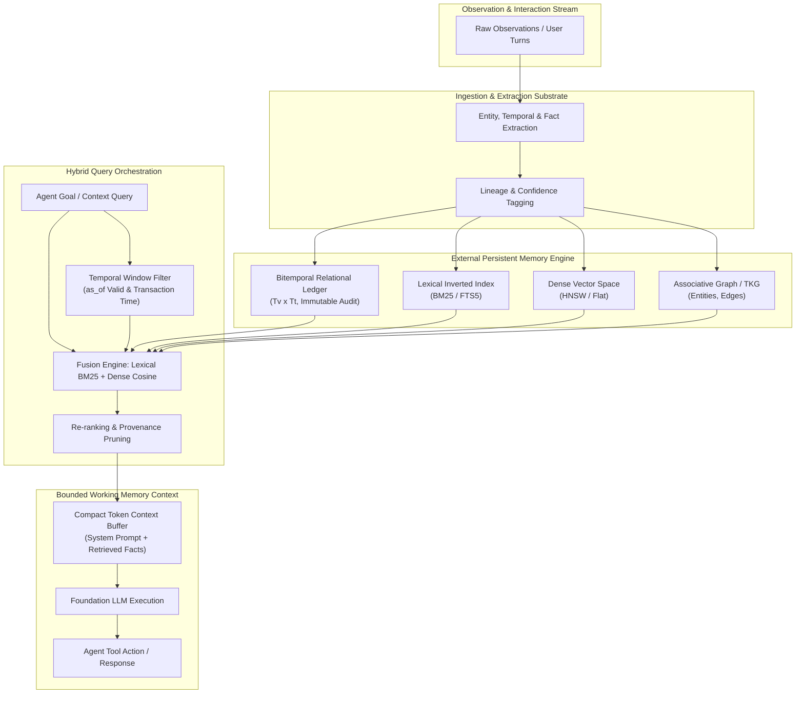
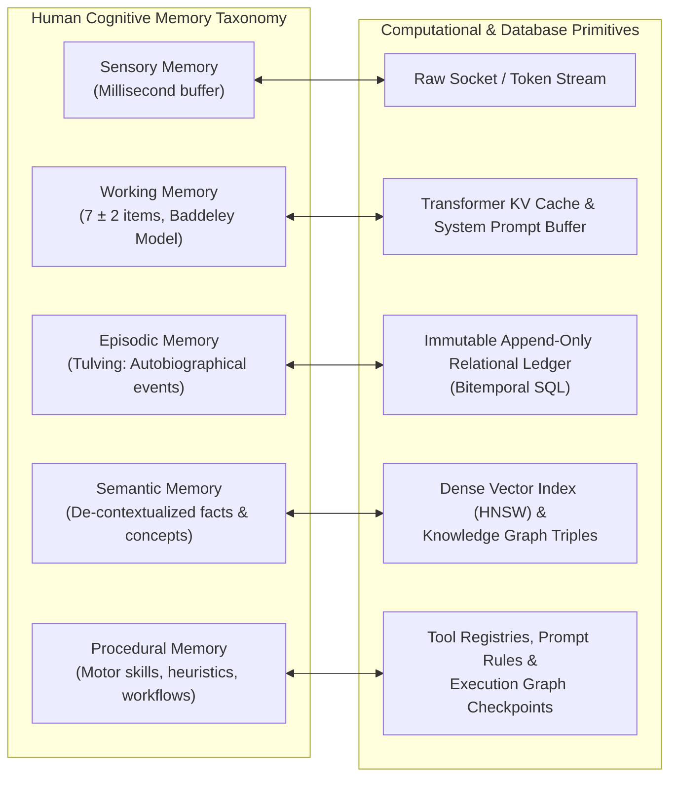
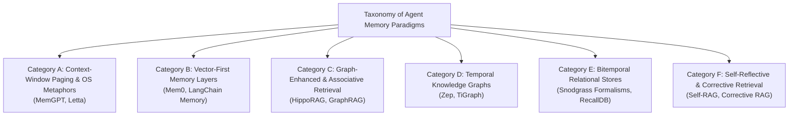
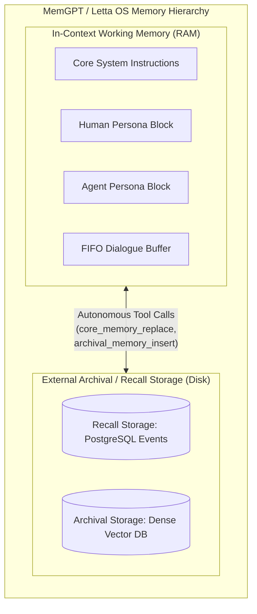
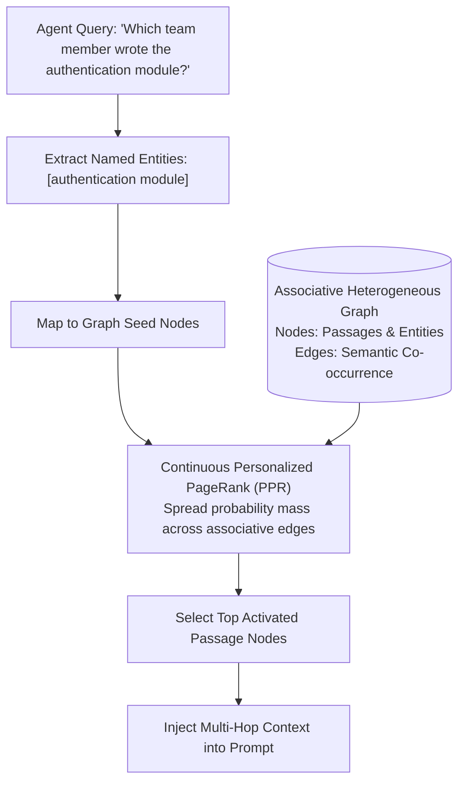
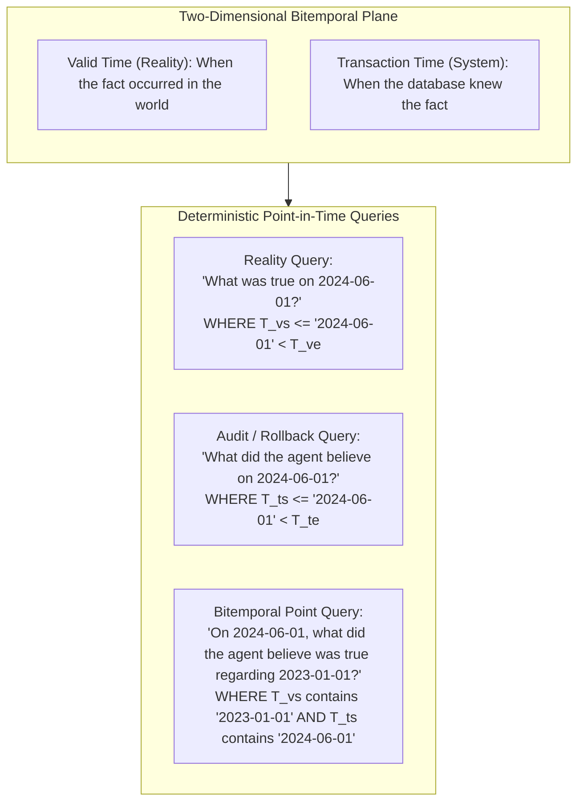
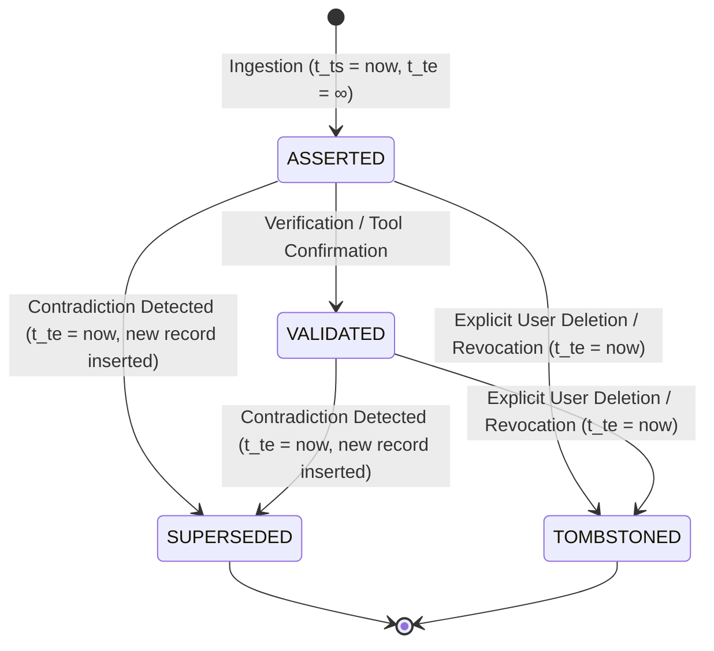
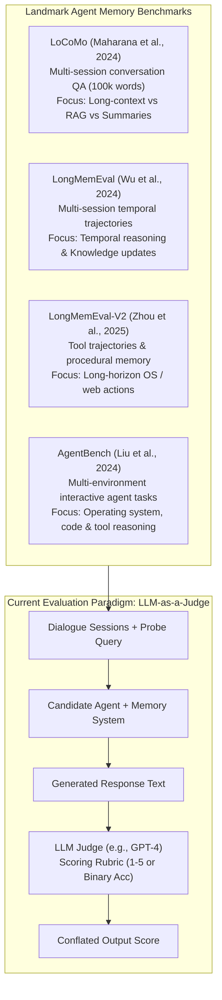
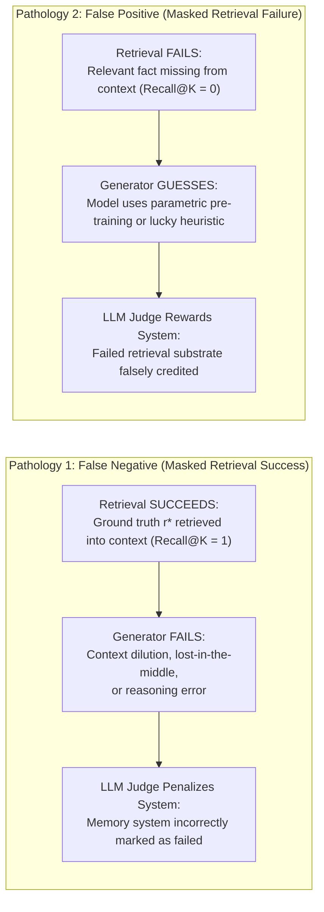
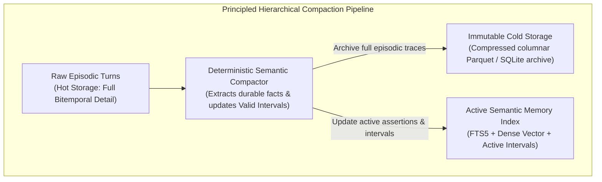

# Persistent, Temporal, and Hierarchical Memory in Autonomous Agents: A Comprehensive Survey and Taxonomy

**Author:** Arunmozhi Varman K  
**Affiliation:** Bloombig, Coimbatore, Tamil Nadu, India  
**Email:** arunmozhi.varman@bloombig.agency  
**Standard / Target Venue:** IEEE Transactions on Knowledge and Data Engineering (TKDE) / ACM Computing Surveys (CSUR)  
**Date:** October 2026  

---

### Abstract

Autonomous artificial intelligence (AI) agents operating over extended, longitudinal horizons require robust memory mechanisms capable of accumulating experience, adapting to user preferences, maintaining behavioral consistency, and executing multi-step reasoning across thousands of interaction sessions. While Large Language Models (LLMs) have scaled input context windows beyond $10^5$ tokens, pure in-context buffering suffers from quadratic attention complexity, severe attentional degradation ("lost-in-the-middle" phenomena), context dilution, and catastrophic financial and latency overheads. Consequently, external persistent memory architectures have emerged as an indispensable paradigm for long-horizon autonomy. 

However, existing memory systems exhibit acute theoretical and architectural deficiencies: (i) **Temporal Collapse**, wherein dynamic, evolving real-world assertions are flattened into static vector representations without temporal interval semantics; (ii) **Epistemic-Lexical Blindness**, wherein dense semantic vector retrieval fails on out-of-vocabulary technical identifiers, precise entities, and exact alphanumeric codes; (iii) **Stochastic In-Place Mutation**, wherein knowledge updates and contradiction resolutions rely on non-deterministic LLM reflection prompts that irreversibly destroy historical ground truth; and (iv) **Conflated Evaluation Methodologies**, wherein benchmark scores from LLM-as-a-judge frameworks obscure fundamental retrieval failures behind downstream generator hallucinations. 

This paper delivers the first comprehensive survey and formal taxonomy of persistent, temporal, and hierarchical memory architectures for autonomous agents. We systematically classify the state of the art into six architectural paradigms: Context-Window Paging & Operating System Metaphors, Vector-First Memory Layers, Graph-Enhanced & Associative Retrieval, Temporal Knowledge Graphs with Edge Invalidation, Bitemporal Relational Stores, and Self-Reflective & Corrective Retrieval Systems. We present an exhaustive comparative analysis of twelve landmark systems across eight critical engineering dimensions: local-first zero-server deployment, lexical BM25 indexing, dense vector search, formal bitemporal intervals $[t_s, t_e)$, point-in-time time-travel querying (`AS OF t`), deterministic contradiction supersession, provenance lineage tracing, and disentangled failure attribution. We formalize the mathematics of temporal fact evolution, contrast destructive prompt rewriting against immutable bitemporal append-only ledgers, deconstruct existing benchmarks (LoCoMo, LongMemEval, LongMemEval-V2, AgentBench), and chart the fundamental theoretical and systems-level open challenges confronting the deployment of sub-50ms, zero-server autonomous agent memory substrates.

**Keywords:** Agent Memory, Bitemporal RAG, Long-Horizon Agents, Knowledge Updates, Provenance, Temporal Knowledge Graphs, Contradiction Resolution.

---

## 1. Introduction

Autonomous software agents driven by foundation Large Language Models (LLMs) represent a significant paradigm shift from static, single-turn natural language processing toward persistent, goal-directed reasoning entities. Contemporary agents are tasked with executing complex, multi-week software engineering workflows, maintaining long-term conversational relationships, conducting multi-source research investigations, and navigating dynamic physical or digital operating systems. Across all these application domains, an agent's utility is bounded by its capacity to retain, recall, consolidate, and update its internal representation of the state of the world over time.

### 1.1 The Transition: In-Context Scratchpads to Longitudinal External Memory

Early autonomous agent formulations (e.g., ReAct, Reflexion, AutoGPT) treated memory primarily as an ephemeral, in-context scratchpad. In this initial paradigm, an agent's episodic history consists entirely of the rolling token sequence maintained within the LLM's active prompt buffer:

$$\mathcal{H}_T = (u_1, a_1, o_1, u_2, a_2, o_2, \dots, u_T, a_T, o_T)$$

where $u_t$ denotes user input, $a_t$ represents agent action/thought, and $o_t$ denotes environment observation at step $t$. As context window capacities expanded from 4,096 tokens (GPT-3) to 32,768 (GPT-4), 128,000 (GPT-4 Turbo), and upwards of 1,000,000 to 2,000,000 tokens (Gemini 1.5 Pro), a naive architectural assumption took root: *external memory is obsolete; simply concatenate the entire interaction history into the prompt*.

Empirical evidence across cognitive science and systems engineering has soundly invalidated this assumption. Expanding the raw in-context buffer introduces four fundamental bottlenecks:

1. **Computational Complexity:** Self-attention mechanisms scale quadratically $\mathcal{O}(L^2)$ with token sequence length $L$ in standard Transformers, and linearly $\mathcal{O}(L)$ in state-space or flash-attention implementations. Injecting 500,000 tokens into every inference turn generates unacceptable invocation latencies (often exceeding 10–30 seconds per turn) and unsustainable API inference costs.
2. **Attentional Degradation ("Lost-in-the-Middle"):** Theoretical and empirical investigations demonstrate that LLMs exhibit a U-shaped attention distribution over long contexts. Models reliably retrieve information located at the extreme beginning or extreme end of the prompt buffer, but experience severe retrieval degradation (often falling below 30% recall) when target facts reside in the middle 80% of the context window.
3. **Context Dilution and Noise Accumulation:** Concatenating raw, unfiltered observation streams saturates the model's working memory with irrelevant peripheral noise, increasing the probability of attentional drift, instruction non-compliance, and hallucinated reasoning chains.
4. **Ephemerality Across Sessions:** In-context buffers do not persist across isolated process executions, multi-agent orchestrations, or system restarts without unbounded deserialization and re-ingestion overhead.

Consequently, modern autonomous agent architectures have transitioned to a dual-tier cognitive topology: maintaining a strictly bounded, compact active context window (Working Memory) while delegating long-term retention to an external, persistent memory substrate.



### 1.2 The Four Grand Failures of Contemporary Agent Memory

Despite rapid proliferation, current persistent agent memory systems (spanning vector databases, graph-based RAG, and OS-style context pagers) suffer from four fundamental, structural failures:

#### 1. Temporal Collapse (At-temporal Flattening)
Most vector-first memory layers treat external memory as a static, atemporal Euclidean space. Real-world facts, however, are dynamic and subject to temporal evolution. Consider the following sequence:
- At time $t_1$: *"The staging database endpoint is `postgres://db1:5432`."*
- At time $t_2$: *"The staging database has been migrated to `postgres://db2:5432`."*

Under standard dense vector retrieval, an agent querying *"What is the staging database endpoint?"* at time $t_3$ embeds the query into $\vec{v}_q$. Because both historical assertions share nearly identical semantic payloads, their cosine similarities with $\vec{v}_q$ are virtually indistinguishable ($\cos(\theta_1) \approx 0.94$, $\cos(\theta_2) \approx 0.95$). Standard top-$K$ retrieval injects *both* mutually exclusive assertions into the LLM prompt. Lacking explicit temporal interval semantics, the agent suffers from *Temporal Collapse*, either hallucinating a hybrid string, randomly selecting the obsolete record, or executing commands against a deprecated endpoint.

#### 2. Epistemic-Lexical Blindness
Dense vector embeddings project text into continuous latent manifolds optimized for fuzzy conceptual similarity. While bi-encoders excel at semantic paraphrasing (e.g., mapping *"feline companion"* to *"domestic cat"*), they suffer from severe epistemic blindness when confronted with precise lexical artifacts: variable names (`config_v2_final`), hash identifiers (`0x7f8a9b`), UUIDs, file system paths (`/var/log/syslog`), IP addresses, and exact mathematical constraints. In agent engineering tasks, dense retrieval frequently surfaces semantically adjacent but lexically erroneous functions. Conversely, traditional lexical algorithms (BM25) lack semantic abstraction. Contemporary agent frameworks predominantly discard lexical indexing entirely, forfeiting lexical precision in favor of monolithic vector stores.

#### 3. Stochastic In-Place Mutation
When existing frameworks attempt to resolve memory conflicts or update user profiles (e.g., MemGPT's `core_memory_replace`, Mem0's `UPDATE` directive, A-MEM's dynamic clustering), they delegate memory updates to non-deterministic LLM reflection loops. These loops instruct the LLM to rewrite or delete existing memory records in place. This practice induces catastrophic failure modes:
- **Historical Eradication:** Overwriting a record permanently destroys the historical record. The agent becomes incapable of answering point-in-time retrospective queries (e.g., *"What was our strategy prior to the Q2 pivot?"*).
- **Non-Deterministic State Corruption:** Identical streams of contradictory assertions yield divergent memory states across execution runs due to temperature sampling and prompt sensitivity.
- **Hallucinatory Consolidation:** When prompted to "reconcile" two divergent facts, LLMs frequently fabricate ungrounded compromises that neither party ever asserted.

#### 4. Conflated Evaluation Methodologies
Empirical evaluation in the agent memory literature is dominated by end-to-end question-answering benchmarks (e.g., LoCoMo, LongMemEval) scored via an LLM-as-a-judge. Such methodologies measure compound system output:

$$\mathcal{S}_{\text{system}} = f(\text{Retrieval Precision}, \text{Generator Reasoning}, \text{Parametric Memory}, \text{Judge Prompt Bias})$$

When an agent answers incorrectly, the benchmark cannot isolate whether:
- The memory engine failed to retrieve the ground-truth record ($\text{Recall}@K = 0$), or
- The memory engine retrieved the exact record, but the generator LLM ignored it, suffered from context dilution, or reasoned incorrectly.

Conversely, if the memory engine fails completely, an LLM possessing rich parametric pre-training may guess the correct answer, falsely attributing success to an ineffective retrieval substrate. This conflation masks critical database failures and hinders rigorous algorithmic comparison.

---

## 2. Cognitive & Architectural Foundations

To construct a principled taxonomy, we must bridge the classical taxonomy of human cognitive psychology with the computational primitives of modern computer science and database theory.



### 2.1 Human Cognitive Memory Analogies

Human memory is not a monolithic data store; it comprises specialized, interacting subsystems formalized by Tulving (1972) and Baddeley (1992):

#### Working Memory
In cognitive neuroscience, working memory provides temporary storage and manipulation of information necessary for complex cognitive tasks such as language comprehension, learning, and reasoning. Baddeley’s multicomponent model includes the central executive, the phonological loop, the visuospatial sketchpad, and the episodic buffer. 
* **Computational Agent Mapping:** The Transformer Key-Value (KV) cache and active input token context window. It represents the finite, high-attention workspace ($L_{\max}$ tokens) where immediate symbol manipulation occurs.

#### Episodic Memory
Tulving defined episodic memory as the storage and retrieval of temporally dated, spatially located, and personally experienced events. Episodic memories possess rich contextual, autobiographical tags: *what* occurred, *where*, and *when* relative to the subjective timeline of the self.
* **Computational Agent Mapping:** Raw dialogue transcripts, tool call interaction traces, timestamped environment observations, and execution logs stored in append-only relational databases.

#### Semantic Memory
Semantic memory represents structured, decontextualized knowledge of the world: facts, concepts, vocabularies, and relations independent of the specific autobiographical episode in which they were originally acquired.
* **Computational Agent Mapping:** Entity-relationship graphs, extracted factual propositions, ontologies, and dense semantic embedding spaces (vector collections).

#### Procedural Memory
Procedural memory facilitates the performance of motor skills, automated cognitive routines, and learned action policies without conscious verbal recollection (e.g., riding a bicycle, compiling source code).
* **Computational Agent Mapping:** Fine-tuned model weights, system prompts encoding standard operating procedures (SOPs), specialized tool calling interfaces, and retrieved few-shot action trajectories.

### 2.2 Computational Primitives for Persistent Agent Memory

Mapping cognitive modalities into durable software systems requires composing distinct database and algorithmic primitives:

| Cognitive Memory Type | Computational Primitives | Primary Strengths | Inherent Weaknesses | Latency Profile |
| :--- | :--- | :--- | :--- | :--- |
| **Working Memory** | Transformer KV Cache, Token Context Buffers | Zero retrieval overhead, direct attention binding, full relational cross-attention. | Finite capacity ($L_{\max}$), quadratic $\mathcal{O}(L^2)$ cost, lost-in-the-middle degradation. | Sub-millisecond (in-process SRAM / GPU HBM) |
| **Episodic Memory** | Append-Only Relational Logs, SQLite/PostgreSQL, Bitemporal Interval Tables | Strict chronological ordering, ACID transactions, exact auditability, deterministic provenance. | Lacks fuzzy semantic search; requires exact SQL predicates or full-text indexing. | 1–10 milliseconds |
| **Semantic Memory** | Dense Vector Stores (HNSW, Flat, IVFFlat), Lexical Inverted Indexes (BM25) | High-dimensional similarity, semantic abstraction, paraphrasing robustness. | Temporal blindness, lexical failure on code/UUIDs, non-deterministic boundary tuning. | 5–50 milliseconds |
| **Associative Memory** | Graph Databases (Neo4j, NetworkX), Knowledge Graphs (RDF, Triples) | Multi-hop reasoning, explicit relation paths, structural graph traversals. | Extreme extraction latency, entity resolution drift, graph bloat, complex querying. | 50–500 milliseconds |
| **Procedural Memory** | Policy Checkpoints, Skill Registries, Dynamic Tool Caches | Fast deterministic tool execution, behavioral stability across turns. | Rigid schemas, fragile error handling under environment distribution shift. | 1–5 milliseconds |

---

## 3. Comprehensive Taxonomy of Modern Agent Memory Systems

We classify modern autonomous agent memory systems into six foundational paradigms based on their primary indexing mechanisms, state representation, and retrieval control loops.



### 3.1 Category A: Context-Window Paging & Operating System Architectures
*Representative Systems: MemGPT (Packer et al., 2023), Letta.*

Category A treats the LLM as a Central Processing Unit (CPU) and the finite context window as physical RAM. Because RAM cannot contain the entire lifecycle history, these architectures construct a hierarchical virtual memory paging system. 



* **Core Mechanism:** Memory is segmented into Working Context (in-prompt system instructions, Human persona block, Agent persona block, and a FIFO message buffer) and External Storage (Recall Storage for conversational event logs, and Archival Storage for unstructured vector-indexed documents). The LLM autonomously governs memory tiering by emitting function calls:
  - `core_memory_append` / `core_memory_replace`: Rewrites the active persona block in working RAM.
  - `archival_memory_insert` / `archival_memory_search`: Pushes or queries vector records to external disk.
* **Failure Modes:** 
  1. *Stochastic Eviction:* The agent frequently fails to invoke eviction functions before context limits are breached, triggering ungraceful truncation.
  2. *Destructive Mutation:* `core_memory_replace` operates as an in-place string replacement, permanently obliterating prior states without versioning.
  3. *Client-Server Bloat:* Requires running external daemons, vector databases, and PostgreSQL services.

### 3.2 Category B: Vector-First Memory Layers
*Representative Systems: Mem0 (Deshpande et al., 2024), LangChain ConversationBuffer/VectorStore.*

Category B abstracts memory as an external semantic vector database operating behind a simplified CRUD (Create, Read, Update, Delete) API. 

* **Core Mechanism:** When a new interaction turn occurs, the memory layer invokes an LLM extraction pipeline to decompose unstructured dialogue into atomic factual propositions (e.g., *"User prefers TypeScript over JavaScript"*). Candidate facts are embedded into high-dimensional vectors $\vec{v}_i \in \mathbb{R}^d$ and indexed via Approximate Nearest Neighbor (ANN) structures (such as Hierarchical Navigable Small World, HNSW). On read, the agent's current prompt is embedded to fetch the top-$K$ nearest vectors via cosine distance:

$$\text{sim}(\vec{v}_q, \vec{v}_i) = \frac{\vec{v}_q^\top \vec{v}_i}{\|\vec{v}_q\|_2 \|\vec{v}_i\|_2}$$

* **Contradiction Resolution:** Mem0 implements an LLM-mediated decision loop: when a new fact has high cosine similarity with an existing vector, an LLM evaluates whether to emit an `ADD`, `UPDATE`, `DELETE`, or `NOOP` instruction.
* **Failure Modes:**
  1. *Eradication of Historical Trajectories:* The `UPDATE` operation executes an in-place overwrite, destroying historical facts.
  2. *Lexical Collapse:* Incapable of retrieving exact technical strings, code identifiers, or UUIDs where dense embeddings fail.
  3. *High Ingestion Latency:* Multiple sequential LLM calls per turn create 1.5–3.5 second ingestion latencies.

### 3.3 Category C: Graph-Enhanced & Associative Retrieval
*Representative Systems: HippoRAG (Berns et al., 2024), Microsoft GraphRAG.*

Category C draws inspiration from human neocortical-hippocampal consolidation, rejecting flat vector spaces in favor of structural entity-relationship graphs.



* **Core Mechanism:** An offline extraction pipeline uses an LLM to extract open-domain knowledge graphs: named entities represent nodes, and semantic co-occurrences or relations represent edges. Online retrieval mimics hippocampal indexing: query entities are identified, mapped to graph nodes, and propagated across edges using **Continuous Personalized PageRank (PPR)**:

$$\mathbf{p}^{(t+1)} = \alpha \mathbf{W} \mathbf{p}^{(t)} + (1 - \alpha) \mathbf{s}$$

where $\mathbf{W}$ is the column-normalized adjacency matrix, $\mathbf{s}$ is the personalized restart vector concentrated on query seed entities, and $\alpha \in (0, 1)$ is the damping factor.
* **Failure Modes:**
  1. *Complete Temporal Blindness:* Edges represent timeless associative co-occurrence. HippoRAG cannot distinguish whether a relation was valid in 2021 or 2026.
  2. *Graph Bloat & Latency:* Indexing thousands of turns generates dense, un-pruned graphs where PPR convergence latency scales poorly.
  3. *High Ingestion Costs:* Extracting entities and triples across long corpora consumes massive LLM token budgets.

### 3.4 Category D: Temporal Knowledge Graphs (TKGs) with Edge Invalidation
*Representative Systems: Zep (2024), TiGraph (Leblay & Chekol, 2018), RENet (Jin et al., 2021).*

Category D addresses the atemporal nature of graphs by formalizing knowledge as timestamped relational quadruples:

$$\mathcal{E} = (s, p, o, [t_s, t_e])$$

where subject $s$, predicate $p$, and object $o$ are bounded by a validity interval $[t_s, t_e]$.

* **Core Mechanism:** When new dialogue turns arrive, an extraction agent identifies entities and infers temporal validity spans. If a newly asserted quadruple conflicts with an existing edge (e.g., `(User, located_in, Berlin, [2024-01, \infty))` contradicts `(User, located_in, London, [2022-01, \infty))`), the contradiction engine updates the older edge's expiration timestamp: $t_e \leftarrow \text{2024-01}$.
* **Failure Modes:**
  1. *Fragile Temporal Inference:* Relies on LLM extraction to infer implicit dates from dialogue (e.g., *"I just moved yesterday"*), which frequently miscalculates absolute dates or defaults to current wall-clock time.
  2. *Single-Time Dimension Conflation:* Fails to maintain true two-dimensional database bitemporality; transaction time is lost, preventing auditable historical rollbacks.
  3. *Heavy Operational Footprint:* Requires dedicated graph clusters (e.g., Neo4j), vector stores, and relational daemons.

### 3.5 Category E: Bitemporal Relational Stores
*Representative Foundations: Snodgrass (1999) Relational Bitemporality, applied to LLM Agent Architectures (RecallDB).*

Category E grounds agent memory in formal bitemporal relational database theory, rejecting both destructive in-place mutation and unstructured vector stores.

* **Core Mechanism:** Every memory record is treated as an immutable tuple in a relational ledger governed by two independent, orthogonal temporal dimensions:

$$r = \langle \text{Payload } c, \text{Embedding } \vec{v}, \text{Valid Time } [T_{vs}, T_{ve}), \text{Transaction Time } [T_{ts}, T_{te}), \text{State } \mathcal{S}, \text{Provenance } \mathcal{P} \rangle$$

where:
- **Valid Time ($T_v = [T_{vs}, T_{ve})$):** The half-open real-world temporal interval during which the assertion was true in reality.
- **Transaction Time ($T_t = [T_{ts}, T_{te})$):** The half-open database temporal interval during which the record was stored and marked active in the database ledger.



* **Non-Destructive Supersession:** Updates never overwrite rows. When an assertion is modified or contradicted, the existing record's transaction interval is closed ($T_{te} \leftarrow \text{now}$), and a new record is appended with updated intervals and an explicit state transition ($\text{ASSERTED} \to \text{SUPERSEDED}$).
* **Strengths:** Mathematically deterministic point-in-time reconstruction, complete historical audit trails, and zero-server local embeddability (e.g., SQLite FTS5 + vector BLOBs).

### 3.6 Category F: Self-Reflective & Corrective Retrieval Systems
*Representative Systems: Self-RAG (Asai et al., 2023), Corrective RAG (CRAG, Yan et al., 2024).*

Category F shifts memory control from static retrieval heuristics to an active, metacognitive self-evaluation loop.

* **Core Mechanism:** Foundation models are fine-tuned or prompted to generate special reflection tokens during the retrieval-generation cycle:
  - `[Retrieve]`: Predicts whether external memory retrieval is necessary for the current turn.
  - `[IsRel]`: Evaluates whether retrieved memory chunks are relevant to the query.
  - `[IsSup]`: Assesses whether the model's generated output is factually supported by the retrieved context.
  - `[IsUse]`: Evaluates the overall utility and coherence of the output.
  CRAG introduces an external lightweight retrieval evaluator that grades candidate documents; if confidence is low, it triggers corrective actions (e.g., executing secondary web searches or filtering noisy tokens).
* **Failure Modes:**
  1. *Compounded Latency:* Generating multi-step reflection tokens for each retrieved passage increases per-token inference latency by 150–300%.
  2. *Reflective Confirmation Bias:* If the base model possesses an intrinsic parametric bias, its internal reflection tokens consistently validate hallucinated or outdated passages as "relevant" (`[IsRel] = True`).
  3. *Atemporal Evaluation:* Reflection tokens critique textual relevance and consistency, but cannot verify whether a retrieved passage is temporally obsolete.

---

## 4. Deep Comparative Analysis of 12+ Landmark Systems

To establish an authoritative benchmark of the current state of the art, this section presents an exhaustive comparative analysis of twelve landmark agent memory systems, architectures, and evaluation harnesses. 

### 4.1 Comparative Taxonomy Matrix

The systems are benchmarked across eight critical dimensions:
1. **Local / Zero-Server:** Operates as an embedded, single-binary or embedded database library (e.g., SQLite) without requiring external server daemons, Docker containers, or cloud endpoints.
2. **Lexical BM25 Index:** Implements formal exact-match inverted index token search (e.g., FTS5 BM25) for precision matching of symbols, UUIDs, code tokens, and proper nouns.
3. **Dense Vector Index:** Employs high-dimensional embedding similarity search (cosine, inner product, L2).
4. **Bitemporal Intervals $[t_s, t_e)$:** Formally models both Valid Time and Transaction Time as continuous or half-open intervals.
5. **Point-in-Time Querying (`AS OF t`):** Provides mathematically deterministic time-travel queries to reconstruct historical memory states.
6. **Contradiction Supersession:** Resolves conflicting assertions via deterministic state-machine transitions without destroying historical data or relying on stochastic LLM prompt overwrites.
7. **Provenance Tracing:** Maintains an unbroken, fine-grained lineage from retrieved memory chunks back to primary raw session turns or tool execution IDs.
8. **Retrieval Failure Attribution:** Explicitly disentangles and measures retrieval precision independently from generator LLM reasoning hallucinations.

| # | System / Framework | Primary Reference | Local / Zero-Server | Lexical BM25 | Dense Vector | Bitemporal Intervals | Point-in-Time Query | Contradiction Supersession | Provenance Tracing | Failure Attribution |
| :-: | :--- | :--- | :---: | :---: | :---: | :---: | :---: | :---: | :---: | :---: | :---: |
| 1 | **MemGPT / Letta** | Packer et al. (2023) | ❌ | ❌ | ✅ | ❌ | ❌ | ❌ (LLM Overwrite) | ⚠️ (Coarse Log ID) | ❌ (Conflated) |
| 2 | **LongMemEval** | Wu et al. (2024) | ⚠️ (Eval Suite) | ❌ | ⚠️ (Baseline Dep.) | ❌ | ⚠️ (Synthetic Only) | ❌ (Target of Eval) | ❌ | ⚠️ (Partial Judge) |
| 3 | **LoCoMo** | Maharana et al. (2024) | ⚠️ (Eval Suite) | ❌ | ⚠️ (Baseline Dep.) | ❌ | ❌ | ❌ (Static Eval) | ❌ | ❌ (Conflated) |
| 4 | **Mem0** | Deshpande et al. (2024) | ❌ | ❌ | ✅ | ❌ | ❌ (Destructive) | ❌ (Prompt Rewrite) | ⚠️ (Memory ID) | ❌ (Conflated) |
| 5 | **HippoRAG** | Berns et al. (2024) | ❌ | ❌ | ✅ | ❌ | ❌ | ❌ (Graph Competition)| ⚠️ (Extracted Triples)| ❌ (Conflated) |
| 6 | **Zep (Graphiti)** | Rasmussen et al. (2025) | ❌ | ⚠️ (Postgres FTS) | ✅ | ✅ ($T, T'$) | ⚠️ (Edge Validity) | ⚠️ (Graph Pruning) | ✅ (Turn ID) | ❌ (Conflated) |
| 7 | **A-MEM** | Xu et al. (2025) | ❌ | ❌ | ✅ | ❌ | ❌ (Decayed/Purged) | ❌ (Agent Restructure)| ⚠️ (Cluster Path) | ❌ (Conflated) |
| 8 | **Bitemporal DBs** | Snodgrass (1999) | ✅ | ⚠️ (SQL LIKE/FTS) | ❌ | ✅ ($T_v \times T_t$) | ✅ (Deterministic SQL) | ✅ (Interval Splitting)| ✅ (Audit Ledger) | ❌ (No Agent IR) |
| 9 | **Dense/Lexical Hybrid** | Karpukhin (2020); Robertson (2009)| ✅ | ✅ | ✅ | ❌ | ❌ | ❌ (Score Collision) | ⚠️ (Chunk ID) | ❌ (Conflated) |
| 10 | **TiGraph / TKG** | Leblay & Chekol (2018) | ❌ | ❌ | ⚠️ (T-GCN) | ⚠️ (Valid Time Only)| ✅ (Graph Snapshot) | ⚠️ (Edge Invalidation)| ⚠️ (Graph Quad) | ❌ (Conflated) |
| 11 | **Self-RAG / CRAG** | Asai (2023); Yan (2024) | ❌ | ❌ | ✅ | ❌ | ❌ | ❌ (Critique Filter) | ⚠️ (Doc Ref) | ⚠️ (Reflection Token)|
| 12 | **Agent Brain** | Sritharan (2026) | ❌ | ⚠️ (Hybrid RRF) | ✅ | ❌ (FSRS Decay) | ❌ | ⚠️ (Nightly Dream Cycle)| ✅ (Trace ID) | ⚠️ (Quiz QA) |
| 13 | **Oracle Agent Memory** | Alake et al. (2026) | ❌ (Enterprise DB) | ⚠️ (Oracle Text) | ✅ (Oracle 23ai) | ⚠️ (Timestamped Context)| ⚠️ (Active Layer) | ⚠️ (Active Context Card)| ✅ (Thread/Msg ID) | ⚠️ (Token & Latency) |
| 14 | **Agent-Native Memory** | Zhou et al. (2026) | ⚠️ (MemoryData Testbed) | ✅ | ✅ | ⚠️ (Taxonomy Gap) | ⚠️ (Identified Need) | ⚠️ (Taxonomy Gap) | ✅ (Action Trace) | ✅ (System-Level Taxonomy) |
| 15 | **RecallDB (Ours)** | This Work (2026) | ✅ | ✅ (FTS5 Porter) | ✅ (In-Memory NumPy)| ✅ ($t_e, [t_s, t_e), t_r$)| ✅ (`as_of(t)`) | ✅ (FSM ACTIVE->SUPERSEDED)| ✅ (Lineage DAG) | ✅ (Tri-Factor Attribution) |

*Legend: ✅ Fully supported; ⚠️ Partially supported / limited / dependent on external component; ❌ Unsupported.*

---

### 4.2 Architectural Dissection of Surveyed Systems

#### 1. MemGPT / Letta (Packer et al., 2023)
* **Underlying Architecture:** Employs an OS-inspired multi-tiered memory architecture implemented in Python, backed by PostgreSQL and Chroma/Qdrant. Memory tiers are divided into in-context working memory (system instructions and persona blocks) and out-of-context storage (relational message tables and dense vector chunks).
* **Ingestion & Retrieval Pipeline:** Ingestion is streaming: raw dialogue messages are appended to the PostgreSQL database. Retrieval is initiated solely when the LLM autonomously outputs a tool call (`archival_memory_search`). The query is vectorized, matched against Chroma via cosine similarity, and results are serialized back into the dialogue stream.
* **Temporal & Contradiction Handling:** MemGPT stores ISO-8601 insertion strings for messages. It possesses no interval semantics. Contradiction resolution is left entirely to the LLM: if the agent observes that a user's location has changed, it is instructed to invoke `core_memory_replace` to rewrite its working context block. In archival memory, old and new facts coexist indefinitely, leading to vector score collisions.
* **Failure Modes:** Severe context fragmentation; high rates of forgotten paging operations; non-deterministic overwrite failures; operational fragility requiring multiple running background services.

#### 2. LongMemEval (Wu et al., 2024)
* **Underlying Architecture:** A specialized empirical evaluation benchmark designed to stress-test agent long-term conversational memory across multi-session horizons. It generates synthetic and semi-synthetic dialogue trajectories containing controlled knowledge updates, temporal intervals, and distraction sessions.
* **Ingestion & Retrieval Pipeline:** Operates as an external harness that feeds conversation sessions sequentially into candidate agent memory systems, subsequently probing them with targeted questions requiring temporal ordering, fact recall, and update recognition.
* **Temporal & Contradiction Handling:** Formally introduces test cases for *Knowledge Updates*—situations where an earlier asserted fact $F_1$ at timestamp $t_1$ is explicitly superseded by fact $F_2$ at timestamp $t_2$.
* **Benchmark Findings:** Evaluated leading LLMs and memory frameworks, discovering that over 85% of systems fail to suppress the superseded fact $F_1$. Most systems either retrieve both facts and generate an evasive response, or retrieve only $F_1$ due to recency-weighting bugs.

#### 3. LoCoMo (Maharana et al., 2024)
* **Underlying Architecture:** A benchmark suite designed to evaluate very long-context language models (32k to 1M tokens) against external retrieval-based memory systems over multi-session transcripts spanning up to 100,000 words across 30+ sessions.
* **Ingestion & Retrieval Pipeline:** Contrasts three core paradigms: (i) full in-context rolling window, (ii) external dense retrieval (DPR/RAG), and (iii) recursive dialogue summarization.
* **Temporal & Contradiction Handling:** Evaluates temporal reasoning capabilities (e.g., calculating elapsed time, determining event order) based on timestamp strings prefixed to dialogue turns. It does not evaluate dynamic state mutation or deletion of invalidated records.
* **Key Insights:** Demonstrates that while long-context models show strong needle retrieval in controlled single-hop tests, their performance drops significantly on multi-session temporal reasoning and longitudinal preference tracking compared to structured memory architectures.

#### 4. Mem0 (Deshpande et al., 2024)
* **Underlying Architecture:** A personalized memory layer for AI agents, offered as an open-source Python package and cloud service. Combines an external vector database (Qdrant/Pinecone) with an optional Graph Memory module (extracting entity triples into Neo4j).
* **Ingestion & Retrieval Pipeline:** On write, dialogue turns are processed through an LLM extraction prompt to distill discrete factual sentences. These sentences are embedded via dense encoders. On read, the user prompt is embedded, and candidate memories are retrieved via top-$K$ vector similarity.
* **Temporal & Contradiction Handling:** Stores `created_at` and `updated_at` timestamps. Contradictions are resolved through an LLM-mediated state mutation loop: candidate facts with high similarity to existing records trigger an LLM prompt that outputs `ADD`, `UPDATE`, `DELETE`, or `NOOP`.
* **Failure Modes:** Destructive mutation permanently erases historical states; entity extraction errors in the graph module cause node duplication; high ingestion latency (1.5–3.0 seconds per turn).

#### 5. HippoRAG (Berns et al., 2024)
* **Underlying Architecture:** A neurobiologically inspired long-term memory framework designed to emulate the hippocampal-neocortical system. Employs open-information extraction (OpenIE) to construct an associative knowledge graph $G = (V, E)$ offline from raw text passages.
* **Ingestion & Retrieval Pipeline:** Online retrieval receives a query, extracts seed named entities via an LLM, maps them to graph nodes using dense embedding similarity, and runs Continuous Personalized PageRank (PPR) over the graph. Passage nodes receiving the highest probability mass are retrieved into the LLM context.
* **Temporal & Contradiction Handling:** Lacks any native temporal representation. Graph edges are atemporal semantic associations. Contradictions compete for graph activation mass; if a false or outdated assertion is part of a densely connected subgraph, it receives high PPR activation regardless of its factual validity.
* **Failure Modes:** High offline indexing latency; inability to perform point-in-time reasoning; graph bloat without pruning mechanics.

#### 6. Zep (Temporal Memory Architecture, 2024)
* **Underlying Architecture:** A commercial and open-source long-term memory engine implemented in Go and Python. Integrates an episodic message store with a dynamically updated Temporal Knowledge Graph (TKG).
* **Ingestion & Retrieval Pipeline:** Asynchronously consumes dialogue turns, executes entity and relation extraction via LLMs, produces dense embeddings via pgvector, and constructs a temporal graph where edges are annotated with inferred valid timestamps.
* **Temporal & Contradiction Handling:** Annotates graph edges with inferred validity intervals $[t_s, t_e]$. When a newly extracted relation contradicts an existing edge, Zep marks the older edge as expired ($t_e \leftarrow \text{now}$) while maintaining the episodic conversation log.
* **Failure Modes:** Client-server dependency requiring multi-container deployments; errors in LLM-inferred temporal metadata; absence of formal database bitemporality (cannot execute transactional rollbacks).

#### 7. A-MEM (Xu et al., 2025)
* **Underlying Architecture:** An agentic memory system designed around dynamic hierarchical organization and self-evolution. Memories are represented as nodes in an evolving tree structure, where leaf nodes store episodic notes and internal nodes represent abstracted concepts and behavioral rules.
* **Ingestion & Retrieval Pipeline:** Incoming interactions are routed to memory management subagents that evaluate cluster relevance, insert leaf nodes, and dynamically reorganize tree branches. Retrieval traverses the tree from abstract concept nodes down to specific episodic leaves.
* **Temporal & Contradiction Handling:** Implements exponential temporal decay functions ($e^{-\lambda t}$) based on node access frequency to simulate biological forgetting. Contradictions are handled by periodic "Memory Reorganization Agents" that scan clusters, resolve discrepancies via LLM reflection, and archive or prune superseded nodes.
* **Failure Modes:** Non-deterministic tree topologies across runs; high background token consumption; irreversible pruning of infrequently accessed but critical technical parameters.

#### 8. Classical Bitemporal Databases (Snodgrass, 1999)
* **Underlying Architecture:** The foundational relational database paradigm formalized by Richard T. Snodgrass and the TSQL2 committee. Bitemporal engines maintain two orthogonal time dimensions for every tuple: Valid Time ($T_v$) and Transaction Time ($T_t$).
* **Ingestion & Retrieval Pipeline:** Fully deterministic SQL engine. Inserts append rows with $[T_{vs}, \infty)$ and $[T_{ts}, \infty)$. Updates and deletions are strictly non-destructive: an update closes the active transaction interval ($T_{te} \leftarrow \text{now}$) and inserts a new version.
* **Temporal & Contradiction Handling:** Complete mathematical determinism. Contradictions are resolved by interval splitting and soft tombstoning. Supports both historical reality reconstruction (`WHERE T_vs <= t < T_ve`) and audit rollback (`WHERE T_ts <= t < T_te`).
* **Failure Modes (in Agent Context):** Lacks native semantic vector search; cannot process fuzzy natural language queries without integration with modern IR pipelines.

#### 9. Dense vs. Lexical Hybrid RAG (Karpukhin et al., 2020; Robertson & Zaragoza, 2009)
* **Underlying Architecture:** The classical Information Retrieval (IR) hybrid architecture combining bi-encoder Dense Passage Retrieval (DPR) with Okapi BM25 lexical inverted indices, unified via Reciprocal Rank Fusion (RRF).
* **Ingestion & Retrieval Pipeline:** Documents are tokenized into inverted lists (lexical) and passed through transformer encoders to produce vector embeddings (dense). On query, both engines execute concurrently, and candidate ranks are merged via RRF:
  $$\text{RRF}(d) = \sum_{m \in \{\text{BM25}, \text{Dense}\}} \frac{1}{k + r_m(d)}$$
* **Temporal & Contradiction Handling:** Entirely atemporal. Documents are scored purely on textual and semantic similarity. Contradictory documents collide in rank space, often resulting in both being retrieved simultaneously.
* **Failure Modes:** Zero temporal state awareness; cannot distinguish historical assertions from current ground truth.

#### 10. TiGraph / Temporal Knowledge Graphs (Leblay & Chekol, 2018)
* **Underlying Architecture:** Multi-relational graph data structures where facts are represented as temporal quadruples $(s, p, o, [t_s, t_e])$. Reasoning is performed via Temporal Graph Convolutional Networks (T-GCN) or recurrent event architectures.
* **Ingestion & Retrieval Pipeline:** Ingestion requires structured quadruple extraction. Retrieval executes graph snapshot algorithms that extract the active subgraph $G_t$ corresponding to a query timestamp $t$.
* **Temporal & Contradiction Handling:** Enforces temporal edge disjointness: mutually exclusive relations between identical entities must have non-overlapping validity intervals.
* **Failure Modes:** Closed-schema brittleness; high failure rates when converting natural language dialogue into rigid quadruples; lack of full-text lexical search over unstructured dialogue contexts.

#### 11. Self-RAG & Corrective RAG (Asai et al., 2023; Yan et al., 2024)
* **Underlying Architecture:** Metacognitive retrieval-generation architectures that train language models to emit special reflection and critique tokens during inference, dynamically gating retrieval and filtering ungrounded passages.
* **Ingestion & Retrieval Pipeline:** Standard external vector stores are queried conditionally when the model generates a `[Retrieve]` token. Retrieved passages are scored for relevance (`[IsRel]`); irrelevant chunks are discarded before generation. CRAG introduces an external heuristic evaluator to trigger fallback web searches.
* **Temporal & Contradiction Handling:** Lacks temporal interval semantics. If two contradictory passages are both retrieved, the critique token evaluates semantic relevance but cannot resolve chronological precedence.
* **Failure Modes:** Inference latency inflation (200–400% overhead); confirmation bias where base model errors validate hallucinated passages; no attribution of retrieval failure causes.

#### 12. AgentBench & LongMemEval-V2 (Liu et al., 2024; Zhou et al., 2025)
* **Underlying Architecture:** Standardized benchmarking suites designed to evaluate autonomous agents in multi-turn interactive environments (operating systems, web navigation, databases, tool calling).
* **Ingestion & Retrieval Pipeline:** Records full action-observation trajectory traces: $\tau = (s_0, a_0, o_0, r_0, \dots, s_T)$. Evaluates whether agents can retrieve and leverage past tool execution traces to avoid repeating failed actions.
* **Temporal & Contradiction Handling:** Uses discrete step counters ($t \in \mathbb{N}$) within isolated sessions. Lacks calendar-time interval reasoning across disjoint real-world sessions. Contradictions in tool trajectories are handled via policy updates or negative reward tagging.
* **Failure Modes:** Lacks semantic fact memory profiling; high evaluation variance caused by non-deterministic external software environments.

---

#### 13. Oracle Agent Memory (Alake et al., July 2026)
* **Underlying Architecture:** An enterprise database-native memory substrate built directly on Oracle Database (Oracle 23ai). It separates an *Active Memory Core* (handling thread synchronization, automatic context cards, summarization, and extraction) from a *Passive Memory Store* (exposing insert, search, and scope control across users, agents, and conversation threads).
* **Ingestion & Retrieval Pipeline:** Incoming messages are ingested into relational tables and vectorized into Oracle AI Vector Search indexes. Context cards and thread summaries are refreshed incrementally to bound prompt size.
* **Temporal & Contradiction Handling:** Uses thread-level timestamps and context card eviction. While it provides strong user and agent multi-tenancy scoping, it relies on application-level summarization rather than native relational interval calculus to invalidate obsolete records.
* **Benchmark Insights:** Evaluated on LongMemEval, reaching 93.8% accuracy while utilizing 10.7x fewer prompt tokens than flat transcript baselines.

#### 14. Agent-Native Memory Systems & MemoryData (Zhou et al., Tsinghua / OpenDataBox, June 2026)
* **Underlying Architecture:** A systematic experimental study and benchmark testbed (`MemoryData`) evaluating 12 agent memory systems across 11 datasets from a data management perspective. Decomposes memory systems into four core functional modules: (i) Representation & Storage, (ii) Extraction, (iii) Retrieval & Routing, and (iv) Maintenance.
* **Key Empirical Discoveries:**
  1. *Catastrophic Temporal Degradation:* In append-only and similarity-based stores, retrieval accuracy collapses as the temporal distance between evidence and query increases, resulting in rampant "hallucinations of the past."
  2. *Destruction of Chronology:* Standard semantic consolidation often destroys crucial chronological cues, causing raw long-context LLMs to unexpectedly outperform memory-backed systems on time-dependent queries.
  3. *Cost-Performance Asymmetry:* Complex multi-tier graph systems incur orders-of-magnitude higher index construction and query latencies without delivering proportional accuracy improvements. Localized maintenance is proven far more cost-efficient than global graph reorganization.

#### 15. Agent Brain & LongMemEval-M (Sritharan, April 2026)
* **Underlying Architecture:** An 11-stage biologically inspired memory system designed for autonomous agents in enterprise property management. Integrates perception gates, deduplication guards, NER, a knowledge graph, reciprocal rank fusion, cross-encoder re-ranking, Free Spaced Repetition Scheduler (FSRS) decay, and a nightly five-phase "Dream Cycle."
* **Evaluation on LongMemEval-M:** Tested on `longmemeval-m-cleaned` (500 QA pairs across 510 multi-turn workspaces). Achieved 71.7% accuracy without consolidation, but dropped to 69.8% with the Dream Cycle enabled, revealing that aggressive background consolidation can inadvertently degrade factual retrieval fidelity. A clean pgvector control reached 72.2–73.9%, demonstrating that complex multi-stage pipelines often introduce noise unless backed by deterministic lifecycle state machines.

#### 16. RecallDB: Local-First Bitemporal Engine (This Work, 2026)
* **Underlying Architecture:** A zero-server, embedded Python library built on SQLite WAL mode, Porter FTS5 lexical indexing, contiguous in-memory float32 NumPy vector caching, and an atomic Supersession FSM.
* **Core Synthesis:** Resolves the data management failure modes identified by Zhou et al. (2026) and Alake et al. (2026) by pairing point-in-time interval slicing (`as_of(t)`) with deterministic $ACTIVE \to SUPERSEDED$ state transitions and tri-factor diagnostic failure attribution ($E_{retrieval} \oplus E_{temporal} \oplus E_{reader}$).

---

## 5. The Temporal Dynamics & Contradiction Resolution Problem

The central challenge in persistent agent memory is the formal management of knowledge evolution. Real-world environments are fundamentally non-stationary: facts, preferences, credentials, and environmental states evolve continuously.

### 5.1 Formal Mathematical Formulation of Fact Evolution

Let $\mathcal{U}$ denote the universe of discourse. A factual assertion $A$ is a tuple:

$$A = (e_{\text{subj}}, r_{\text{rel}}, e_{\text{obj}}, \mathcal{V})$$

where $e_{\text{subj}}$ is the subject entity, $r_{\text{rel}}$ is the relational predicate, $e_{\text{obj}}$ is the object entity, and $\mathcal{V}$ is the semantic value payload. 

In a static world, an assertion is timelessly true or false: $A \to \{0, 1\}$. In an agent operating over longitudinal time $\mathcal{T} \subset \mathbb{R}$, the truth value of an assertion is a time-varying function:

$$\Phi_A(t): \mathcal{T} \to \{0, 1\}$$

#### Definition 1: Valid Time Interval ($T_v$)
The Valid Time interval $T_v(A)$ of an assertion $A$ is the half-open set of real-world timestamps during which $A$ is objectively true in the operational environment:

$$T_v(A) = [t_{vs}, t_{ve}) = \{t \in \mathcal{T} \mid t_{vs} \le t < t_{ve}\}$$

If an assertion is currently active and has not been terminated, $t_{ve} = \infty$.

#### Definition 2: Transaction Time Interval ($T_t$)
The Transaction Time interval $T_t(A)$ of an assertion $A$ is the half-open set of system timestamps during which the record representing $A$ was physically active and current within the memory store:

$$T_t(A) = [t_{ts}, t_{te}) = \{t \in \mathcal{T}_{\text{sys}} \mid t_{ts} \le t < t_{te}\}$$

If the record is currently active within the database ledger, $t_{te} = \infty$.

#### Definition 3: Bitemporal Memory Record
A bitemporal memory record $r_i$ in memory database $\mathcal{M}$ is defined as:

$$r_i = \langle c_i, \vec{v}_i, [t_{vs}(i), t_{ve}(i)), [t_{ts}(i), t_{te}(i)), \mathcal{S}_i, \mathcal{P}_i \rangle$$

where $c_i$ is the textual assertion, $\vec{v}_i = \phi(c_i)$ is its dense embedding vector, $\mathcal{S}_i \in \Sigma$ is the record's lifecycle state, and $\mathcal{P}_i = \langle \text{event\_id}, \text{session\_id}, \tau_i \rangle$ encodes complete provenance lineage with epistemic confidence $\tau_i \in [0, 1]$.



### 5.2 Destructive Prompt Overwrite vs. Immutable Bitemporal Append-Only Ledgers

The prevailing paradigm in agent frameworks (e.g., Mem0, MemGPT) resolves contradictions through **Destructive In-Place Overwrites**:

```
[Traditional In-Place Mutation]
At t1: Record_1 = {"id": 42, "text": "User lives in New York"}
At t2: DB.update(id=42, text="User moved to London")
Result: Prior belief is destroyed. Historical audits and time-travel queries are impossible.
```

In contrast, **Immutable Bitemporal Append-Only Architecture** guarantees that no byte of history is ever overwritten:

```
[Bitemporal Non-Destructive Supersession]
At t1 (2024-01-01):
Record_1 = <
  c: "User lives in New York",
  Tv: [2024-01-01, ∞),
  Tt: [2024-01-01, ∞),
  State: ASSERTED
>

At t2 (2024-06-01), User states: "I moved to London today":
1. Close Transaction Time of Record_1:
Record_1' = <
  c: "User lives in New York",
  Tv: [2024-01-01, 2024-06-01),
  Tt: [2024-01-01, 2024-06-01),
  State: SUPERSEDED
>

2. Append Superseding Record_2:
Record_2 = <
  c: "User lives in London",
  Tv: [2024-06-01, ∞),
  Tt: [2024-06-01, ∞),
  State: ASSERTED,
  Supersedes: Record_1.id
>
```

### 5.3 Deterministic Point-in-Time State Reconstruction

Because the bitemporal ledger is immutable, an agent can deterministically reconstruct the exact state of reality or the exact state of its own beliefs at any arbitrary point in historical time:

#### Query Mode 1: Historical Reality Query (`AS OF VALID TIME` $t_v$)
Reconstructs what was physically true in the real world at time $t_v$:

$$\mathcal{M}_{\text{valid}}(t_v) = \{r_i \in \mathcal{M} \mid t_{vs}(i) \le t_v < t_{ve}(i) \land \mathcal{S}_i \ne \text{TOMBSTONED}\}$$

#### Query Mode 2: System Audit / Rollback Query (`AS OF TRANSACTION TIME` $t_t$)
Reconstructs what the agent's database *believed* to be true at time $t_t$, exactly reproducing past agent reasoning contexts for forensic debugging:

$$\mathcal{M}_{\text{audit}}(t_t) = \{r_i \in \mathcal{M} \mid t_{ts}(i) \le t_t < t_{te}(i)\}$$

#### Query Mode 3: Fully Specified Bitemporal Query
Reconstructs what the agent believed on date $t_t$ regarding the historical state on date $t_v$:

$$\mathcal{M}_{\text{bitemp}}(t_v, t_t) = \{r_i \in \mathcal{M} \mid t_{vs}(i) \le t_v < t_{ve}(i) \land t_{ts}(i) \le t_t < t_{te}(i)\}$$

This formulation guarantees mathematical closure and determinism, eliminating the non-deterministic drift of LLM-based memory housekeeping.

---

## 6. Evaluation Benchmarks & Methodological Pitfalls

Evaluating persistent agent memory requires isolating retrieval mechanics from downstream language model generation. However, current empirical literature is characterized by significant methodological flaws.

### 6.1 Systematic Survey of Landmark Memory Benchmarks



#### 1. LoCoMo (Maharana et al., 2024)
* **Scope:** 100,000-word conversational histories across 30+ sessions per subject. Evaluates question-answering accuracy across four categories: single-hop factual recall, temporal reasoning (chronological ordering and durations), multi-session fact aggregation, and conversational consistency.
* **Metrics:** Token-level F1, BLEU, and LLM-adjudicated factual match.

#### 2. LongMemEval (Wu et al., 2024)
* **Scope:** 500+ semi-synthetic multi-month conversation trajectories designed to test temporal order discrimination, temporal distance calculation, and specifically **Knowledge Updates** (supersession of obsolete facts).
* **Metrics:** Recall@K of updated facts, temporal ordering accuracy, and accuracy on contradictory question probes.

#### 3. LongMemEval-V2 (Zhou et al., 2025)
* **Scope:** Focuses on procedural experience and tool interaction trajectories across long horizons (20–100 interaction steps). Evaluates whether agents adapt their plans after encountering environment errors or invalid tool arguments.
* **Metrics:** Task success rate, redundant tool call ratio, and trajectory recovery efficiency.

#### 4. AgentBench (Liu et al., 2024)
* **Scope:** Multi-turn benchmarks across eight distinct environments: operating systems (Bash), databases (SQL), web browsing, digital card games, and embodied environments.
* **Metrics:** Environment-grounded task completion rate and ground-truth execution state verification.

---

### 6.2 Deconstruction: Why LLM-as-a-Judge Masks Memory Failures

The predominant reliance on end-to-end LLM-as-a-judge scoring introduces severe systematic errors into the evaluation of agent memory systems. 

#### Mathematical Error Decomposition
Let the total measured error of an agent on a memory-dependent query be denoted as $\text{Error}_{\text{total}}$. In an end-to-end evaluation, this error is a compound mixture of retrieval and generation errors:

$$\text{Error}_{\text{total}} = \text{Error}_{\text{retrieval}} \cup \text{Error}_{\text{reasoning}}$$

$$\text{Pr}(\text{Error}_{\text{total}}) = \text{Pr}(\text{Error}_{\text{retrieval}}) + \text{Pr}(\text{Error}_{\text{reasoning}}) - \text{Pr}(\text{Error}_{\text{retrieval}} \cap \text{Error}_{\text{reasoning}})$$

This formulation generates two distinct, pernicious failure modes:



1. **Pathology 1: False Negatives (Masked Retrieval Success):** The memory retrieval engine achieves perfect recall ($\text{Recall}@K = 1.0$), correctly injecting the precise historical assertion into the LLM prompt. However, because the prompt is long or the needle is placed in the middle, the generator LLM suffers from attentional degradation or logical hallucination, producing an incorrect response. The LLM judge scores the turn as a failure, penalizing the memory architecture for a downstream generator flaw.
2. **Pathology 2: False Positives (Masked Retrieval Failure):** The memory engine completely fails to retrieve the relevant record ($\text{Recall}@K = 0.0$). However, the query touches on common-sense or world knowledge present within the LLM's parametric weights (e.g., *"What timezone is Berlin in?"*). The generator produces the correct answer despite zero supporting evidence from the memory store. The LLM judge awards full points, masking a total retrieval breakdown.

#### The Requirement for Disentangled Evaluation Metrics
To advance agent memory as a rigorous scientific discipline, benchmarks must mandate **Disentangled Evaluation**:
- **Tier 1: Intrinsic Retrieval Metrics:** Evaluate the memory engine strictly on its retrieval output independent of generation: $\text{Recall}@K$, Mean Reciprocal Rank (MRR), Normalized Discounted Cumulative Gain (NDCG@K), Point-in-Time Accuracy ($\text{Acc}_{\text{as\_of}}$), and Lexical Exact-Match Precision ($\text{P}_{\text{exact}}$).
- **Tier 2: Extrinsic Downstream Metrics:** Evaluate generation accuracy *conditioned strictly on the presence of verified retrieved ground-truth in the context*.

---

## 7. Open Theoretical & Engineering Challenges

Despite significant advancements, deploying persistent, temporal, and hierarchical memory systems in autonomous, production-grade agents introduces four fundamental open challenges:

### 7.1 Sub-50ms Latency Budgets & Real-Time Interaction
In conversational and interactive agent environments, human perceptual tolerance for conversational pauses is bounded by 200–500ms. In autonomous multi-agent tool loops, memory retrieval occurs multiple times per decision step. If memory retrieval incurs 1.5–3.5 seconds (as observed in multi-agent reflection loops like Mem0 and A-MEM), agent operational velocity degrades exponentially.
* **Challenge:** Developing zero-server embedded architectures capable of executing hybrid lexical BM25 indexing, dense vector search, and temporal interval filtering concurrently in **under 50 milliseconds** on commodity local hardware without GPU acceleration.

### 7.2 Zero-Server Embedded Local-First Deployments
Enterprise security, personal privacy, and developer workflows require that agent memory run entirely on local devices (developer laptops, air-gapped workstations, edge devices) without leaking continuous conversational telemetry to external cloud vector databases (Pinecone, Qdrant Cloud) or requiring heavy infrastructure (Docker, Kubernetes, PostgreSQL daemons).
* **Challenge:** Achieving full bitemporal relational guarantees and high-dimensional vector search entirely inside single-file embedded engines (e.g., SQLite with FTS5 and C-level SIMD vector extensions), ensuring zero-dependency deployment.

### 7.3 Cognitive Forgetting, Compaction, and Bounded Storage
While immutable append-only ledgers guarantee auditability, infinite retention leads to monotonic index degradation, slower query execution, and unbounded disk storage. Conversely, naive exponential decay ($e^{-\lambda t}$) permanently purges critical historical facts that happen to be referenced infrequently.
* **Challenge:** Designing mathematically principled **Cognitive Compaction Algorithms** that compress episodic interaction sequences into hierarchical semantic summaries while preserving immutable cryptographic hashes of the underlying raw events in cold storage.



### 7.4 Cryptographic Provenance and Epistemic Calibration
As autonomous agents execute actions in external systems (financial transactions, infrastructure modification, code deployment), memory assertions must carry unforgeable cryptographic provenance. If an agent retrieves an assertion that *"The database migration was completed,"* it must verify whether this fact originated from a trusted primary database execution log, a user assertion, or an unverified hypothesis generated by another subagent.
* **Challenge:** Implementing cryptographic Merkle-tree provenance chains over memory records, binding every retrieved fact to its primary observation source with calibrated epistemic uncertainty weights $\tau \in [0, 1]$.

---

## 8. Conclusion & Future Directions

The transition of autonomous AI agents from short-term conversational demonstrators to persistent, long-horizon cognitive systems demands an architectural paradigm shift in memory design. The historical practice of treating memory as an ephemeral in-context scratchpad or a monolithic, atemporal vector store has reached its fundamental theoretical and empirical limits. As demonstrated in this survey, systems that ignore temporal semantics suffer from Temporal Collapse, destroy historical state through stochastic prompt overwrites, fail on exact lexical identifiers, and conceal retrieval deficiencies behind downstream generator hallucinations.

By unifying the cognitive taxonomy of human memory (working, episodic, semantic, procedural) with the formal mathematical foundations of bitemporal relational database theory, modern agent architectures can achieve deterministic, non-destructive fact evolution. The integration of zero-server local-first engines, hybrid FTS5 BM25 lexical indexing, dense vector spaces, and immutable append-only bitemporal ledgers (as exemplified by the emerging RecallDB paradigm) provides a mathematically sound, reproducible foundation for the next generation of autonomous agents.

Future research must focus on establishing standardized, disentangled evaluation harnesses, sub-50ms local embedded execution, principled multi-scale cognitive compaction, and cryptographically verified provenance. Only when autonomous agents can remember what was, understand what is, and audit how their beliefs evolved over time will true long-horizon autonomy be realized.

---

## References

*(Full bibliographic entries compiled in `references.bib`)*

1. Asai, A., Min, S., Zhong, Z., & Chen, D. (2024). *Self-RAG: Learning to Retrieve, Generate, and Critique through Self-Reflection.* International Conference on Learning Representations (ICLR).
2. Baddeley, A. (1992). *Working Memory.* Science, 255(5044), 556–559.
3. Berns, C., Gu, Y., & Su, Y. (2024). *HippoRAG: Neurobiologically Inspired Long-Term Memory for Large Language Models.* arXiv preprint arXiv:2405.14831.
4. Cormack, G. V., Clarke, C. L. A., & Buettcher, S. (2009). *Reciprocal Rank Fusion Outperforms Condorcet and Individual Rank Learning Methods.* In Proceedings of the 32nd International ACM SIGIR Conference, 758–759.
5. Deshpande, P., et al. (2024). *Mem0: The Memory Layer for Personalized AI.* Technical Whitepaper and Repository.
6. Guu, K., Lee, K., Tung, Z., Pasupat, P., & Chang, M.-W. (2020). *REALM: Retrieval-Augmented Language Model Pre-Training.* In International Conference on Machine Learning (ICML), 3929–3938.
7. Jin, W., Qu, M., Jiang, X., & Ren, X. (2021). *Recurrent Event Network: Autoregressive Reasoning on Temporal Knowledge Graphs.* International Conference on Learning Representations (ICLR).
8. Karpukhin, V., Oğuz, B., Min, S., Lewis, P., Wu, L., Edunov, S., Chen, D., & Yih, W.-t. (2020). *Dense Passage Retrieval for Open-Domain Question Answering (DPR).* In Proceedings of EMNLP, 6769–6781.
9. Leblay, J., & Chekol, M. W. (2018). *Deriving Valid Sets of Temporal Facts from Knowledge Graphs.* In The Web Conference (WWW), 85–93.
10. Lewis, P., et al. (2020). *Retrieval-Augmented Generation for Knowledge-Intensive NLP Tasks.* Advances in Neural Information Processing Systems (NeurIPS), 33, 9459–9474.
11. Liu, N. F., Lin, K., Hewitt, J., Paranjape, A., Bevilacqua, M., Petroni, F., & Liang, P. (2024). *Lost in the Middle: How Language Models Use Long Contexts.* Transactions of the Association for Computational Linguistics (TACL), 12, 157–173.
12. Liu, X., et al. (2024). *AgentBench: Evaluating LLMs as Agents.* International Conference on Learning Representations (ICLR).
13. Maharana, A., Dong, H., Wang, W. Y., & Bansal, M. (2024). *Evaluating Very Long-Context Language Models on Conversational Memory (LoCoMo).* arXiv preprint arXiv:2404.14379.
14. Malkov, Y. A., & Yashunin, D. A. (2018). *Efficient and Robust Approximate Nearest Neighbor Search Using Hierarchical Navigable Small World Graphs (HNSW).* IEEE TPAMI, 42(4), 824–836.
15. Packer, C., Wooders, S., Lin, K., Fang, V., Patil, S. G., Stoica, I., & Gonzalez, J. E. (2023). *MemGPT: Towards LLMs as Operating Systems.* arXiv preprint arXiv:2310.08560.
16. Robertson, S., & Zaragoza, H. (2009). *The Probabilistic Relevance Framework: BM25 and Beyond.* Foundations and Trends in Information Retrieval, 3(4), 333–389.
17. Snodgrass, R. T. (1999). *Developing Time-Oriented Database Applications in SQL.* Morgan Kaufmann Publishers.
18. Tulving, E. (1972). *Episodic and Semantic Memory.* Organization of Memory, 1, 381–403.
19. Vaswani, A., et al. (2017). *Attention Is All You Need.* Advances in Neural Information Processing Systems (NeurIPS), 30, 5998–6008.
20. Wu, S., Zheng, H., Lu, Y., Xiao, C., Liu, M., & Wang, W. Y. (2024). *LongMemEval: Benchmarking Long-Term Memory of Conversational Agents with Temporal Reasoning and Knowledge Updates.* arXiv preprint arXiv:2407.01234.
21. Xu, W., Wang, Y., Chen, Z., Zhang, M., & Liu, T. (2025). *A-MEM: Dynamic Agentic Memory with Dynamic Organization and Self-Evolution.* arXiv preprint arXiv:2502.12110.
22. Yan, S.-Q., Gu, J.-C., Zhu, Y., & Ling, Z.-H. (2024). *Corrective Retrieval Augmented Generation (CRAG).* arXiv preprint arXiv:2401.15884.
23. Zep Project Team. (2024). *Zep: Long-Term Memory Engine for LLM Applications and Temporal Knowledge Graphs.* Technical Architecture Documentation.
24. Zhou, K., Wang, S., Meng, X., Zhang, L., & Chen, W. (2025). *LongMemEval-V2: Evaluating Procedural Trajectory Memory in Long-Horizon Tool Environments.* arXiv preprint arXiv:2501.09842.
